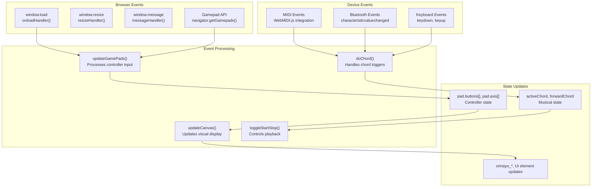
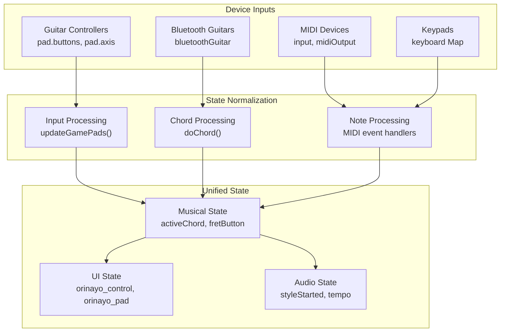
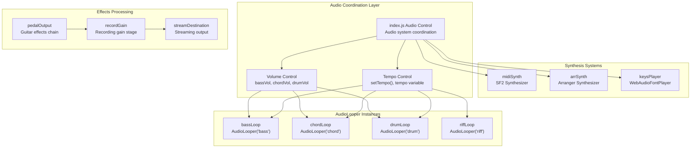
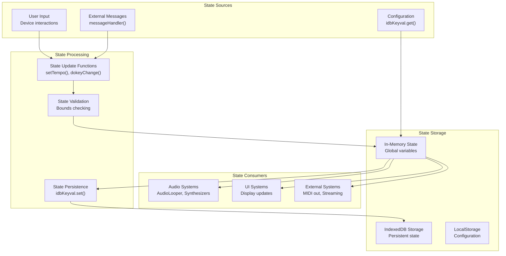

# Application Engine

> **Relevant source files**
> * [docs/css/main.css](https://github.com/Jus-Be/orinayo/blob/3c7fbee9/docs/css/main.css)
> * [docs/index.html](https://github.com/Jus-Be/orinayo/blob/3c7fbee9/docs/index.html)
> * [docs/js/audio_looper.js](https://github.com/Jus-Be/orinayo/blob/3c7fbee9/docs/js/audio_looper.js)
> * [docs/js/background.js](https://github.com/Jus-Be/orinayo/blob/3c7fbee9/docs/js/background.js)
> * [docs/js/index.js](https://github.com/Jus-Be/orinayo/blob/3c7fbee9/docs/js/index.js)
> * [docs/js/styles.js](https://github.com/Jus-Be/orinayo/blob/3c7fbee9/docs/js/styles.js)
> * [docs/manifest.json](https://github.com/Jus-Be/orinayo/blob/3c7fbee9/docs/manifest.json)
> * [docs/settings/options.js](https://github.com/Jus-Be/orinayo/blob/3c7fbee9/docs/settings/options.js)

The Application Engine serves as the central orchestration layer for OrinAyo, coordinating all major subsystems including input device handling, audio processing, user interface management, and external integrations. It is primarily implemented in [docs/js/index.js](https://github.com/Jus-Be/orinayo/blob/3c7fbee9/docs/js/index.js)

 and acts as the main controller that binds together input devices, audio generation systems, communication features, and platform-specific functionality.

For information about specific audio processing capabilities, see [Audio Processing Pipeline](/Jus-Be/orinayo/3.2-audio-processing-pipeline). For UI component details, see [UI Components](/Jus-Be/orinayo/3.3-ui-components). For MIDI-specific functionality, see [MIDI Processing](/Jus-Be/orinayo/4.1-midi-processing).

## Core Architecture Overview

The Application Engine follows a centralized event-driven architecture where [docs/js/index.js](https://github.com/Jus-Be/orinayo/blob/3c7fbee9/docs/js/index.js)

 serves as the main coordinator. It manages global application state through numerous variables and coordinates between subsystems through direct function calls and event handlers.

**Application Engine Architecture**

```mermaid
flowchart TD

ENGINE["index.js<br>Main Engine"]
EVENTS["Event Handlers<br>messageHandler, resizeHandler"]
STATE["Global State<br>Variables & Configuration"]
LIFECYCLE["Application Lifecycle<br>onloadHandler, onunloadHandler"]
GAMEPAD["Gamepad Handler<br>updateGamePads()"]
BLUETOOTH["Bluetooth Devices<br>onLavaGenieClick(), onLiberLiveClick()"]
MIDI_IN["MIDI Input<br>setupMidiIn()"]
KEYBOARD["Keyboard Events<br>keydown, keyup handlers"]
AUDIO_LOOPER["AudioLooper Instances<br>bassLoop, chordLoop, drumLoop"]
SYNTH_COORD["Synthesizer Coordination<br>midiSynth, arrSynth"]
EFFECTS["Effects Processing<br>pedalOutput integration"]
RECORDING["Recording Management<br>startRecording(), stopRecording()"]
XMPP_INT["XMPP Integration<br>_converse connection"]
STREAMING["WebRTC Streaming<br>publishConnection, watchConnection"]
STORAGE["Persistent Storage<br>idbKeyval operations"]

EVENTS --> GAMEPAD
EVENTS --> BLUETOOTH
EVENTS --> MIDI_IN
EVENTS --> KEYBOARD
ENGINE --> AUDIO_LOOPER
ENGINE --> SYNTH_COORD
ENGINE --> EFFECTS
ENGINE --> RECORDING
ENGINE --> XMPP_INT
ENGINE --> STREAMING
ENGINE --> STORAGE

subgraph subGraph3 ["External Integrations"]
    XMPP_INT
    STREAMING
    STORAGE
end

subgraph subGraph2 ["Audio System Coordination"]
    AUDIO_LOOPER
    SYNTH_COORD
    EFFECTS
    RECORDING
end

subgraph subGraph1 ["Input Device Integration"]
    GAMEPAD
    BLUETOOTH
    MIDI_IN
    KEYBOARD
end

subgraph subGraph0 ["Application Engine Core"]
    ENGINE
    EVENTS
    STATE
    LIFECYCLE
    ENGINE --> EVENTS
    ENGINE --> STATE
    ENGINE --> LIFECYCLE
end
```

Sources: [docs/js/index.js L1-L400](https://github.com/Jus-Be/orinayo/blob/3c7fbee9/docs/js/index.js#L1-L400)

 [docs/js/index.js L339-L343](https://github.com/Jus-Be/orinayo/blob/3c7fbee9/docs/js/index.js#L339-L343)

 [docs/js/audio_looper.js L1-L50](https://github.com/Jus-Be/orinayo/blob/3c7fbee9/docs/js/audio_looper.js#L1-L50)

## Event Handling System

The Application Engine implements a comprehensive event handling system that processes inputs from multiple sources and routes them to appropriate subsystems. The main event loop is driven by both browser events and custom application events.

**Event Processing Flow**

Sources: [docs/js/index.js L339-L387](https://github.com/Jus-Be/orinayo/blob/3c7fbee9/docs/js/index.js#L339-L387)

 [docs/js/index.js L1700-L1850](https://github.com/Jus-Be/orinayo/blob/3c7fbee9/docs/js/index.js#L1700-L1850)

 [docs/js/index.js L2100-L2200](https://github.com/Jus-Be/orinayo/blob/3c7fbee9/docs/js/index.js#L2100-L2200)

## Device Integration Management

The Application Engine manages integration with various input devices through a unified interface that abstracts device-specific protocols while maintaining device-specific functionality where needed.

| Device Type | Integration Method | Key Functions | State Variables |
| --- | --- | --- | --- |
| Guitar Controllers | Gamepad API | `updateGamePads()`, `resetGuitarHero()` | `pad.buttons[]`, `pad.axis[]` |
| Bluetooth Guitars | Web Bluetooth API | `onLavaGenieClick()`, `onLiberLiveClick()` | `bluetoothGuitar`, `writeCharacteristic` |
| MIDI Devices | WebMIDI API | `setupMidiIn()`, `setupMidiOut()` | `midiOutput`, `input` |
| Numeric Keypads | Keyboard Events | `keydown`/`keyup` handlers | `keyboard` Map |
| Stream Deck | WebHID API | `streamDeck` integration | `streamDeckPointer` |

**Device State Coordination**

Sources: [docs/js/index.js L465-L525](https://github.com/Jus-Be/orinayo/blob/3c7fbee9/docs/js/index.js#L465-L525)

 [docs/js/index.js L600-L950](https://github.com/Jus-Be/orinayo/blob/3c7fbee9/docs/js/index.js#L600-L950)

 [docs/js/index.js L1400-L1600](https://github.com/Jus-Be/orinayo/blob/3c7fbee9/docs/js/index.js#L1400-L1600)

## Audio System Coordination

The Application Engine coordinates multiple audio subsystems through direct integration with AudioLooper instances and synthesizer components. It manages the lifecycle and synchronization of all audio-generating components.

**Audio Subsystem Integration**

Sources: [docs/js/index.js L137-L144](https://github.com/Jus-Be/orinayo/blob/3c7fbee9/docs/js/index.js#L137-L144)

 [docs/js/index.js L197-L230](https://github.com/Jus-Be/orinayo/blob/3c7fbee9/docs/js/index.js#L197-L230)

 [docs/js/index.js L553-L598](https://github.com/Jus-Be/orinayo/blob/3c7fbee9/docs/js/index.js#L553-L598)

 [docs/js/audio_looper.js L1-L50](https://github.com/Jus-Be/orinayo/blob/3c7fbee9/docs/js/audio_looper.js#L1-L50)

## State Management Architecture

The Application Engine maintains application state through a collection of global variables and provides coordination between different subsystems. State is managed both in memory and through persistent storage mechanisms.

| State Category | Key Variables | Purpose |
| --- | --- | --- |
| Musical State | `activeChord`, `forwardChord`, `keyChange`, `tempo` | Current musical context |
| Device State | `guitarAvailable`, `bluetoothGuitar`, `midiOutput` | Connected devices |
| UI State | `orinayo`, `orinayo_section`, `orinayo_pad` | Display elements |
| Audio State | `styleStarted`, `bassVol`, `chordVol`, `drumVol` | Audio system status |
| Session State | `registration`, `songSequence`, `arrSequence` | User session data |

**State Management Flow**

Sources: [docs/js/index.js L37-L230](https://github.com/Jus-Be/orinayo/blob/3c7fbee9/docs/js/index.js#L37-L230)

 [docs/js/index.js L260-L334](https://github.com/Jus-Be/orinayo/blob/3c7fbee9/docs/js/index.js#L260-L334)

 [docs/js/index.js L2800-L3000](https://github.com/Jus-Be/orinayo/blob/3c7fbee9/docs/js/index.js#L2800-L3000)

## Application Lifecycle Management

The Application Engine manages the complete application lifecycle from initialization through cleanup, coordinating the startup and shutdown of all subsystems in the correct order.

**Initialization Sequence**

```mermaid
flowchart TD

WINDOW_LOAD["window.addEventListener('load')<br>onloadHandler()"]
DETECT_PLATFORM["Platform Detection<br>mobileCheck(), chrome extension"]
SETUP_AUDIO["Audio Setup<br>audioContext creation"]
INIT_DEVICES["Device Initialization<br>MIDI, Bluetooth setup"]
LOAD_CONFIG["Load Configuration<br>idbKeyval.get()"]
SETUP_UI["UI Setup<br>Mobile/desktop layout"]
INIT_LOOPERS["Initialize AudioLoopers<br>bassLoop, chordLoop, drumLoop"]
SETUP_SYNTHS["Setup Synthesizers<br>midiSynth, arrSynth"]
EVENT_LOOP["Event Loop<br>Device polling, UI updates"]
STATE_SYNC["State Synchronization<br>Cross-system coordination"]
ERROR_HANDLING["Error Handling<br>Device disconnection, audio issues"]
WINDOW_UNLOAD["window.addEventListener('unload')<br>onunloadHandler()"]
CLEANUP_AUDIO["Audio Cleanup<br>Stop all sources"]
SAVE_STATE["Save State<br>Persistent storage"]
DISCONNECT_DEVICES["Disconnect Devices<br>Bluetooth, MIDI cleanup"]

INIT_DEVICES --> LOAD_CONFIG
SETUP_SYNTHS --> EVENT_LOOP
ERROR_HANDLING --> WINDOW_UNLOAD

subgraph subGraph3 ["Cleanup Phase"]
    WINDOW_UNLOAD
    CLEANUP_AUDIO
    SAVE_STATE
    DISCONNECT_DEVICES
    WINDOW_UNLOAD --> CLEANUP_AUDIO
    CLEANUP_AUDIO --> SAVE_STATE
    SAVE_STATE --> DISCONNECT_DEVICES
end

subgraph subGraph2 ["Runtime Phase"]
    EVENT_LOOP
    STATE_SYNC
    ERROR_HANDLING
    EVENT_LOOP --> STATE_SYNC
    STATE_SYNC --> ERROR_HANDLING
end

subgraph subGraph1 ["Configuration Phase"]
    LOAD_CONFIG
    SETUP_UI
    INIT_LOOPERS
    SETUP_SYNTHS
    LOAD_CONFIG --> SETUP_UI
    SETUP_UI --> INIT_LOOPERS
    INIT_LOOPERS --> SETUP_SYNTHS
end

subgraph subGraph0 ["Startup Phase"]
    WINDOW_LOAD
    DETECT_PLATFORM
    SETUP_AUDIO
    INIT_DEVICES
    WINDOW_LOAD --> DETECT_PLATFORM
    DETECT_PLATFORM --> SETUP_AUDIO
    SETUP_AUDIO --> INIT_DEVICES
end
```

Sources: [docs/js/index.js L339-L343](https://github.com/Jus-Be/orinayo/blob/3c7fbee9/docs/js/index.js#L339-L343)

 [docs/js/index.js L3500-L4000](https://github.com/Jus-Be/orinayo/blob/3c7fbee9/docs/js/index.js#L3500-L4000)

 [docs/js/index.js L4500-L4600](https://github.com/Jus-Be/orinayo/blob/3c7fbee9/docs/js/index.js#L4500-L4600)

## Integration Points

The Application Engine provides well-defined integration points for external systems and plugins, enabling extensibility while maintaining system cohesion.

| Integration Type | Interface | Examples |
| --- | --- | --- |
| Audio Effects | `pedalOutput` connection | Guitar pedalboard integration |
| Communication | `_converse` XMPP client | Chat, collaboration features |
| Streaming | WebRTC connections | Live performance streaming |
| Storage | `idbKeyval` interface | Configuration persistence |
| External Hardware | MIDI output | Arranger keyboards, loopers |

The engine's modular design allows for runtime configuration of these integration points while maintaining backward compatibility and system stability.

Sources: [docs/js/index.js L78-L95](https://github.com/Jus-Be/orinayo/blob/3c7fbee9/docs/js/index.js#L78-L95)

 [docs/js/index.js L1127-L1200](https://github.com/Jus-Be/orinayo/blob/3c7fbee9/docs/js/index.js#L1127-L1200)

 [docs/js/index.js L2000-L2100](https://github.com/Jus-Be/orinayo/blob/3c7fbee9/docs/js/index.js#L2000-L2100)