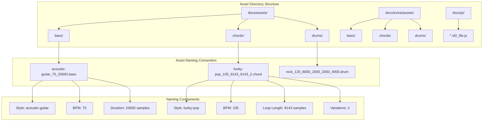
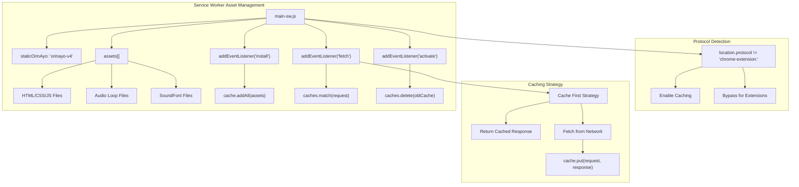
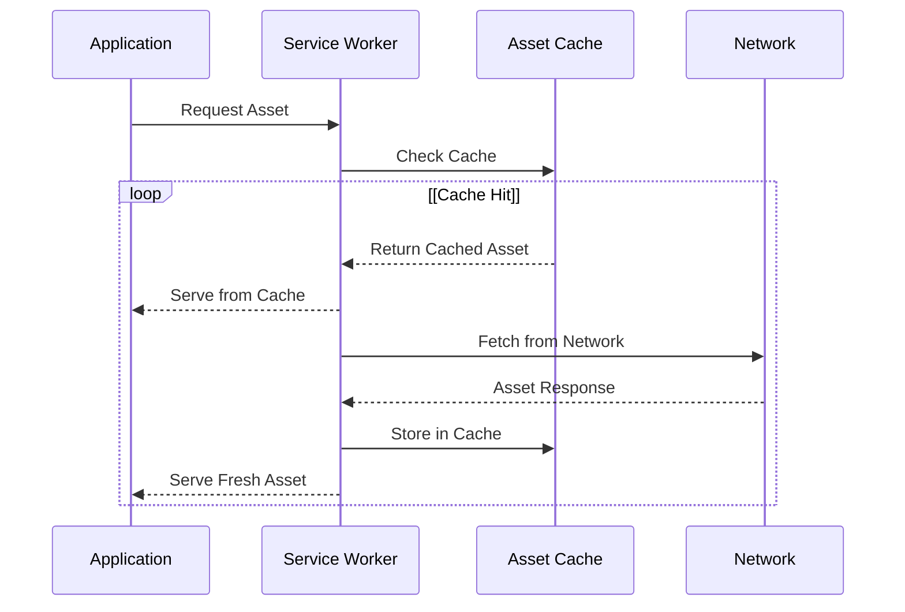
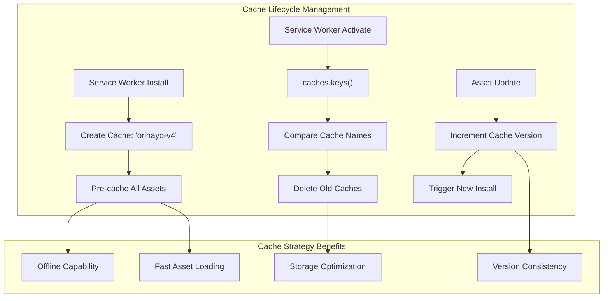

# Asset Management

> **Relevant source files**
> * [docs/extra/assets/bass/brit-rock_80_24000.bass](https://github.com/Jus-Be/orinayo/blob/3c7fbee9/docs/extra/assets/bass/brit-rock_80_24000.bass)
> * [docs/extra/assets/bass/disco-rock_120_16000.bass](https://github.com/Jus-Be/orinayo/blob/3c7fbee9/docs/extra/assets/bass/disco-rock_120_16000.bass)
> * [docs/extra/assets/bass/rock-ballad_70_27429.bass](https://github.com/Jus-Be/orinayo/blob/3c7fbee9/docs/extra/assets/bass/rock-ballad_70_27429.bass)
> * [docs/extra/assets/bass/slow-blues_60_32000.bass](https://github.com/Jus-Be/orinayo/blob/3c7fbee9/docs/extra/assets/bass/slow-blues_60_32000.bass)
> * [docs/extra/assets/bass/slow-pop_75_25600.bass](https://github.com/Jus-Be/orinayo/blob/3c7fbee9/docs/extra/assets/bass/slow-pop_75_25600.bass)
> * [docs/extra/assets/bass/slow-rock_80_12000.bass](https://github.com/Jus-Be/orinayo/blob/3c7fbee9/docs/extra/assets/bass/slow-rock_80_12000.bass)
> * [docs/extra/assets/chords/blues-slow_60_32000_32000_2.chord](https://github.com/Jus-Be/orinayo/blob/3c7fbee9/docs/extra/assets/chords/blues-slow_60_32000_32000_2.chord)
> * [docs/extra/assets/chords/brit-rock_80_24000_24000_2.chord](https://github.com/Jus-Be/orinayo/blob/3c7fbee9/docs/extra/assets/chords/brit-rock_80_24000_24000_2.chord)
> * [docs/extra/assets/chords/disco-rock_120_16000_16000_4.chord](https://github.com/Jus-Be/orinayo/blob/3c7fbee9/docs/extra/assets/chords/disco-rock_120_16000_16000_4.chord)
> * [docs/extra/assets/chords/rock-ballad_70_27429_27429_2.chord](https://github.com/Jus-Be/orinayo/blob/3c7fbee9/docs/extra/assets/chords/rock-ballad_70_27429_27429_2.chord)
> * [docs/extra/assets/chords/slow-blues_60_32000_32000_2.chord](https://github.com/Jus-Be/orinayo/blob/3c7fbee9/docs/extra/assets/chords/slow-blues_60_32000_32000_2.chord)
> * [docs/extra/assets/chords/slow-pop_75_25600_25600_2.chord](https://github.com/Jus-Be/orinayo/blob/3c7fbee9/docs/extra/assets/chords/slow-pop_75_25600_25600_2.chord)
> * [docs/js/main-sw.js](https://github.com/Jus-Be/orinayo/blob/3c7fbee9/docs/js/main-sw.js)

This document covers OrinAyo's comprehensive asset management system, which handles the organization, caching, and delivery of audio assets including musical loops, samples, and SoundFont files. The system ensures efficient storage and retrieval of audio assets for both online and offline performance scenarios.

For information about the audio processing of these assets, see [Audio Processing Pipeline](/Jus-Be/orinayo/3.2-audio-processing-pipeline). For details about SoundFont synthesis specifically, see [Sound Synthesis](/Jus-Be/orinayo/4.2-sound-synthesis).

## Asset Organization Structure

OrinAyo's assets are organized in a hierarchical directory structure that categorizes audio content by type, musical style, and performance characteristics.



Sources: [docs/js/main-sw.js L46-L76](https://github.com/Jus-Be/orinayo/blob/3c7fbee9/docs/js/main-sw.js#L46-L76)

 [docs/js/main-sw.js L78-L204](https://github.com/Jus-Be/orinayo/blob/3c7fbee9/docs/js/main-sw.js#L78-L204)

 [docs/js/main-sw.js L206-L328](https://github.com/Jus-Be/orinayo/blob/3c7fbee9/docs/js/main-sw.js#L206-L328)

 [docs/js/main-sw.js L330-L368](https://github.com/Jus-Be/orinayo/blob/3c7fbee9/docs/js/main-sw.js#L330-L368)

## Service Worker Caching Implementation

The asset management system is built around a Service Worker that implements a comprehensive caching strategy for offline capability and performance optimization.



Sources: [docs/js/main-sw.js L1](https://github.com/Jus-Be/orinayo/blob/3c7fbee9/docs/js/main-sw.js#L1-L1)

 [docs/js/main-sw.js L371-L383](https://github.com/Jus-Be/orinayo/blob/3c7fbee9/docs/js/main-sw.js#L371-L383)

 [docs/js/main-sw.js L385-L406](https://github.com/Jus-Be/orinayo/blob/3c7fbee9/docs/js/main-sw.js#L385-L406)

 [docs/js/main-sw.js L408-L426](https://github.com/Jus-Be/orinayo/blob/3c7fbee9/docs/js/main-sw.js#L408-L426)

 [docs/js/main-sw.js L374](https://github.com/Jus-Be/orinayo/blob/3c7fbee9/docs/js/main-sw.js#L374-L374)

 [docs/js/main-sw.js L388](https://github.com/Jus-Be/orinayo/blob/3c7fbee9/docs/js/main-sw.js#L388-L388)

## Audio Asset Categories

The system manages three primary categories of audio assets, each serving specific roles in music production.

### Bass Assets

Bass loops provide rhythmic and harmonic foundation across various musical styles:

| Style Category | Example Files | BPM Range | Characteristics |
| --- | --- | --- | --- |
| Acoustic | `acoustic-guitar_75_25600.bass` | 60-145 | Natural guitar tones |
| Electronic | `disco-pop_116_8276_2.bass` | 100-130 | Synthesized bass lines |
| Genre-Specific | `blues_75_25600.bass`, `funk_130_14769.bass` | 75-180 | Style-characteristic patterns |

### Chord Assets

Chord progressions and harmonic accompaniment patterns:

| Pattern Type | Example Files | Variations | Usage |
| --- | --- | --- | --- |
| Strumming | `acoustic-strum_145_3310_3310_2.chord` | 2-4 | Rhythmic chord patterns |
| Arpeggiated | `beat-arp_118_16271.chord` | 1-2 | Broken chord sequences |
| Genre-Specific | `afro-pop_111_8649_8649_4.chord` | 2-8 | Cultural/style patterns |

### Drum Assets

Percussion patterns and rhythmic foundations:

| Drum Pattern | Example Files | Complexity | Instruments |
| --- | --- | --- | --- |
| Basic Beats | `8beat_100_2400_9600_2400_2400_4800.drum` | Simple | Kick, Snare, Hi-hat |
| Complex Patterns | `afro-juju_125_1920_7680_1920_1920_1920.drum` | Advanced | Full percussion kit |
| Fill Variations | `rock_120_2000_16000_2000_2000_8000.drum` | Variable | Dynamic transitions |

Sources: [docs/js/main-sw.js L46-L76](https://github.com/Jus-Be/orinayo/blob/3c7fbee9/docs/js/main-sw.js#L46-L76)

 [docs/js/main-sw.js L78-L204](https://github.com/Jus-Be/orinayo/blob/3c7fbee9/docs/js/main-sw.js#L78-L204)

 [docs/js/main-sw.js L206-L328](https://github.com/Jus-Be/orinayo/blob/3c7fbee9/docs/js/main-sw.js#L206-L328)

## SoundFont Integration

The asset management system includes JavaScript-embedded SoundFont files for realistic instrument synthesis.

```mermaid
flowchart TD

SF2_FILES["SoundFont Assets"]
ELECTRIC_GUITAR["0270_EGuitar_FSBS_SF2_file.js"]
ACOUSTIC_GUITAR["0250_RG_Acoustic_SF2_file.js"]
ASPIRIN_SYNTH["0250_Aspirin_sf2_file.js"]
CHAOS_SYNTH["0250_Chaos_sf2_file.js"]
ACOUSTIC_STEEL["0250_LK_AcousticSteel_SF2_file.js"]
JCLIVE_260["0260_JCLive_sf2_file.js"]
ASPIRIN_270["0270_Aspirin_sf2_file.js"]
JCLIVE_280["0280_JCLive_sf2_file.js"]
ACOUSTIC_253["0253_Acoustic_Guitar_sf2_file.js"]
ASPIRIN_341["0341_Aspirin_sf2_file.js"]
GUITAR_CATEGORY["Guitar Instruments"]
SYNTH_CATEGORY["Synthesizer Sounds"]
LIVE_CATEGORY["Live Performance"]

ELECTRIC_GUITAR --> GUITAR_CATEGORY
ACOUSTIC_GUITAR --> GUITAR_CATEGORY
ACOUSTIC_STEEL --> GUITAR_CATEGORY
ACOUSTIC_253 --> GUITAR_CATEGORY
ASPIRIN_SYNTH --> SYNTH_CATEGORY
CHAOS_SYNTH --> SYNTH_CATEGORY
ASPIRIN_270 --> SYNTH_CATEGORY
ASPIRIN_341 --> SYNTH_CATEGORY
JCLIVE_260 --> LIVE_CATEGORY
JCLIVE_280 --> LIVE_CATEGORY

subgraph subGraph1 ["SoundFont Categories"]
    GUITAR_CATEGORY
    SYNTH_CATEGORY
    LIVE_CATEGORY
end

subgraph subGraph0 ["SoundFont Asset Management"]
    SF2_FILES
    ELECTRIC_GUITAR
    ACOUSTIC_GUITAR
    ASPIRIN_SYNTH
    CHAOS_SYNTH
    ACOUSTIC_STEEL
    JCLIVE_260
    ASPIRIN_270
    JCLIVE_280
    ACOUSTIC_253
    ASPIRIN_341
    SF2_FILES --> ELECTRIC_GUITAR
    SF2_FILES --> ACOUSTIC_GUITAR
    SF2_FILES --> ASPIRIN_SYNTH
    SF2_FILES --> CHAOS_SYNTH
    SF2_FILES --> ACOUSTIC_STEEL
    SF2_FILES --> JCLIVE_260
    SF2_FILES --> ASPIRIN_270
    SF2_FILES --> JCLIVE_280
    SF2_FILES --> ACOUSTIC_253
    SF2_FILES --> ASPIRIN_341
end
```



Sources: [docs/js/main-sw.js L12-L21](https://github.com/Jus-Be/orinayo/blob/3c7fbee9/docs/js/main-sw.js#L12-L21)

## Loading Strategies and Performance

The asset management system implements multiple loading strategies optimized for different deployment scenarios.

### Cache-First Strategy



### Protocol-Aware Caching

The system detects the deployment context and adapts caching behavior:

| Protocol | Caching Behavior | Reason |
| --- | --- | --- |
| `https:` | Full caching enabled | Standard web deployment |
| `http:` | Full caching enabled | Development/local deployment |
| `chrome-extension:` | Caching bypassed | Extension security model |

Sources: [docs/js/main-sw.js L374](https://github.com/Jus-Be/orinayo/blob/3c7fbee9/docs/js/main-sw.js#L374-L374)

 [docs/js/main-sw.js L388](https://github.com/Jus-Be/orinayo/blob/3c7fbee9/docs/js/main-sw.js#L388-L388)

 [docs/js/main-sw.js L411](https://github.com/Jus-Be/orinayo/blob/3c7fbee9/docs/js/main-sw.js#L411-L411)

## Asset File Formats

All audio assets are stored as OGG Vorbis compressed files with specific naming conventions that encode metadata directly in filenames.

### Filename Encoding Pattern

```
{style}_{bpm}_{duration}[_{loop_length}][_{variations}].{type}
```

**Components:**

* `style`: Musical genre or pattern name (e.g., "acoustic-guitar", "afro-pop")
* `bpm`: Beats per minute tempo
* `duration`: Total duration in samples
* `loop_length`: (Optional) Loop segment length in samples
* `variations`: (Optional) Number of pattern variations
* `type`: Asset category (`bass`, `chord`, `drum`)

### Example Decodings:

* `acoustic-guitar_75_25600.bass` → Acoustic guitar bass at 75 BPM, 25,600 samples duration
* `funky-pop_105_9143_9143_2.chord` → Funky pop chords at 105 BPM, 9,143 samples total/loop, 2 variations
* `rock_120_8000_2000_2000_4000.drum` → Rock drums at 120 BPM with complex timing structure

Sources: [docs/extra/assets/bass/slow-blues_60_32000.bass L1-L10](https://github.com/Jus-Be/orinayo/blob/3c7fbee9/docs/extra/assets/bass/slow-blues_60_32000.bass#L1-L10)

 [docs/extra/assets/chords/blues-slow_60_32000_32000_2.chord L1-L10](https://github.com/Jus-Be/orinayo/blob/3c7fbee9/docs/extra/assets/chords/blues-slow_60_32000_32000_2.chord#L1-L10)

 [docs/extra/assets/chords/slow-blues_60_32000_32000_2.chord L1-L10](https://github.com/Jus-Be/orinayo/blob/3c7fbee9/docs/extra/assets/chords/slow-blues_60_32000_32000_2.chord#L1-L10)

## Cache Management and Versioning

The system implements automatic cache versioning and cleanup to ensure users receive updated assets.



The current cache version is `orinayo-v4`, indicating the fourth major iteration of the asset caching system.

Sources: [docs/js/main-sw.js L1](https://github.com/Jus-Be/orinayo/blob/3c7fbee9/docs/js/main-sw.js#L1-L1)

 [docs/js/main-sw.js L413-L425](https://github.com/Jus-Be/orinayo/blob/3c7fbee9/docs/js/main-sw.js#L413-L425)

 [docs/js/main-sw.js L377-L381](https://github.com/Jus-Be/orinayo/blob/3c7fbee9/docs/js/main-sw.js#L377-L381)