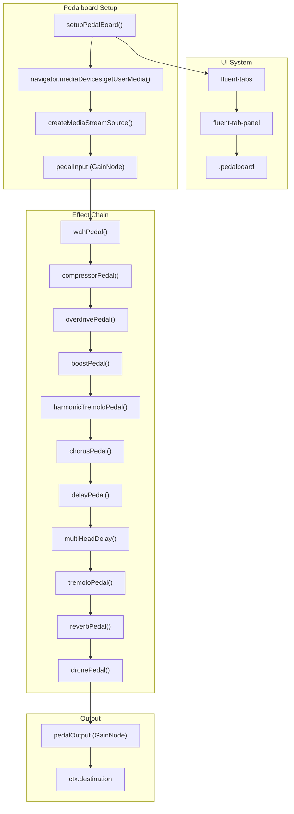
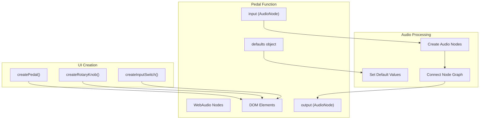
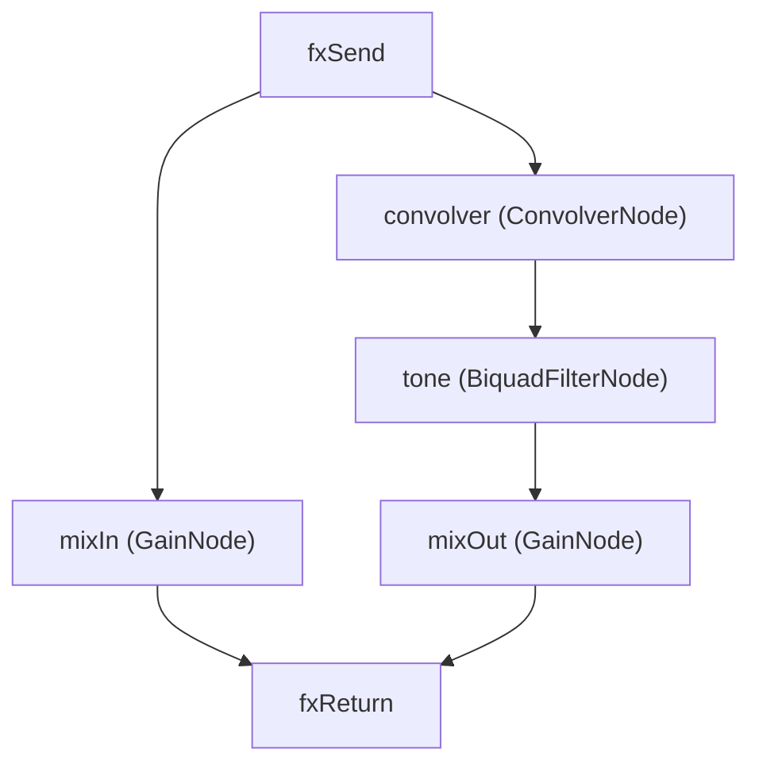
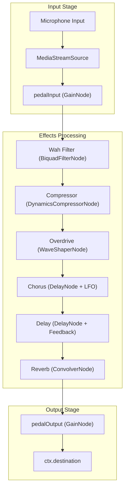

# Audio Effects (Pedalboard)

> **Relevant source files**
> * [docs/assets/pedalboard.js](https://github.com/Jus-Be/orinayo/blob/3c7fbee9/docs/assets/pedalboard.js)
> * [docs/assets/src/pedals/chorus.js](https://github.com/Jus-Be/orinayo/blob/3c7fbee9/docs/assets/src/pedals/chorus.js)
> * [docs/assets/src/pedals/compressor.js](https://github.com/Jus-Be/orinayo/blob/3c7fbee9/docs/assets/src/pedals/compressor.js)
> * [docs/assets/src/pedals/delay.js](https://github.com/Jus-Be/orinayo/blob/3c7fbee9/docs/assets/src/pedals/delay.js)
> * [docs/assets/src/pedals/harmonic-tremolo.js](https://github.com/Jus-Be/orinayo/blob/3c7fbee9/docs/assets/src/pedals/harmonic-tremolo.js)
> * [docs/assets/src/pedals/multihead-delay.js](https://github.com/Jus-Be/orinayo/blob/3c7fbee9/docs/assets/src/pedals/multihead-delay.js)
> * [docs/assets/src/pedals/overdrive.js](https://github.com/Jus-Be/orinayo/blob/3c7fbee9/docs/assets/src/pedals/overdrive.js)
> * [docs/assets/src/pedals/reverb.js](https://github.com/Jus-Be/orinayo/blob/3c7fbee9/docs/assets/src/pedals/reverb.js)
> * [docs/assets/src/pedals/tremolo.js](https://github.com/Jus-Be/orinayo/blob/3c7fbee9/docs/assets/src/pedals/tremolo.js)
> * [docs/assets/src/pedals/wah.js](https://github.com/Jus-Be/orinayo/blob/3c7fbee9/docs/assets/src/pedals/wah.js)
> * [docs/assets/style.css](https://github.com/Jus-Be/orinayo/blob/3c7fbee9/docs/assets/style.css)

The Audio Effects system provides a comprehensive guitar effects pedalboard implementation using the WebAudio API. This system processes audio input through a configurable chain of effects pedals including distortion, modulation, delay, and reverb effects. The pedalboard integrates with OrinAyo's audio processing pipeline to enhance live guitar performance and recording capabilities.

For information about audio synthesis and SoundFont processing, see [Sound Synthesis](/Jus-Be/orinayo/4.2-sound-synthesis). For details about audio input processing and pitch detection, see [Audio-to-MIDI Conversion](/Jus-Be/orinayo/4.5-audio-to-midi-conversion).

## Architecture Overview

The pedalboard system follows a modular architecture where each effect is implemented as an independent module that can be chained together in sequence. The system uses WebAudio API nodes for real-time audio processing and provides a tabbed user interface for parameter control.



Sources: [docs/assets/pedalboard.js L13-L142](https://github.com/Jus-Be/orinayo/blob/3c7fbee9/docs/assets/pedalboard.js#L13-L142)

## Pedalboard Initialization

The `setupPedalBoard` function initializes the entire effects system by setting up audio input, creating the effect chain, and building the user interface. The function accepts parameters for audio context, guitar configuration, and device selection.

### Audio Input Configuration

The system configures audio input with specific constraints to minimize latency and disable automatic audio processing that could interfere with guitar effects:

| Parameter | Value | Purpose |
| --- | --- | --- |
| `autoGainControl` | false | Prevents automatic volume adjustment |
| `noiseSuppression` | false | Preserves natural guitar tone |
| `echoCancellation` | false | Avoids interference with delay effects |
| `channelCount` | 2 | Enables stereo processing |
| `latency` | 0 | Minimizes processing delay |

The audio input setup creates a `MediaStreamSource` connected to `pedalInput`, which serves as the entry point for the effects chain.

Sources: [docs/assets/pedalboard.js L19-L47](https://github.com/Jus-Be/orinayo/blob/3c7fbee9/docs/assets/pedalboard.js#L19-L47)

### Effect Chain Construction

The effect chain is dynamically constructed using a `reduce` operation that connects each pedal in sequence:

```javascript
window.pedalOutput = pedals.reduce((input, pedal, index) => {
    return pedal(input, index + 1);
}, pedalInput);
```

This approach ensures proper signal flow while maintaining modularity. Each pedal function receives the previous pedal's output as its input and returns its own output node.

Sources: [docs/assets/pedalboard.js L134-L136](https://github.com/Jus-Be/orinayo/blob/3c7fbee9/docs/assets/pedalboard.js#L134-L136)

## Individual Pedal Implementation

Each pedal follows a consistent implementation pattern with standardized parameters and WebAudio node configurations. All pedals export a function that creates the necessary audio processing nodes and user interface elements.

### Common Pedal Structure



Sources: [docs/assets/src/pedals/delay.js L3-L88](https://github.com/Jus-Be/orinayo/blob/3c7fbee9/docs/assets/src/pedals/delay.js#L3-L88)

 [docs/assets/src/pedals/reverb.js L3-L73](https://github.com/Jus-Be/orinayo/blob/3c7fbee9/docs/assets/src/pedals/reverb.js#L3-L73)

 [docs/assets/src/pedals/chorus.js L3-L92](https://github.com/Jus-Be/orinayo/blob/3c7fbee9/docs/assets/src/pedals/chorus.js#L3-L92)

### Delay Pedal Implementation

The delay pedal demonstrates the standard pedal architecture with audio processing nodes and parameter controls:

| Component | WebAudio Node | Purpose |
| --- | --- | --- |
| `delay` | DelayNode | Creates time-based delay |
| `feedback` | GainNode | Controls delay regeneration |
| `delayGain` | GainNode | Controls wet/dry mix |
| `filter` | BiquadFilterNode | Shapes delayed signal tone |

The delay pedal supports tempo-synchronized timing with a maximum delay time of 1.5 seconds and includes feedback control with limiting to prevent runaway oscillation.

Sources: [docs/assets/src/pedals/delay.js L14-L38](https://github.com/Jus-Be/orinayo/blob/3c7fbee9/docs/assets/src/pedals/delay.js#L14-L38)

### Reverb Pedal Implementation

The reverb pedal uses impulse response convolution to simulate acoustic spaces:



The system loads impulse response files from `./audio/ir/` directory and applies them through the `ConvolverNode`. The mix controls balance the dry and processed signals.

Sources: [docs/assets/src/pedals/reverb.js L11-L36](https://github.com/Jus-Be/orinayo/blob/3c7fbee9/docs/assets/src/pedals/reverb.js#L11-L36)

 [docs/assets/pedalboard.js L76-L84](https://github.com/Jus-Be/orinayo/blob/3c7fbee9/docs/assets/pedalboard.js#L76-L84)

### Multi-Head Delay Implementation

The multi-head delay pedal creates complex delay patterns by implementing multiple independent delay lines with individual controls for timing, feedback, and stereo positioning:

| Delay Head | Pan Position | Delay Time | Feedback |
| --- | --- | --- | --- |
| Head 1 | 1.0 (Right) | 0.300s | 0.3 |
| Head 2 | -1.0 (Left) | 0.463s | 0.3 |
| Head 3 | 0.5 (Right) | 0.976s | 0.1 |
| Head 4 | -0.5 (Left) | 0.488s | 0.1 |

Each delay head includes chorus modulation, EQ controls, and individual mix/pan settings, creating rich stereo delay textures.

Sources: [docs/assets/src/pedals/multihead-delay.js L34-L205](https://github.com/Jus-Be/orinayo/blob/3c7fbee9/docs/assets/src/pedals/multihead-delay.js#L34-L205)

 [docs/assets/src/pedals/multihead-delay.js L217-L220](https://github.com/Jus-Be/orinayo/blob/3c7fbee9/docs/assets/src/pedals/multihead-delay.js#L217-L220)

## User Interface System

The pedalboard UI uses Fluent UI components organized in a tabbed interface. Each tab contains related effects grouped by function:

### Tab Organization

| Tab ID | Effects Included | Purpose |
| --- | --- | --- |
| `wahwah` | Wah Wah | Filter-based effects |
| `compressor` | Compressor | Dynamics processing |
| `overdrive` | Overdrive | Distortion effects |
| `boost` | Boost | Signal amplification |
| `harmonic_tremolo` | Harmonic Tremolo | Amplitude modulation |
| `chorus-delay-reverb` | Chorus, Delay, Reverb | Time-based effects |
| `multi_head_delay` | Multi-Head Delay | Complex delay patterns |
| `tremolo` | Tremolo | Basic amplitude modulation |
| `drone` | Drone | Sustained tones |

### Visual Styling

The pedalboard uses CSS to create realistic pedal representations with visual feedback:

* Pedal bodies use gradient backgrounds to simulate different effect types
* Rotary knobs provide visual indication of parameter values through CSS transforms
* LED indicators show pedal activation state with colored glows
* Responsive layout adapts to different screen sizes

Sources: [docs/assets/pedalboard.js L86-L117](https://github.com/Jus-Be/orinayo/blob/3c7fbee9/docs/assets/pedalboard.js#L86-L117)

 [docs/assets/style.css L1-L452](https://github.com/Jus-Be/orinayo/blob/3c7fbee9/docs/assets/style.css#L1-L452)

## MIDI Integration

The pedalboard system integrates with MIDI controllers for real-time parameter control. The system listens for MIDI Control Change messages and maps them to effect parameters:

### MIDI Expression Pedal Support

The wah pedal and multi-head delay support MIDI expression pedal control through CC messages:

* CC 176 messages control the wah filter frequency
* Expression values (0-127) map to the filter frequency range (100-1500 Hz)
* Visual knob position updates to reflect MIDI control changes

This enables hands-free control of effect parameters during live performance.

Sources: [docs/assets/pedalboard.js L56-L74](https://github.com/Jus-Be/orinayo/blob/3c7fbee9/docs/assets/pedalboard.js#L56-L74)

 [docs/assets/src/pedals/wah.js L54-L59](https://github.com/Jus-Be/orinayo/blob/3c7fbee9/docs/assets/src/pedals/wah.js#L54-L59)

 [docs/assets/src/pedals/multihead-delay.js L139-L144](https://github.com/Jus-Be/orinayo/blob/3c7fbee9/docs/assets/src/pedals/multihead-delay.js#L139-L144)

## Audio Signal Flow

The complete audio signal flow demonstrates how input audio is processed through the effects chain:



The signal path maintains unity gain staging throughout the chain to prevent clipping while preserving signal integrity. Each effect can be bypassed individually through input switching nodes that maintain signal continuity.

Sources: [docs/assets/pedalboard.js L134-L141](https://github.com/Jus-Be/orinayo/blob/3c7fbee9/docs/assets/pedalboard.js#L134-L141)

 [docs/assets/src/pedals/delay.js L20-L38](https://github.com/Jus-Be/orinayo/blob/3c7fbee9/docs/assets/src/pedals/delay.js#L20-L38)

 [docs/assets/src/pedals/reverb.js L17-L34](https://github.com/Jus-Be/orinayo/blob/3c7fbee9/docs/assets/src/pedals/reverb.js#L17-L34)