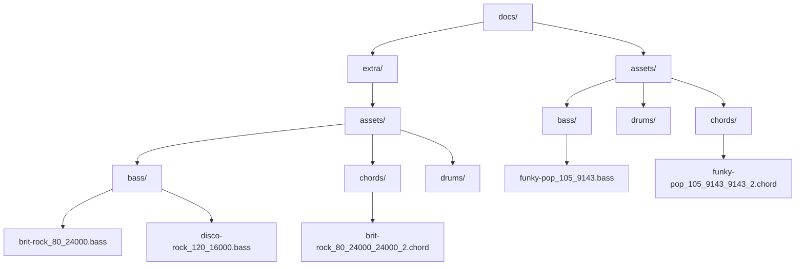
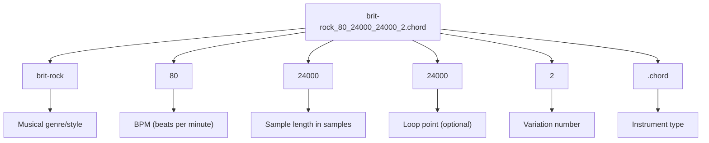
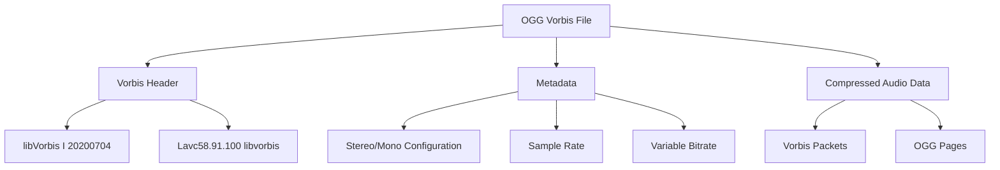
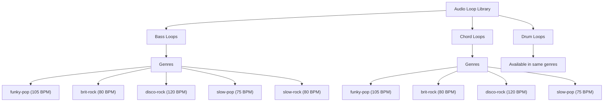
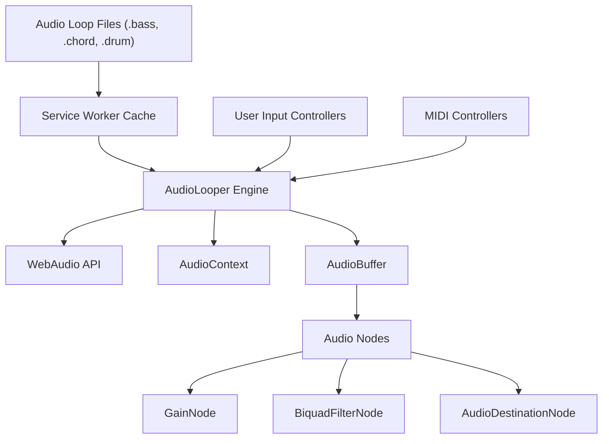
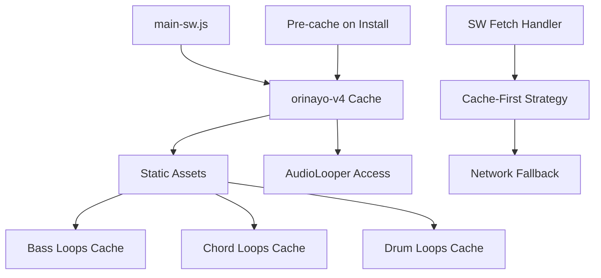

# Audio Loops and Samples

> **Relevant source files**
> * [docs/assets/bass/desert-pop_97_19794.bass](https://github.com/Jus-Be/orinayo/blob/3c7fbee9/docs/assets/bass/desert-pop_97_19794.bass)
> * [docs/assets/bass/funky-pop_105_9143.bass](https://github.com/Jus-Be/orinayo/blob/3c7fbee9/docs/assets/bass/funky-pop_105_9143.bass)
> * [docs/assets/chords/acoustic-strum_90_5333.chord](https://github.com/Jus-Be/orinayo/blob/3c7fbee9/docs/assets/chords/acoustic-strum_90_5333.chord)
> * [docs/assets/chords/desert-pop_97_19794_19794_2.chord](https://github.com/Jus-Be/orinayo/blob/3c7fbee9/docs/assets/chords/desert-pop_97_19794_19794_2.chord)
> * [docs/assets/chords/funky-pop_105_9143_9143_2.chord](https://github.com/Jus-Be/orinayo/blob/3c7fbee9/docs/assets/chords/funky-pop_105_9143_9143_2.chord)
> * [docs/assets/drums/desert-pop_97_4948_19794_2474_2474_9897.drum](https://github.com/Jus-Be/orinayo/blob/3c7fbee9/docs/assets/drums/desert-pop_97_4948_19794_2474_2474_9897.drum)
> * [docs/extra/assets/bass/brit-rock_80_24000.bass](https://github.com/Jus-Be/orinayo/blob/3c7fbee9/docs/extra/assets/bass/brit-rock_80_24000.bass)
> * [docs/extra/assets/bass/disco-rock_120_16000.bass](https://github.com/Jus-Be/orinayo/blob/3c7fbee9/docs/extra/assets/bass/disco-rock_120_16000.bass)
> * [docs/extra/assets/bass/rock-ballad_70_27429.bass](https://github.com/Jus-Be/orinayo/blob/3c7fbee9/docs/extra/assets/bass/rock-ballad_70_27429.bass)
> * [docs/extra/assets/bass/slow-pop_75_25600.bass](https://github.com/Jus-Be/orinayo/blob/3c7fbee9/docs/extra/assets/bass/slow-pop_75_25600.bass)
> * [docs/extra/assets/bass/slow-rock_80_12000.bass](https://github.com/Jus-Be/orinayo/blob/3c7fbee9/docs/extra/assets/bass/slow-rock_80_12000.bass)
> * [docs/extra/assets/chords/brit-rock_80_24000_24000_2.chord](https://github.com/Jus-Be/orinayo/blob/3c7fbee9/docs/extra/assets/chords/brit-rock_80_24000_24000_2.chord)
> * [docs/extra/assets/chords/disco-rock_120_16000_16000_4.chord](https://github.com/Jus-Be/orinayo/blob/3c7fbee9/docs/extra/assets/chords/disco-rock_120_16000_16000_4.chord)
> * [docs/extra/assets/chords/rock-ballad_70_27429_27429_2.chord](https://github.com/Jus-Be/orinayo/blob/3c7fbee9/docs/extra/assets/chords/rock-ballad_70_27429_27429_2.chord)
> * [docs/extra/assets/chords/slow-pop_75_25600_25600_2.chord](https://github.com/Jus-Be/orinayo/blob/3c7fbee9/docs/extra/assets/chords/slow-pop_75_25600_25600_2.chord)

This document covers OrinAyo's musical asset library structure, including the organization, naming conventions, and technical specifications of bass, chord, and drum loops used throughout the application. These pre-recorded audio samples provide the foundational musical elements for live music production and backing tracks.

For information about SoundFont synthesis and instrument definitions, see [SoundFont Files](/Jus-Be/orinayo/7.2-soundfont-files). For details about audio processing and playback, see [Audio Processing Pipeline](/Jus-Be/orinayo/3.2-audio-processing-pipeline).

## Asset Organization Structure

OrinAyo's audio loops are organized in a hierarchical directory structure that separates assets by location and type:

**Asset Directory Structure**

| Directory Path | Purpose | Content Type |
| --- | --- | --- |
| `docs/assets/bass/` | Core bass loop samples | Low-frequency rhythm tracks |
| `docs/assets/chords/` | Core chord progression loops | Harmonic backing tracks |
| `docs/assets/drums/` | Core drum pattern loops | Percussion and rhythm sections |
| `docs/extra/assets/bass/` | Extended bass loop library | Additional bass variations |
| `docs/extra/assets/chords/` | Extended chord progression library | Additional harmonic content |
| `docs/extra/assets/drums/` | Extended drum pattern library | Additional percussion patterns |

Sources: File paths observed in provided file listing

## File Naming Convention

Audio loop files follow a standardized naming pattern that encodes musical and technical metadata:

**Naming Pattern Components**

| Component | Example | Description |
| --- | --- | --- |
| Genre | `funky-pop`, `brit-rock`, `disco-rock`, `slow-rock` | Musical style identifier |
| Tempo | `75`, `80`, `105`, `120` | Beats per minute |
| Duration | `9143`, `12000`, `16000`, `24000`, `25600` | Sample length or timing info |
| Loop Point | `9143`, `24000`, `25600` | Loop repetition point (when present) |
| Variation | `2`, `4` | Different versions of same pattern |
| Extension | `.bass`, `.chord`, `.drum` | Instrument type |

Sources: [docs/assets/chords/funky-pop_105_9143_9143_2.chord](https://github.com/Jus-Be/orinayo/blob/3c7fbee9/docs/assets/chords/funky-pop_105_9143_9143_2.chord)

 [docs/assets/bass/funky-pop_105_9143.bass](https://github.com/Jus-Be/orinayo/blob/3c7fbee9/docs/assets/bass/funky-pop_105_9143.bass)

 [docs/extra/assets/chords/brit-rock_80_24000_24000_2.chord](https://github.com/Jus-Be/orinayo/blob/3c7fbee9/docs/extra/assets/chords/brit-rock_80_24000_24000_2.chord)

 [docs/extra/assets/bass/disco-rock_120_16000.bass](https://github.com/Jus-Be/orinayo/blob/3c7fbee9/docs/extra/assets/bass/disco-rock_120_16000.bass)

## Audio Format and Technical Specifications

All audio loops are stored in OGG Vorbis format, providing efficient compression while maintaining audio quality suitable for music production:

**Technical Specifications**

| Property | Value | Description |
| --- | --- | --- |
| Container Format | OGG | Xiph.Org container format |
| Audio Codec | Vorbis | Open source lossy audio compression |
| Encoder | libVorbis I 20200704 | Encoder version from headers |
| Transcoder | Lavc58.91.100 | FFmpeg's libvorbis implementation |
| File Header | `OggS` | OGG stream identifier |
| Quality | Variable bitrate | Optimized for music content |

Sources: [docs/assets/chords/funky-pop_105_9143_9143_2.chord L1-L20](https://github.com/Jus-Be/orinayo/blob/3c7fbee9/docs/assets/chords/funky-pop_105_9143_9143_2.chord#L1-L20)

 [docs/extra/assets/bass/slow-pop_75_25600.bass L1-L20](https://github.com/Jus-Be/orinayo/blob/3c7fbee9/docs/extra/assets/bass/slow-pop_75_25600.bass#L1-L20)

## Asset Categories and Musical Content

The loop library spans multiple musical genres and tempos, organized into three primary instrument categories:

**Genre and Tempo Distribution**

| Genre | Tempo (BPM) | Bass Loops | Chord Loops | Typical Use Case |
| --- | --- | --- | --- | --- |
| `funky-pop` | 105 | ✓ | ✓ | Moderate tempo funk and pop |
| `brit-rock` | 80 | ✓ | ✓ | Classic rock and alternative |
| `disco-rock` | 120 | ✓ | ✓ | High-energy dance and rock |
| `slow-pop` | 75 | ✓ | ✓ | Ballads and slow songs |
| `slow-rock` | 80 | ✓ | - | Rock ballads |

Sources: File names pattern analysis across [docs/assets/](https://github.com/Jus-Be/orinayo/blob/3c7fbee9/docs/assets/)

 and [docs/extra/assets/](https://github.com/Jus-Be/orinayo/blob/3c7fbee9/docs/extra/assets/)

 directories

## Integration with Audio System

Audio loops integrate with OrinAyo's WebAudio-based audio processing pipeline through the AudioLooper engine:

**Loading and Playback Chain**

1. **Asset Discovery**: Files are catalogued by the service worker for offline availability
2. **AudioLooper Integration**: The `audio_looper.js` engine manages loop playback and synchronization
3. **WebAudio Processing**: Loops are decoded into AudioBuffers for real-time manipulation
4. **User Control**: Input controllers trigger and modify loop playback parameters

Sources: High-level architecture diagrams showing AudioLooper Engine and WebAudio Loops integration

## Cache Management and Performance

Audio loops are managed through OrinAyo's service worker caching system to ensure responsive performance and offline capability:

**Caching Strategy**

| Strategy Component | Implementation | Purpose |
| --- | --- | --- |
| Pre-cache | Install-time asset loading | Immediate availability |
| Cache-first | Prioritize cached versions | Fast load times |
| Network fallback | Fetch if cache miss | Content availability |
| Version control | `orinayo-v4` cache key | Asset management |

Sources: Service worker and caching system architecture from high-level diagrams