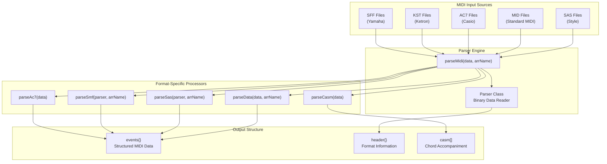
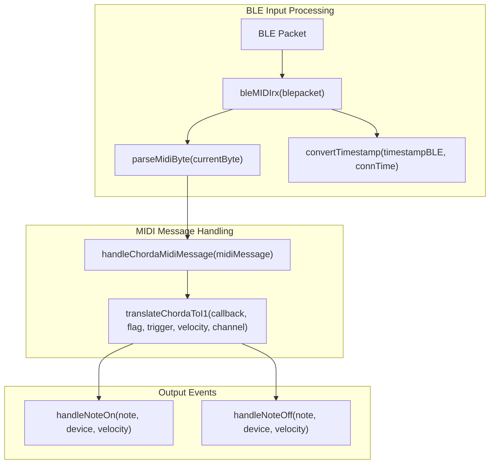
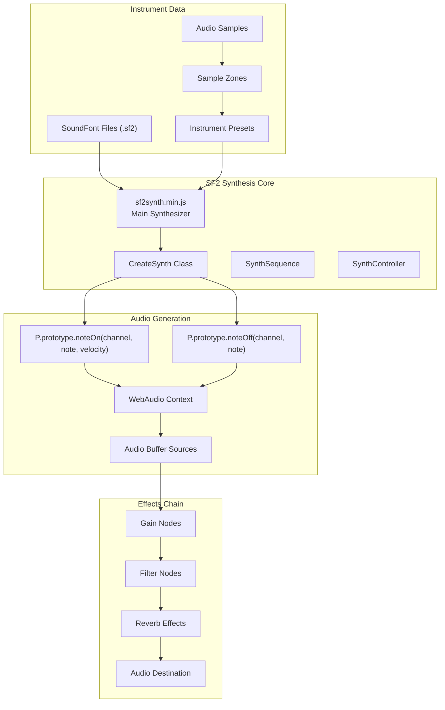
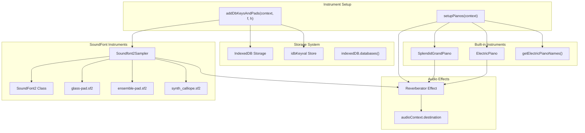
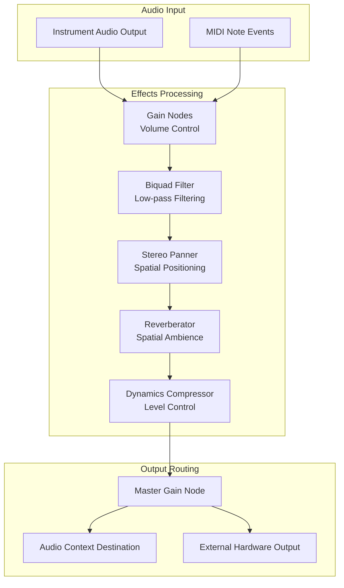
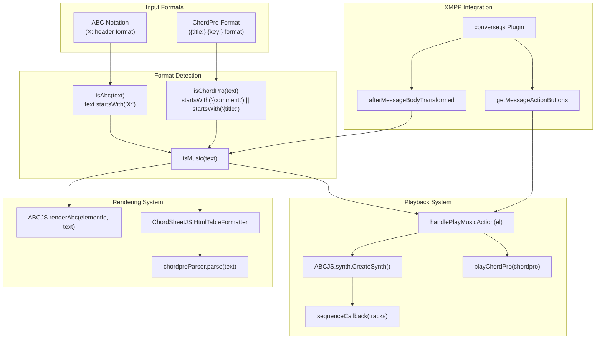
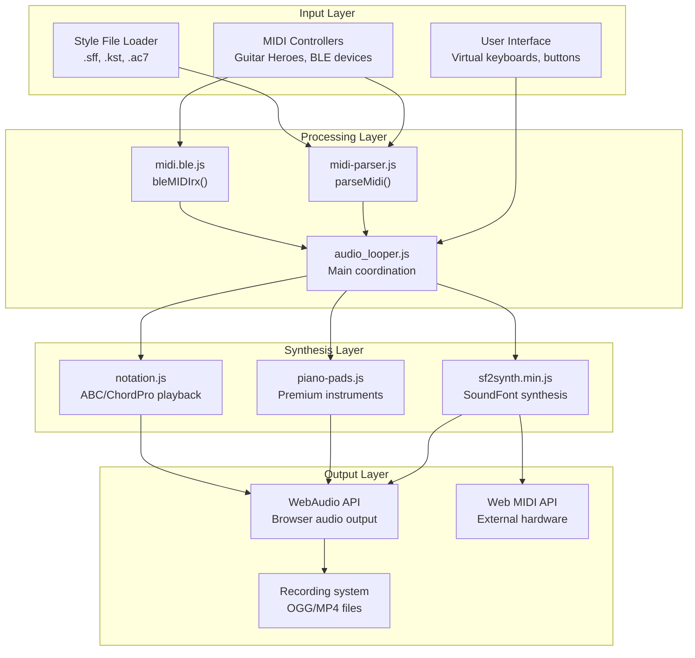

# Audio Systems

> **Relevant source files**
> * [docs/assets/gmgsx.sf2](https://github.com/Jus-Be/orinayo/blob/3c7fbee9/docs/assets/gmgsx.sf2)
> * [docs/assets/leads/synth_calliope.sf2](https://github.com/Jus-Be/orinayo/blob/3c7fbee9/docs/assets/leads/synth_calliope.sf2)
> * [docs/assets/pads/glass-pad.sf2](https://github.com/Jus-Be/orinayo/blob/3c7fbee9/docs/assets/pads/glass-pad.sf2)
> * [docs/css/synth.css](https://github.com/Jus-Be/orinayo/blob/3c7fbee9/docs/css/synth.css)
> * [docs/js/midi-parser.js](https://github.com/Jus-Be/orinayo/blob/3c7fbee9/docs/js/midi-parser.js)
> * [docs/js/midi.ble.js](https://github.com/Jus-Be/orinayo/blob/3c7fbee9/docs/js/midi.ble.js)
> * [docs/js/piano-pads.js](https://github.com/Jus-Be/orinayo/blob/3c7fbee9/docs/js/piano-pads.js)
> * [docs/js/sf2.synth.min.js](https://github.com/Jus-Be/orinayo/blob/3c7fbee9/docs/js/sf2.synth.min.js)
> * [docs/js/smplr.mjs](https://github.com/Jus-Be/orinayo/blob/3c7fbee9/docs/js/smplr.mjs)
> * [docs/packages/notation/abcjs.js](https://github.com/Jus-Be/orinayo/blob/3c7fbee9/docs/packages/notation/abcjs.js)
> * [docs/packages/notation/notation.js](https://github.com/Jus-Be/orinayo/blob/3c7fbee9/docs/packages/notation/notation.js)
> * [orinayo.exe](https://github.com/Jus-Be/orinayo/blob/3c7fbee9/orinayo.exe)

This document covers OrinAyo's comprehensive audio processing capabilities, including MIDI parsing, sound synthesis, instrument management, and music notation systems. The audio systems handle input from various controllers, process MIDI data, synthesize sounds using SoundFont technology, and provide real-time audio effects.

For information about input device handling, see [Input Controllers](/Jus-Be/orinayo/2.3-input-controllers). For details about the audio looping engine that coordinates these systems, see [Audio Processing Pipeline](/Jus-Be/orinayo/3.2-audio-processing-pipeline).

## MIDI Processing Pipeline

OrinAyo's MIDI processing system handles multiple file formats and provides real-time MIDI communication through Bluetooth Low Energy. The system supports Yamaha SFF, Ketron KST, Casio AC7, and standard MIDI files.

### MIDI File Parser Architecture

The MIDI parser supports multiple industry-standard arranger file formats through specialized parsing functions. Each format processor extracts musical sections like "Main A", "Fill In AA", "Intro A", and "Ending A" into a unified event structure.

**Sources:** [docs/js/midi-parser.js L4-L53](https://github.com/Jus-Be/orinayo/blob/3c7fbee9/docs/js/midi-parser.js#L4-L53)

 [docs/js/midi-parser.js L204-L426](https://github.com/Jus-Be/orinayo/blob/3c7fbee9/docs/js/midi-parser.js#L204-L426)

 [docs/js/midi-parser.js L517-L583](https://github.com/Jus-Be/orinayo/blob/3c7fbee9/docs/js/midi-parser.js#L517-L583)

### BLE MIDI Communication

The BLE MIDI system processes incoming Bluetooth MIDI packets, handles timestamp synchronization, and translates device-specific MIDI messages into OrinAyo's internal event format.

**Sources:** [docs/js/midi.ble.js L122-L171](https://github.com/Jus-Be/orinayo/blob/3c7fbee9/docs/js/midi.ble.js#L122-L171)

 [docs/js/midi.ble.js L12-L89](https://github.com/Jus-Be/orinayo/blob/3c7fbee9/docs/js/midi.ble.js#L12-L89)

 [docs/js/midi.ble.js L173-L221](https://github.com/Jus-Be/orinayo/blob/3c7fbee9/docs/js/midi.ble.js#L173-L221)

 [docs/js/midi.ble.js L224-L264](https://github.com/Jus-Be/orinayo/blob/3c7fbee9/docs/js/midi.ble.js#L224-L264)

## Sound Synthesis Engine

OrinAyo uses SoundFont 2 synthesis for realistic instrument sounds, implemented through a WebAudio-based synthesizer that supports polyphonic playback and real-time parameter control.

### SoundFont Synthesis Architecture

The synthesis engine creates individual voice instances for each note, applies envelope shaping, filtering, and routing through a WebAudio effects chain to the final output destination.

**Sources:** [docs/js/sf2.synth.min.js L38-L96](https://github.com/Jus-Be/orinayo/blob/3c7fbee9/docs/js/sf2.synth.min.js#L38-L96)

 [docs/js/sf2.synth.min.js L745-L775](https://github.com/Jus-Be/orinayo/blob/3c7fbee9/docs/js/sf2.synth.min.js#L745-L775)

 [docs/js/sf2.synth.min.js L412-L449](https://github.com/Jus-Be/orinayo/blob/3c7fbee9/docs/js/sf2.synth.min.js#L412-L449)

## Instrument Management

The instrument system provides high-quality piano, pad, and lead sounds through both built-in samples and user-loaded SoundFont files stored in IndexedDB.

### Piano and Pad Instruments

| Instrument Type | Implementation | Audio Engine | Effects |
| --- | --- | --- | --- |
| Grand Piano | `SplendidGrandPiano` | Smplr Library | Reverb 0.25 |
| Electric Piano | `ElectricPiano` | Smplr Library | Reverb 0.25 |
| Glass Pad | `Soundfont2Sampler` | SF2 + Smplr | Reverb 0.15 |
| Ensemble Pad | `Soundfont2Sampler` | SF2 + Smplr | Reverb 0.15 |
| Synth Lead | `Soundfont2Sampler` | SF2 + Smplr | Reverb 0.05 |

The instrument management system automatically scans IndexedDB for user-uploaded SoundFont files and integrates them with built-in instruments, providing a unified interface for sound selection.

**Sources:** [docs/js/piano-pads.js L6-L64](https://github.com/Jus-Be/orinayo/blob/3c7fbee9/docs/js/piano-pads.js#L6-L64)

 [docs/js/piano-pads.js L67-L160](https://github.com/Jus-Be/orinayo/blob/3c7fbee9/docs/js/piano-pads.js#L67-L160)

 [docs/js/smplr.mjs L1-L100](https://github.com/Jus-Be/orinayo/blob/3c7fbee9/docs/js/smplr.mjs#L1-L100)

## Audio Effects Processing

Audio effects are implemented through WebAudio nodes and provide real-time processing capabilities including reverb, filtering, and dynamic range control.

### Effects Chain Architecture

The effects chain processes audio through multiple stages, with each effect implemented as WebAudio nodes that can be dynamically connected and controlled in real-time.

**Sources:** [docs/js/sf2.synth.min.js L58-L80](https://github.com/Jus-Be/orinayo/blob/3c7fbee9/docs/js/sf2.synth.min.js#L58-L80)

 [docs/js/piano-pads.js L9-L21](https://github.com/Jus-Be/orinayo/blob/3c7fbee9/docs/js/piano-pads.js#L9-L21)

 [docs/css/synth.css L1-L83](https://github.com/Jus-Be/orinayo/blob/3c7fbee9/docs/css/synth.css#L1-L83)

## Music Notation System

OrinAyo supports both ABC notation and ChordPro format for displaying and playing musical scores, integrated with the XMPP communication system for collaborative music sharing.

### Notation Processing Pipeline

The notation system automatically detects music formats in chat messages, renders them as interactive musical scores, and provides playback capabilities through the audio synthesis engine.

**Sources:** [docs/packages/notation/notation.js L42-L52](https://github.com/Jus-Be/orinayo/blob/3c7fbee9/docs/packages/notation/notation.js#L42-L52)

 [docs/packages/notation/notation.js L54-L97](https://github.com/Jus-Be/orinayo/blob/3c7fbee9/docs/packages/notation/notation.js#L54-L97)

 [docs/packages/notation/notation.js L108-L132](https://github.com/Jus-Be/orinayo/blob/3c7fbee9/docs/packages/notation/notation.js#L108-L132)

 [docs/packages/notation/abcjs.js L74-L88](https://github.com/Jus-Be/orinayo/blob/3c7fbee9/docs/packages/notation/abcjs.js#L74-L88)

## System Integration

The audio systems integrate with OrinAyo's core architecture through event-driven communication and shared WebAudio context management.

### Audio System Data Flow

The audio systems operate through a shared WebAudio context with centralized routing through the AudioLooper engine, enabling synchronized playback, recording, and external hardware integration.

**Sources:** [docs/js/midi-parser.js L1-L10](https://github.com/Jus-Be/orinayo/blob/3c7fbee9/docs/js/midi-parser.js#L1-L10)

 [docs/js/sf2.synth.min.js L412-L449](https://github.com/Jus-Be/orinayo/blob/3c7fbee9/docs/js/sf2.synth.min.js#L412-L449)

 [docs/js/piano-pads.js L6-L25](https://github.com/Jus-Be/orinayo/blob/3c7fbee9/docs/js/piano-pads.js#L6-L25)

 [docs/js/midi.ble.js L1-L15](https://github.com/Jus-Be/orinayo/blob/3c7fbee9/docs/js/midi.ble.js#L1-L15)