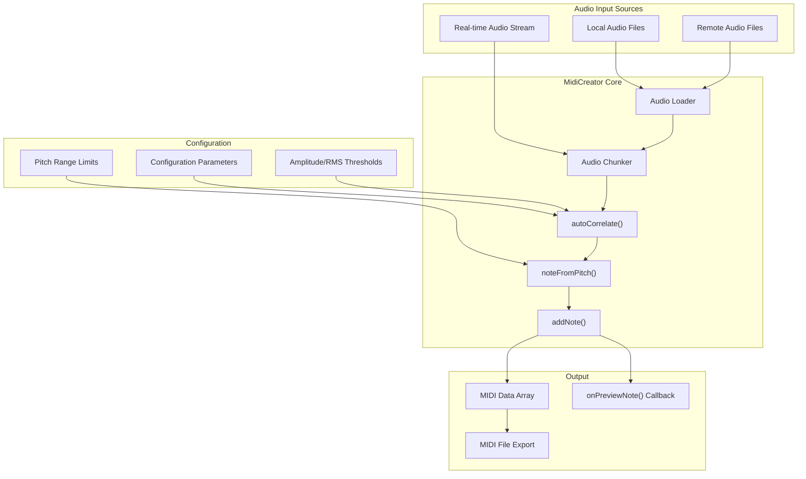
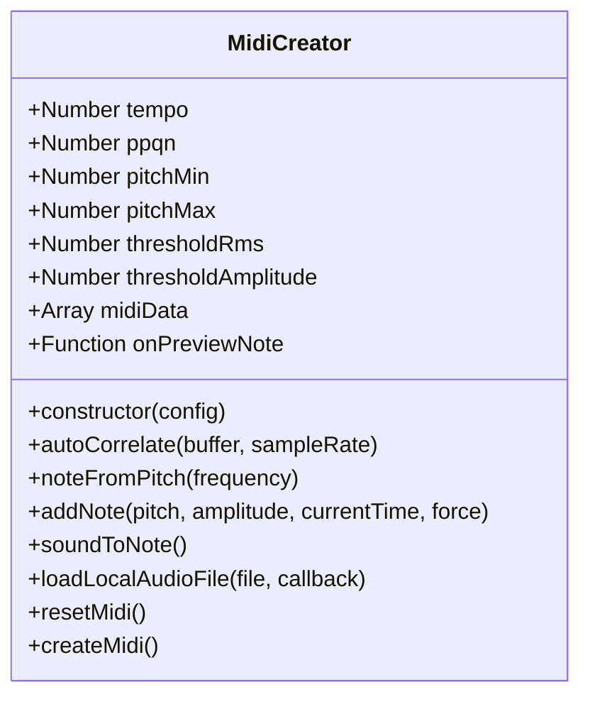
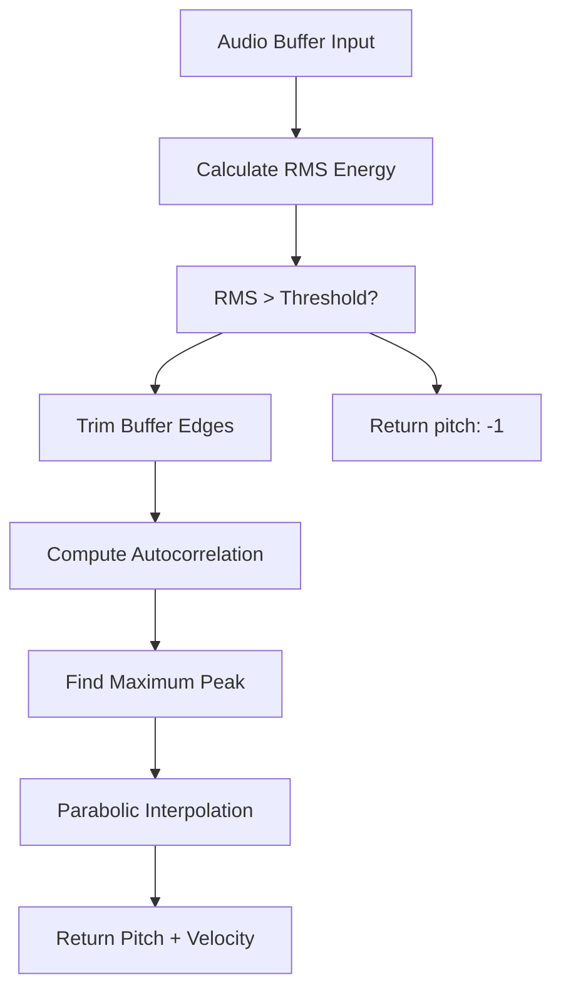
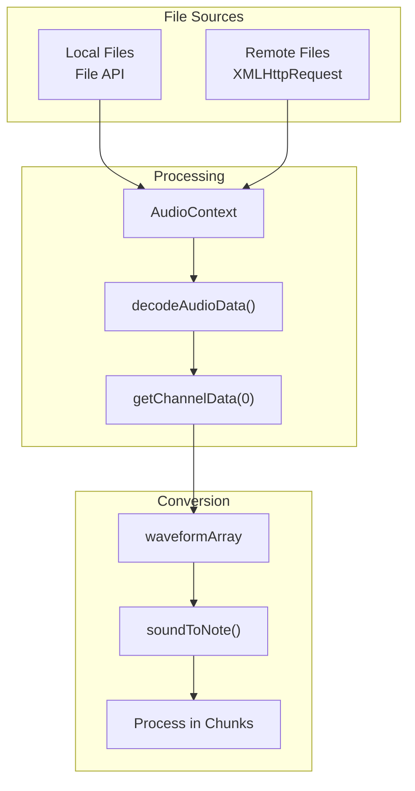

# Audio-to-MIDI Conversion

> **Relevant source files**
> * [docs/js/midi-creator.js](https://github.com/Jus-Be/orinayo/blob/3c7fbee9/docs/js/midi-creator.js)

This document covers OrinAyo's audio-to-MIDI conversion system, which analyzes audio input in real-time or from audio files and converts detected pitches into MIDI note events. The system uses autocorrelation-based pitch detection to identify musical notes from audio signals and generates corresponding MIDI data.

For broader audio processing capabilities, see [Audio Processing Pipeline](/Jus-Be/orinayo/3.2-audio-processing-pipeline). For MIDI file handling and parsing, see [MIDI Processing](/Jus-Be/orinayo/4.1-midi-processing).

## Architecture Overview

The audio-to-MIDI conversion system is implemented as a self-contained module that can process both real-time audio streams and pre-recorded audio files. The system operates by analyzing audio in chunks, detecting fundamental frequencies using autocorrelation, and converting those frequencies to MIDI note events.



**Sources:** [docs/js/midi-creator.js L1-L649](https://github.com/Jus-Be/orinayo/blob/3c7fbee9/docs/js/midi-creator.js#L1-L649)

## Core Components

### MidiCreator Class

The `MidiCreator` class serves as the primary interface for audio-to-MIDI conversion functionality. It encapsulates all configuration parameters, processing methods, and output generation capabilities.

| Component | Purpose | Key Methods |
| --- | --- | --- |
| Configuration | Audio processing parameters | Constructor, `setMinNote()`, `setMaxNote()` |
| Pitch Detection | Frequency analysis | `autoCorrelate()`, `fixPitch()` |
| Note Conversion | Frequency to MIDI mapping | `noteFromPitch()`, `noteFromNumber()` |
| MIDI Generation | Note event creation | `addNote()`, `createMidi()` |
| File Processing | Audio file loading | `loadLocalAudioFile()`, `loadRemoteAudioFile()` |



**Sources:** [docs/js/midi-creator.js L1-L128](https://github.com/Jus-Be/orinayo/blob/3c7fbee9/docs/js/midi-creator.js#L1-L128)

 [docs/js/midi-creator.js L200-L420](https://github.com/Jus-Be/orinayo/blob/3c7fbee9/docs/js/midi-creator.js#L200-L420)

## Pitch Detection Algorithm

The system uses the ACF2+ (Autocorrelation Function) algorithm for pitch detection, implemented in the `autoCorrelate()` method. This approach analyzes the periodic structure of audio signals to identify fundamental frequencies.

### Processing Workflow



### Algorithm Implementation

The autocorrelation process involves several key steps:

1. **Signal Validation**: RMS energy calculation to ensure sufficient signal strength
2. **Buffer Trimming**: Remove low-amplitude regions from buffer edges
3. **Autocorrelation Calculation**: Compute correlation coefficients for different delay values
4. **Peak Detection**: Identify the highest correlation peak after the first zero crossing
5. **Pitch Refinement**: Use parabolic interpolation for sub-sample accuracy

**Sources:** [docs/js/midi-creator.js L428-L507](https://github.com/Jus-Be/orinayo/blob/3c7fbee9/docs/js/midi-creator.js#L428-L507)

## MIDI Generation Process

The conversion from detected pitches to MIDI events involves several processing stages to ensure musical accuracy and timing precision.

### Note Processing Pipeline

```

```

### Key Processing Features

* **Pitch Averaging**: Multiple pitch detections are averaged before note generation to reduce noise
* **Range Filtering**: Only pitches within configured `pitchMin` and `pitchMax` range are processed
* **Temporal Filtering**: Minimum interval between notes prevents excessive note triggering
* **Velocity Mapping**: Amplitude values are converted to MIDI velocity (40-127 range)

**Sources:** [docs/js/midi-creator.js L235-L342](https://github.com/Jus-Be/orinayo/blob/3c7fbee9/docs/js/midi-creator.js#L235-L342)

 [docs/js/midi-creator.js L247-L277](https://github.com/Jus-Be/orinayo/blob/3c7fbee9/docs/js/midi-creator.js#L247-L277)

## Configuration Parameters

The `MidiCreator` class accepts extensive configuration options to optimize performance for different audio sources and musical contexts.

### Primary Configuration Options

| Parameter | Default | Purpose | Range |
| --- | --- | --- | --- |
| `tempo` | 130 | Beats per minute for timing | 1-720 |
| `ppqn` | 96 | Pulses per quarter note | Positive integer |
| `sampleRate` | 32000 | Audio sample rate in Hz | Standard rates |
| `resolution` | 32 | Time resolution for processing | Positive integer |
| `pitchMin` | 20 | Minimum frequency in Hz | 20-20000 |
| `pitchMax` | 20000 | Maximum frequency in Hz | 20-20000 |
| `thresholdRms` | 0.01 | RMS energy threshold | 0.0-1.0 |
| `thresholdAmplitude` | 0.2 | Amplitude threshold | 0.0-1.0 |
| `minSample` | 500 | Minimum samples for analysis | Positive integer |

### Timing and Resolution

The system calculates processing parameters based on musical timing:

* **Bar Duration**: `60 / (tempo * ppqn)` milliseconds per tick
* **Minimum Interval**: `60000 / (tempo * resolution)` milliseconds between notes
* **Chunk Size**: `(sampleRate * 240) / (tempo * resolution)` samples per chunk

**Sources:** [docs/js/midi-creator.js L1-L102](https://github.com/Jus-Be/orinayo/blob/3c7fbee9/docs/js/midi-creator.js#L1-L102)

 [docs/js/midi-creator.js L570-L581](https://github.com/Jus-Be/orinayo/blob/3c7fbee9/docs/js/midi-creator.js#L570-L581)

## File Processing Capabilities

The system supports both local and remote audio file processing through dedicated loading methods.

### Audio File Loading



### Processing Methods

* **`loadLocalAudioFile()`**: Processes files selected via HTML file input using FileReader API
* **`loadRemoteAudioFile()`**: Downloads and processes audio files from URLs using XMLHttpRequest
* **`soundToNote()`**: Main processing method that chunks audio data and converts to MIDI notes

The system automatically handles audio decoding and extracts the first channel for monophonic analysis.

**Sources:** [docs/js/midi-creator.js L514-L564](https://github.com/Jus-Be/orinayo/blob/3c7fbee9/docs/js/midi-creator.js#L514-L564)

 [docs/js/midi-creator.js L587-L615](https://github.com/Jus-Be/orinayo/blob/3c7fbee9/docs/js/midi-creator.js#L587-L615)

## Integration Points

The audio-to-MIDI conversion system integrates with OrinAyo's broader audio processing architecture through several key interfaces:

* **Real-time Processing**: Can be integrated with WebAudio streams for live conversion
* **Preview Callbacks**: `onPreviewNote()` function allows real-time note preview during conversion
* **MIDI Output**: Generated MIDI data can be fed into OrinAyo's MIDI processing pipeline
* **Configuration API**: Dynamic parameter adjustment for different audio sources and musical styles

**Sources:** [docs/js/midi-creator.js L118](https://github.com/Jus-Be/orinayo/blob/3c7fbee9/docs/js/midi-creator.js#L118-L118)

 [docs/js/midi-creator.js L337](https://github.com/Jus-Be/orinayo/blob/3c7fbee9/docs/js/midi-creator.js#L337-L337)