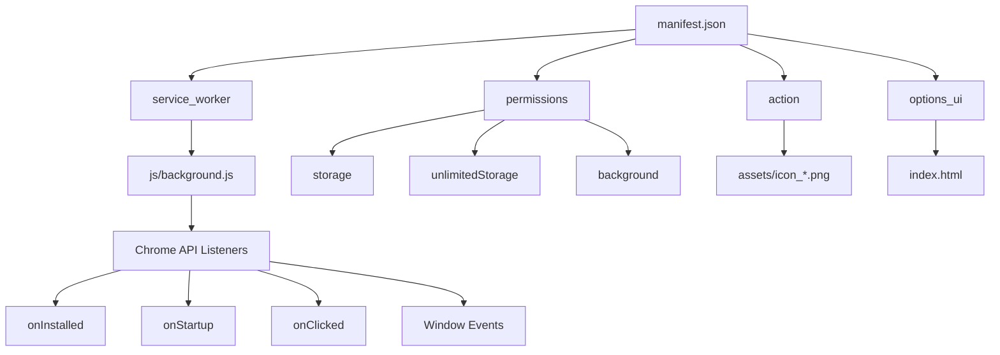
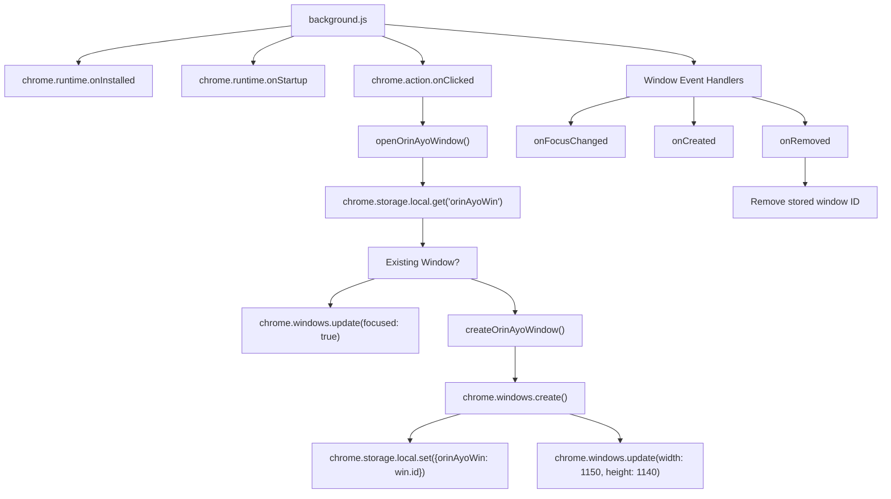
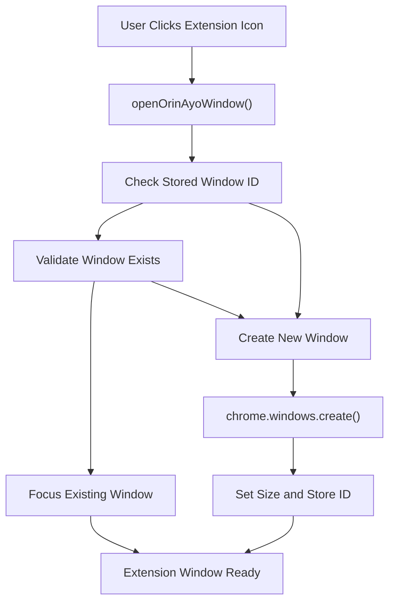
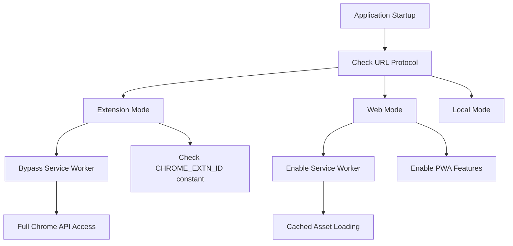
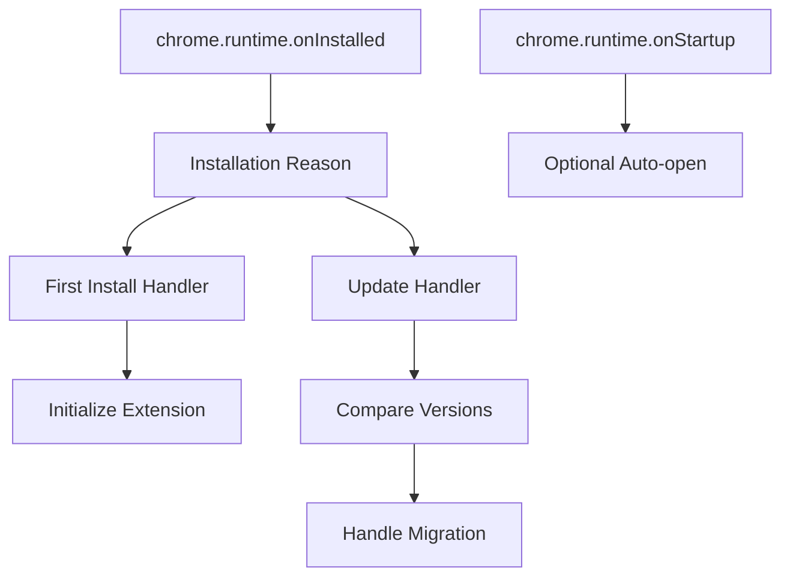

# Chrome Extension

> **Relevant source files**
> * [docs/css/main.css](https://github.com/Jus-Be/orinayo/blob/3c7fbee9/docs/css/main.css)
> * [docs/index.html](https://github.com/Jus-Be/orinayo/blob/3c7fbee9/docs/index.html)
> * [docs/js/audio_looper.js](https://github.com/Jus-Be/orinayo/blob/3c7fbee9/docs/js/audio_looper.js)
> * [docs/js/background.js](https://github.com/Jus-Be/orinayo/blob/3c7fbee9/docs/js/background.js)
> * [docs/js/index.js](https://github.com/Jus-Be/orinayo/blob/3c7fbee9/docs/js/index.js)
> * [docs/js/styles.js](https://github.com/Jus-Be/orinayo/blob/3c7fbee9/docs/js/styles.js)
> * [docs/manifest.json](https://github.com/Jus-Be/orinayo/blob/3c7fbee9/docs/manifest.json)
> * [docs/settings/options.js](https://github.com/Jus-Be/orinayo/blob/3c7fbee9/docs/settings/options.js)

This document covers OrinAyo's Chrome extension implementation, which provides a desktop-like experience for the web application through a browser extension popup window. For information about the Progressive Web App implementation, see [Progressive Web App](/Jus-Be/orinayo/6.1-progressive-web-app). For details about service worker functionality and caching, see [Service Worker & Caching](/Jus-Be/orinayo/6.3-service-worker-and-caching).

## Purpose and Architecture

The Chrome extension serves as an alternative deployment method for OrinAyo, allowing users to launch the application in a dedicated popup window with enhanced permissions and desktop integration. The extension uses Manifest V3 with a background service worker to manage window lifecycle and provide persistent storage capabilities.

### Extension Manifest Configuration

**Extension Manifest Structure**
Sources: [docs/manifest.json L1-L31](https://github.com/Jus-Be/orinayo/blob/3c7fbee9/docs/manifest.json#L1-L31)

| Property | Value | Purpose |
| --- | --- | --- |
| `manifest_version` | 3 | Uses latest Manifest V3 specification |
| `background.service_worker` | `./js/background.js` | Background script for extension logic |
| `permissions` | `["background", "storage", "unlimitedStorage"]` | Required Chrome API access |
| `options_ui.page` | `index.html` | Main application serves as options page |
| `action.default_icon` | Icon assets | Extension toolbar button configuration |

### Background Service Worker Implementation

The extension's core functionality is implemented in the background service worker that handles Chrome extension lifecycle events and window management.

**Background Service Worker Event Handlers**
Sources: [docs/js/background.js L34-L126](https://github.com/Jus-Be/orinayo/blob/3c7fbee9/docs/js/background.js#L34-L126)

### Window Management System

The extension implements a sophisticated window management system to provide a desktop application-like experience:

**Window Creation and Management Functions**
Sources: [docs/js/background.js L88-L125](https://github.com/Jus-Be/orinayo/blob/3c7fbee9/docs/js/background.js#L88-L125)

### Protocol Detection and Service Worker Integration

The main application includes Chrome extension detection logic to handle different deployment contexts:

**Extension Detection Logic**
Sources: [docs/js/index.js L6](https://github.com/Jus-Be/orinayo/blob/3c7fbee9/docs/js/index.js#L6-L6)

 [docs/js/background.js L34](https://github.com/Jus-Be/orinayo/blob/3c7fbee9/docs/js/background.js#L34-L34)

### Extension-Specific Features

The Chrome extension provides several advantages over the web application:

**Enhanced Permissions and Storage**

* Unlimited storage quota for audio assets and user data
* Background processing capabilities through service worker
* Access to Chrome-specific APIs for enhanced functionality

**Desktop Integration**

* Dedicated application window with custom sizing (1150x1140 pixels)
* Window state persistence across browser sessions
* Integration with browser extension management

**Window Lifecycle Management**

* Automatic window focus when extension icon is clicked
* Prevention of duplicate windows through storage-based tracking
* Proper cleanup of window references when windows are closed

Sources: [docs/manifest.json L11-L15](https://github.com/Jus-Be/orinayo/blob/3c7fbee9/docs/manifest.json#L11-L15)

 [docs/js/background.js L95](https://github.com/Jus-Be/orinayo/blob/3c7fbee9/docs/js/background.js#L95-L95)

 [docs/js/background.js L72-L79](https://github.com/Jus-Be/orinayo/blob/3c7fbee9/docs/js/background.js#L72-L79)

### Installation and Update Handling

The extension includes handlers for installation and update events:

**Installation Event Handling**
Sources: [docs/js/background.js L36-L57](https://github.com/Jus-Be/orinayo/blob/3c7fbee9/docs/js/background.js#L36-L57)

The Chrome extension implementation provides OrinAyo with a robust desktop application experience while maintaining the flexibility of web technologies. The extension's window management system, enhanced permissions, and integration with Chrome APIs create a seamless user experience that bridges web and desktop application paradigms.