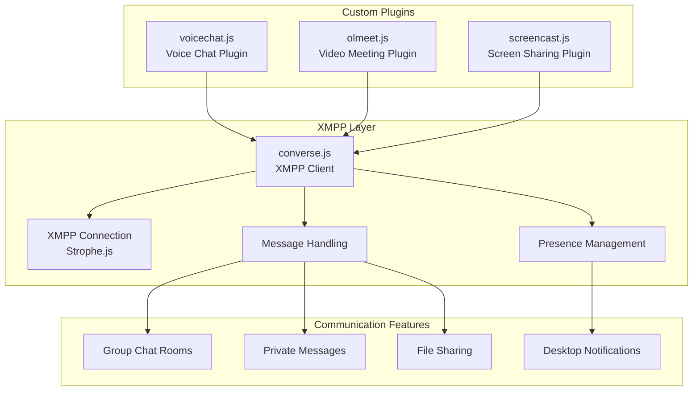
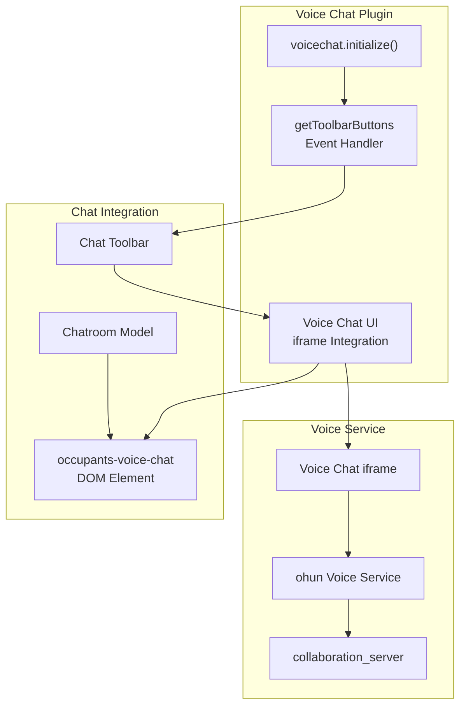
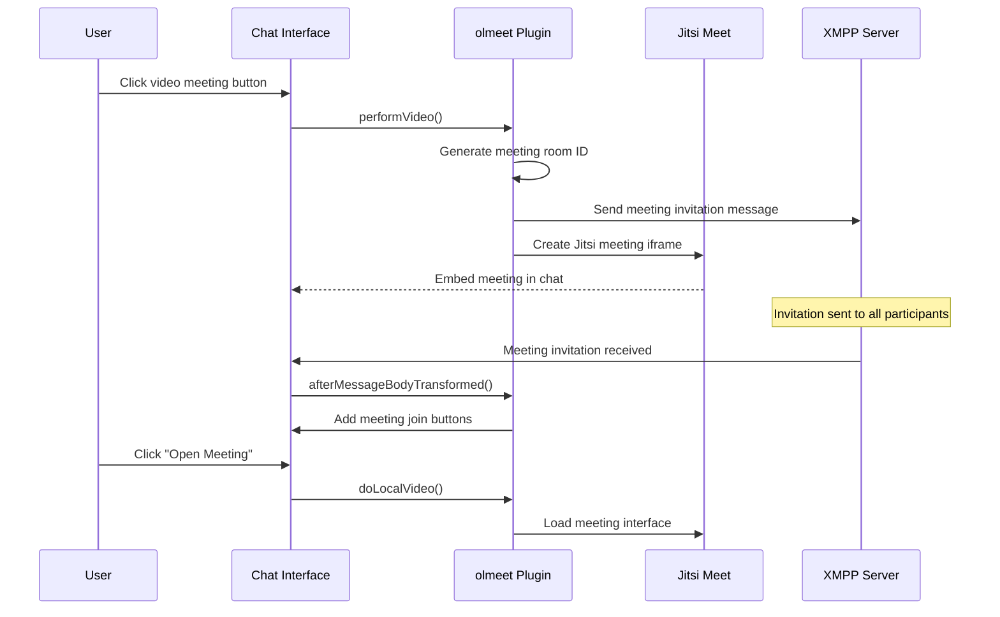
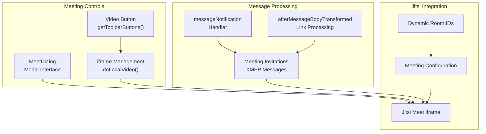
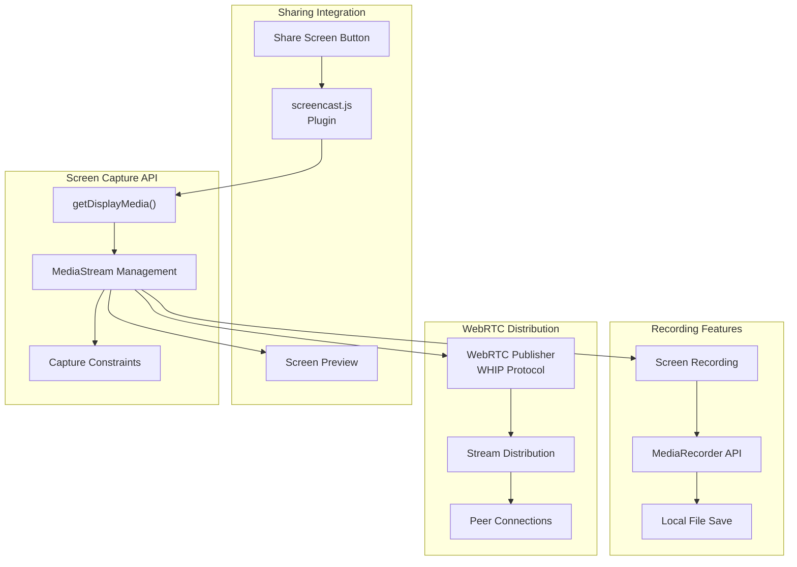
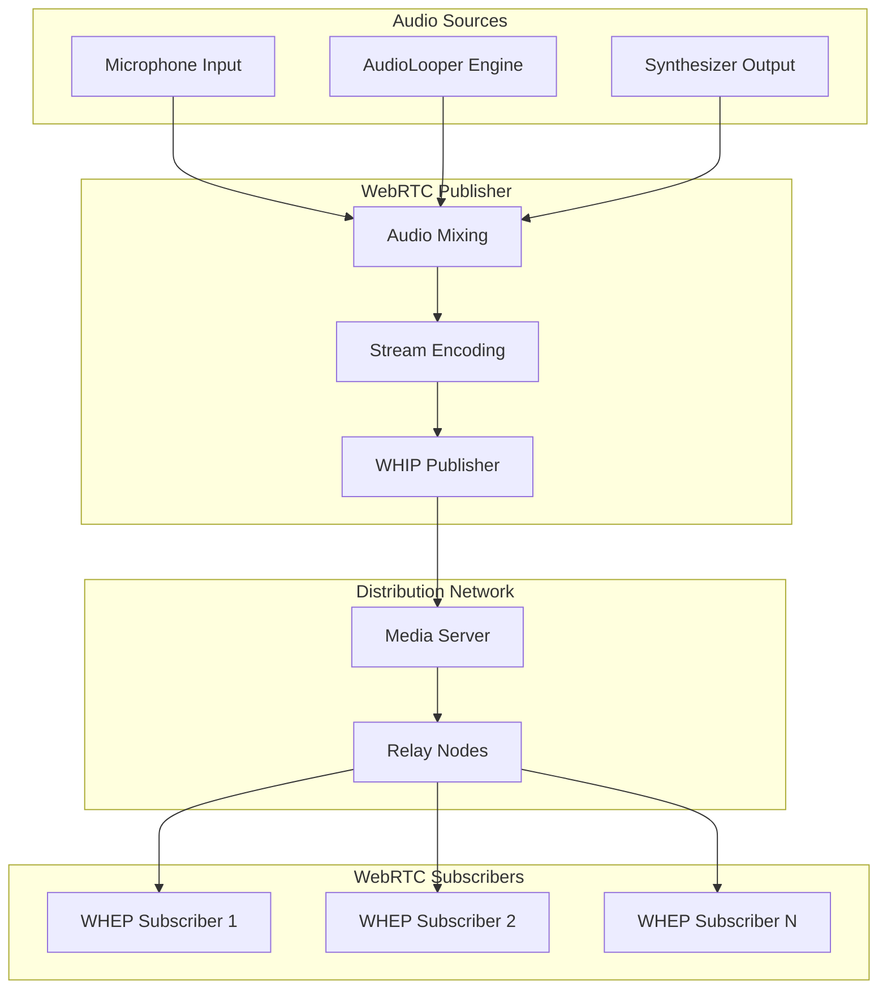
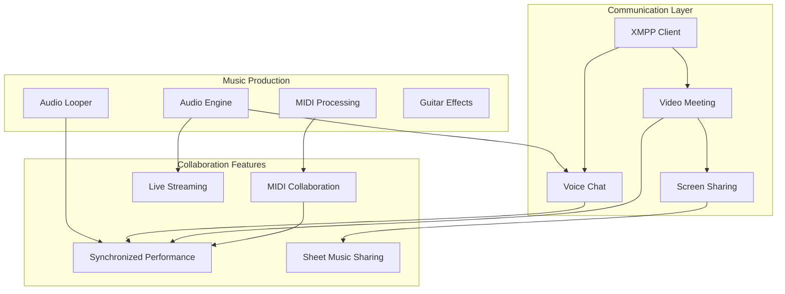

# Communication & Collaboration

> **Relevant source files**
> * [docs/dist/converse.css](https://github.com/Jus-Be/orinayo/blob/3c7fbee9/docs/dist/converse.css)
> * [docs/dist/converse.css.map](https://github.com/Jus-Be/orinayo/blob/3c7fbee9/docs/dist/converse.css.map)
> * [docs/dist/converse.js](https://github.com/Jus-Be/orinayo/blob/3c7fbee9/docs/dist/converse.js)
> * [docs/dist/converse.js.map](https://github.com/Jus-Be/orinayo/blob/3c7fbee9/docs/dist/converse.js.map)
> * [docs/dist/converse.min.css](https://github.com/Jus-Be/orinayo/blob/3c7fbee9/docs/dist/converse.min.css)
> * [docs/dist/converse.min.css.map](https://github.com/Jus-Be/orinayo/blob/3c7fbee9/docs/dist/converse.min.css.map)
> * [docs/dist/converse.min.js](https://github.com/Jus-Be/orinayo/blob/3c7fbee9/docs/dist/converse.min.js)
> * [docs/dist/converse.min.js.map](https://github.com/Jus-Be/orinayo/blob/3c7fbee9/docs/dist/converse.min.js.map)
> * [docs/dist/locales/ca-LC_MESSAGES-converse-po.js](https://github.com/Jus-Be/orinayo/blob/3c7fbee9/docs/dist/locales/ca-LC_MESSAGES-converse-po.js)
> * [docs/dist/locales/ru-LC_MESSAGES-converse-po.js](https://github.com/Jus-Be/orinayo/blob/3c7fbee9/docs/dist/locales/ru-LC_MESSAGES-converse-po.js)
> * [docs/packages/olmeet/olmeet.js](https://github.com/Jus-Be/orinayo/blob/3c7fbee9/docs/packages/olmeet/olmeet.js)
> * [docs/packages/voicechat/voicechat.js](https://github.com/Jus-Be/orinayo/blob/3c7fbee9/docs/packages/voicechat/voicechat.js)

This document covers OrinAyo's real-time communication and collaboration systems, which enable musicians to connect, communicate, and perform together. The system integrates XMPP messaging, voice/video chat, screen sharing, and WebRTC streaming to support collaborative music making sessions.

For information about the core audio systems and MIDI processing, see [Audio Systems](/Jus-Be/orinayo/4-audio-systems). For details about platform deployment and service workers, see [Platform Support](/Jus-Be/orinayo/6-platform-support).

## XMPP Communication Foundation

OrinAyo uses Converse.js as its XMPP client foundation, providing text messaging, presence awareness, and group chat functionality. The system extends the base Converse.js functionality with custom plugins for music collaboration features.

The XMPP integration provides the foundation for all communication features, with plugins extending functionality for multimedia collaboration.

Sources: [docs/dist/converse.js L1](https://github.com/Jus-Be/orinayo/blob/3c7fbee9/docs/dist/converse.js#L1-L1)

 [docs/packages/voicechat/voicechat.js L1-L96](https://github.com/Jus-Be/orinayo/blob/3c7fbee9/docs/packages/voicechat/voicechat.js#L1-L96)

 [docs/packages/olmeet/olmeet.js L1-L481](https://github.com/Jus-Be/orinayo/blob/3c7fbee9/docs/packages/olmeet/olmeet.js#L1-L481)

## Voice Chat Integration

The voice chat system integrates audio communication directly into XMPP chat rooms through the `voicechat` plugin. This plugin adds voice chat capabilities to group conversations, allowing musicians to communicate while collaborating.

### Voice Chat Plugin Architecture

The `performAudio` function handles voice chat activation, creating an iframe that connects to the voice service based on the chat room's JID.

Sources: [docs/packages/voicechat/voicechat.js L43-L95](https://github.com/Jus-Be/orinayo/blob/3c7fbee9/docs/packages/voicechat/voicechat.js#L43-L95)

 [docs/packages/voicechat/voicechat.js L18-L33](https://github.com/Jus-Be/orinayo/blob/3c7fbee9/docs/packages/voicechat/voicechat.js#L18-L33)

### Voice Chat Implementation Details

| Component | Function | Key Features |
| --- | --- | --- |
| `voicechat.js` | Voice chat plugin | Toolbar integration, iframe management |
| `performAudio()` | Chat activation | Dynamic iframe creation, server URL handling |
| `ohun` service | Voice backend | WebRTC audio streaming, room-based channels |
| Chat toolbar | UI integration | Toggle button, visual feedback |

The voice chat system uses iframe embedding to integrate external voice services while maintaining security boundaries and chat context.

Sources: [docs/packages/voicechat/voicechat.js L43-L95](https://github.com/Jus-Be/orinayo/blob/3c7fbee9/docs/packages/voicechat/voicechat.js#L43-L95)

## Video Meeting System

The video meeting functionality is implemented through the `olmeet` plugin, which integrates Jitsi Meet video conferencing into XMPP chat sessions. This enables face-to-face collaboration during music sessions.

### Meeting Integration Flow

The system supports both embedded meetings within chat windows and external meeting windows, with automatic invitation distribution through XMPP.

Sources: [docs/packages/olmeet/olmeet.js L151-L197](https://github.com/Jus-Be/orinayo/blob/3c7fbee9/docs/packages/olmeet/olmeet.js#L151-L197)

 [docs/packages/olmeet/olmeet.js L112-L138](https://github.com/Jus-Be/orinayo/blob/3c7fbee9/docs/packages/olmeet/olmeet.js#L112-L138)

### Meeting Plugin Components

The plugin generates unique meeting room IDs and handles both meeting creation and invitation processing through XMPP message parsing.

Sources: [docs/packages/olmeet/olmeet.js L177-L197](https://github.com/Jus-Be/orinayo/blob/3c7fbee9/docs/packages/olmeet/olmeet.js#L177-L197)

 [docs/packages/olmeet/olmeet.js L209-L428](https://github.com/Jus-Be/orinayo/blob/3c7fbee9/docs/packages/olmeet/olmeet.js#L209-L428)

## Screen Sharing Capabilities

Screen sharing functionality enables users to share their desktop, application windows, or browser tabs during collaborative sessions. This is particularly useful for sharing digital audio workstations, sheet music, or other visual content.

### Screen Sharing Architecture

Screen sharing integrates with the WebRTC streaming infrastructure to distribute shared content to multiple participants in real-time.

Sources: Based on system architecture diagrams and WebRTC integration patterns

## WebRTC Streaming Infrastructure

The WebRTC streaming system provides low-latency audio and video distribution for live performance scenarios. It implements both WHIP (WebRTC-HTTP Ingestion Protocol) and WHEP (WebRTC-HTTP Egress Protocol) for standardized streaming.

### Streaming Data Flow

The streaming system captures multiple audio sources, mixes them, and distributes the combined stream to multiple subscribers with minimal latency.

Sources: Based on system architecture diagrams showing WebRTC streaming components

## Integration with Music Production

The communication systems are tightly integrated with OrinAyo's music production capabilities, enabling seamless collaboration during live performance and composition sessions.

### Collaboration Workflow Integration

The communication systems work in conjunction with the audio engine to enable real-time collaborative music making with synchronized audio, visual feedback, and coordination tools.

Sources: Based on system architecture showing integration between communication and audio systems

## Configuration and Deployment

The communication systems require configuration of XMPP servers, voice chat services, and WebRTC infrastructure. The system supports multiple deployment scenarios from local development to distributed production environments.

### Service Configuration

| Service | Configuration | Default | Purpose |
| --- | --- | --- | --- |
| XMPP Server | `collaboration_server.server_url` | Local | Messaging and presence |
| Voice Chat | `ohun` service URL | Embedded | Audio communication |
| Video Meeting | `olmeet_url` | `meet.jit.si` | Video conferencing |
| WebRTC | WHIP/WHEP endpoints | Auto-detected | Live streaming |

The system automatically detects available services and provides fallback options when external services are unavailable.

Sources: [docs/packages/voicechat/voicechat.js L47](https://github.com/Jus-Be/orinayo/blob/3c7fbee9/docs/packages/voicechat/voicechat.js#L47-L47)

 [docs/packages/olmeet/olmeet.js L438-L443](https://github.com/Jus-Be/orinayo/blob/3c7fbee9/docs/packages/olmeet/olmeet.js#L438-L443)