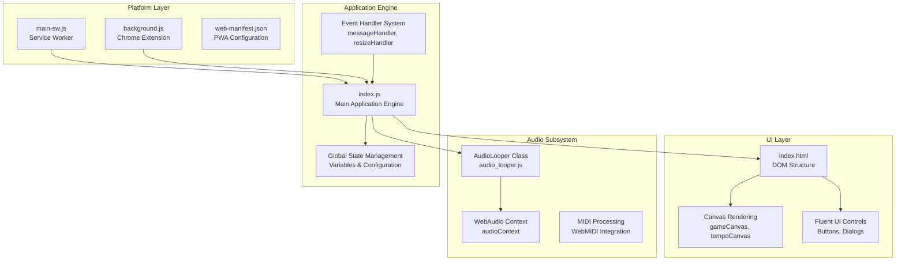
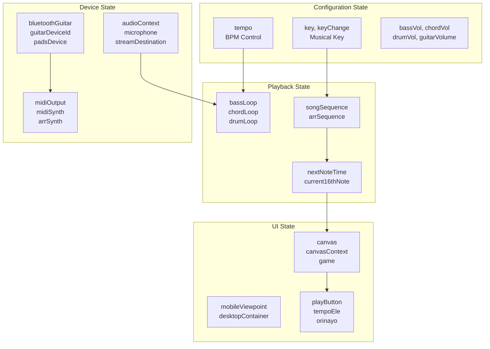
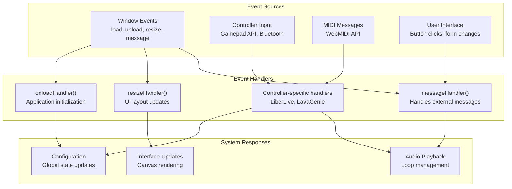
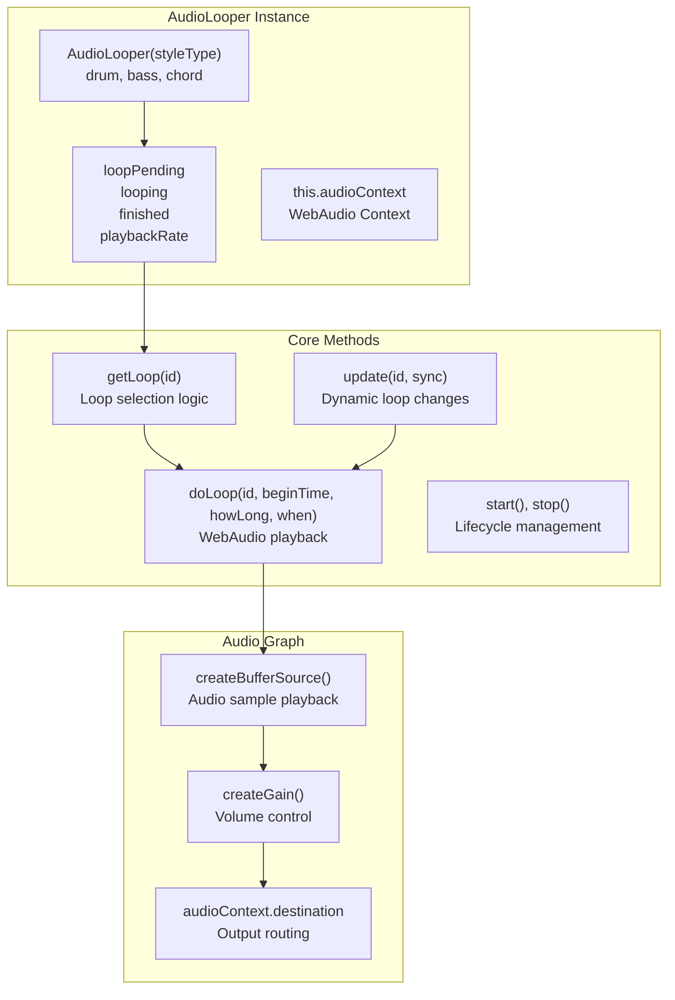
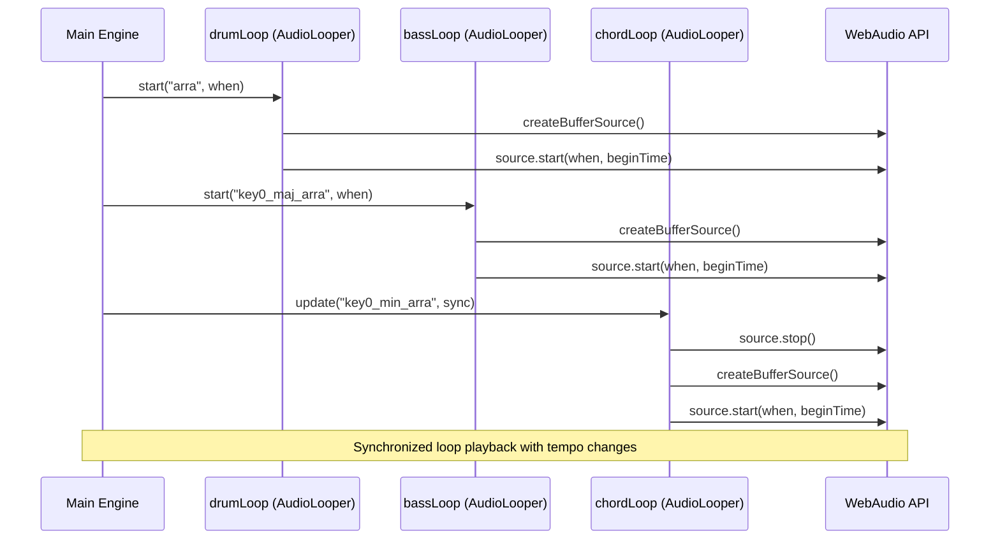
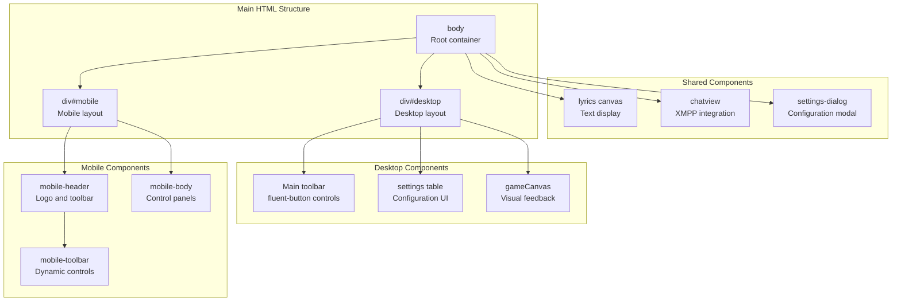
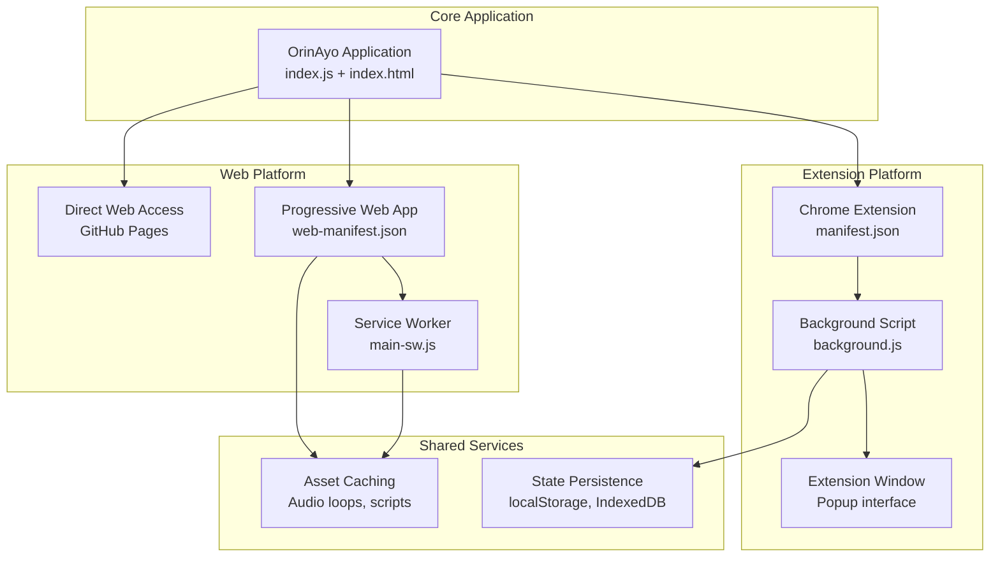
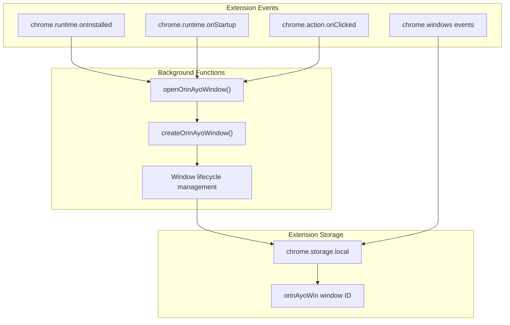
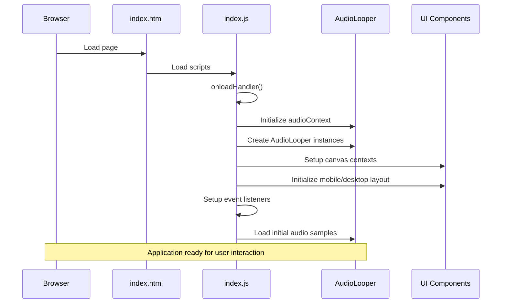

# Core Architecture

> **Relevant source files**
> * [docs/css/main.css](https://github.com/Jus-Be/orinayo/blob/3c7fbee9/docs/css/main.css)
> * [docs/index.html](https://github.com/Jus-Be/orinayo/blob/3c7fbee9/docs/index.html)
> * [docs/js/audio_looper.js](https://github.com/Jus-Be/orinayo/blob/3c7fbee9/docs/js/audio_looper.js)
> * [docs/js/background.js](https://github.com/Jus-Be/orinayo/blob/3c7fbee9/docs/js/background.js)
> * [docs/js/index.js](https://github.com/Jus-Be/orinayo/blob/3c7fbee9/docs/js/index.js)
> * [docs/js/styles.js](https://github.com/Jus-Be/orinayo/blob/3c7fbee9/docs/js/styles.js)
> * [docs/manifest.json](https://github.com/Jus-Be/orinayo/blob/3c7fbee9/docs/manifest.json)
> * [docs/settings/options.js](https://github.com/Jus-Be/orinayo/blob/3c7fbee9/docs/settings/options.js)

This document provides a technical overview of OrinAyo's core application architecture, covering the main application engine, audio processing systems, and user interface components. It explains how these systems interact to create a live music production environment in the browser.

For information about specific input controllers and device integration, see [Input Controllers](/Jus-Be/orinayo/2.3-input-controllers). For detailed audio processing workflows, see [Audio Processing Pipeline](/Jus-Be/orinayo/3.2-audio-processing-pipeline). For UI-specific implementation details, see [UI Components](/Jus-Be/orinayo/3.3-ui-components).

## Application Structure Overview

OrinAyo follows a modular architecture built around a central application engine that coordinates between audio processing, user interface, and external device systems. The application runs as a single-page web application with support for multiple deployment targets.

### Core System Architecture

**Sources:** [docs/js/index.js L1-L7341](https://github.com/Jus-Be/orinayo/blob/3c7fbee9/docs/js/index.js#L1-L7341)

 [docs/index.html L1-L298](https://github.com/Jus-Be/orinayo/blob/3c7fbee9/docs/index.html#L1-L298)

 [docs/js/audio_looper.js L1-L319](https://github.com/Jus-Be/orinayo/blob/3c7fbee9/docs/js/audio_looper.js#L1-L319)

 [docs/js/background.js L1-L126](https://github.com/Jus-Be/orinayo/blob/3c7fbee9/docs/js/background.js#L1-L126)

## Main Application Engine

The core application engine is implemented in `index.js` and serves as the central coordinator for all system components. It manages global state, handles events from multiple input sources, and orchestrates audio playback.

### Engine Components and Responsibilities

| Component | Primary Functions | Key Code Elements |
| --- | --- | --- |
| **Global State Management** | Configuration, device state, audio parameters | [docs/js/index.js L37-L164](https://github.com/Jus-Be/orinayo/blob/3c7fbee9/docs/js/index.js#L37-L164) |
| **Event Processing** | Window events, controller input, MIDI messages | [docs/js/index.js L339-L353](https://github.com/Jus-Be/orinayo/blob/3c7fbee9/docs/js/index.js#L339-L353) |
| **Audio Coordination** | WebAudio context, loop management, effects | [docs/js/index.js L193-L210](https://github.com/Jus-Be/orinayo/blob/3c7fbee9/docs/js/index.js#L193-L210) |
| **Device Integration** | Bluetooth controllers, MIDI devices, Stream Deck | [docs/js/index.js L465-L679](https://github.com/Jus-Be/orinayo/blob/3c7fbee9/docs/js/index.js#L465-L679) |

### Global State Architecture

**Sources:** [docs/js/index.js L37-L164](https://github.com/Jus-Be/orinayo/blob/3c7fbee9/docs/js/index.js#L37-L164)

 [docs/js/index.js L193-L210](https://github.com/Jus-Be/orinayo/blob/3c7fbee9/docs/js/index.js#L193-L210)

 [docs/js/index.js L250-L258](https://github.com/Jus-Be/orinayo/blob/3c7fbee9/docs/js/index.js#L250-L258)

### Event System Architecture

The application implements a comprehensive event handling system that processes input from multiple sources and coordinates responses across the system.

**Sources:** [docs/js/index.js L339-L353](https://github.com/Jus-Be/orinayo/blob/3c7fbee9/docs/js/index.js#L339-L353)

 [docs/js/index.js L465-L679](https://github.com/Jus-Be/orinayo/blob/3c7fbee9/docs/js/index.js#L465-L679)

 [docs/js/index.js L681-L952](https://github.com/Jus-Be/orinayo/blob/3c7fbee9/docs/js/index.js#L681-L952)

## Audio System Integration

The audio subsystem centers around the `AudioLooper` class, which manages loop-based audio playback coordinated with the WebAudio API. The main engine interfaces with audio through several key integration points.

### AudioLooper Class Architecture

**Sources:** [docs/js/audio_looper.js L1-L43](https://github.com/Jus-Be/orinayo/blob/3c7fbee9/docs/js/audio_looper.js#L1-L43)

 [docs/js/audio_looper.js L44-L143](https://github.com/Jus-Be/orinayo/blob/3c7fbee9/docs/js/audio_looper.js#L44-L143)

 [docs/js/audio_looper.js L216-L245](https://github.com/Jus-Be/orinayo/blob/3c7fbee9/docs/js/audio_looper.js#L216-L245)

### Audio Processing Flow

The main engine coordinates three `AudioLooper` instances for drums, bass, and chords, managing their synchronization and parameter updates.

**Sources:** [docs/js/audio_looper.js L216-L245](https://github.com/Jus-Be/orinayo/blob/3c7fbee9/docs/js/audio_looper.js#L216-L245)

 [docs/js/audio_looper.js L165-L214](https://github.com/Jus-Be/orinayo/blob/3c7fbee9/docs/js/audio_looper.js#L165-L214)

 [docs/js/audio_looper.js L277-L307](https://github.com/Jus-Be/orinayo/blob/3c7fbee9/docs/js/audio_looper.js#L277-L307)

## User Interface Architecture

The UI system is built around a responsive HTML structure that adapts between desktop and mobile layouts, with canvas-based game interfaces and Fluent UI controls for user interaction.

### HTML Structure and Component Organization

**Sources:** [docs/index.html L19-L86](https://github.com/Jus-Be/orinayo/blob/3c7fbee9/docs/index.html#L19-L86)

 [docs/index.html L87-L221](https://github.com/Jus-Be/orinayo/blob/3c7fbee9/docs/index.html#L87-L221)

 [docs/index.html L137-L150](https://github.com/Jus-Be/orinayo/blob/3c7fbee9/docs/index.html#L137-L150)

### Canvas System Integration

The application uses multiple canvas elements for different rendering purposes, managed through the main engine's canvas context.

| Canvas Element | Purpose | Key Variables | Integration Points |
| --- | --- | --- | --- |
| `gameCanvas` | Game controller visualization | [docs/js/index.js L250-L254](https://github.com/Jus-Be/orinayo/blob/3c7fbee9/docs/js/index.js#L250-L254) | Guitar Hero-style interface |
| `tempoCanvas` | Tempo and beat visualization | [docs/js/index.js L189](https://github.com/Jus-Be/orinayo/blob/3c7fbee9/docs/js/index.js#L189-L189) | Metronome display |
| `lyrics` | Song lyrics and chord display | [docs/js/index.js L108-L110](https://github.com/Jus-Be/orinayo/blob/3c7fbee9/docs/js/index.js#L108-L110) | ChordPro rendering |

**Sources:** [docs/index.html L224](https://github.com/Jus-Be/orinayo/blob/3c7fbee9/docs/index.html#L224-L224)

 [docs/index.html L241](https://github.com/Jus-Be/orinayo/blob/3c7fbee9/docs/index.html#L241-L241)

 [docs/index.html L142](https://github.com/Jus-Be/orinayo/blob/3c7fbee9/docs/index.html#L142-L142)

 [docs/js/index.js L250-L254](https://github.com/Jus-Be/orinayo/blob/3c7fbee9/docs/js/index.js#L250-L254)

## Platform Integration Layer

OrinAyo supports multiple deployment targets through a platform abstraction layer that handles Progressive Web App features, Chrome Extension functionality, and Service Worker caching.

### Multi-Platform Deployment Architecture

**Sources:** [docs/js/background.js L34-L80](https://github.com/Jus-Be/orinayo/blob/3c7fbee9/docs/js/background.js#L34-L80)

 [docs/manifest.json L1-L31](https://github.com/Jus-Be/orinayo/blob/3c7fbee9/docs/manifest.json#L1-L31)

 [docs/js/background.js L88-L125](https://github.com/Jus-Be/orinayo/blob/3c7fbee9/docs/js/background.js#L88-L125)

### Chrome Extension Integration

The Chrome Extension platform provides additional capabilities through the background service worker and dedicated window management.

**Sources:** [docs/js/background.js L36-L62](https://github.com/Jus-Be/orinayo/blob/3c7fbee9/docs/js/background.js#L36-L62)

 [docs/js/background.js L88-L125](https://github.com/Jus-Be/orinayo/blob/3c7fbee9/docs/js/background.js#L88-L125)

 [docs/js/background.js L72-L79](https://github.com/Jus-Be/orinayo/blob/3c7fbee9/docs/js/background.js#L72-L79)

## System Initialization and Lifecycle

The application follows a structured initialization sequence that sets up all subsystems in the correct order and manages their lifecycle throughout the application's runtime.

### Application Bootstrap Sequence

**Sources:** [docs/js/index.js L339](https://github.com/Jus-Be/orinayo/blob/3c7fbee9/docs/js/index.js#L339-L339)

 [docs/js/index.js L193-L210](https://github.com/Jus-Be/orinayo/blob/3c7fbee9/docs/js/index.js#L193-L210)

 [docs/js/audio_looper.js L1-L12](https://github.com/Jus-Be/orinayo/blob/3c7fbee9/docs/js/audio_looper.js#L1-L12)