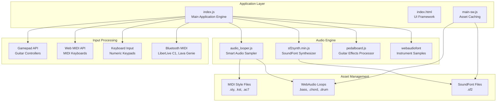
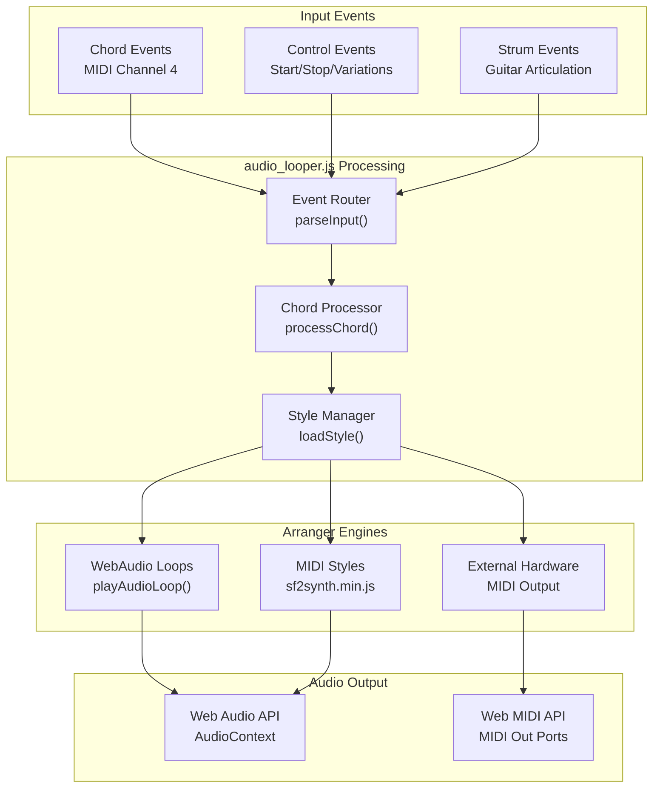

# Getting Started

> **Relevant source files**
> * [README.md](https://github.com/Jus-Be/orinayo/blob/3c7fbee9/README.md)
> * [USER-GUIDE.md](https://github.com/Jus-Be/orinayo/blob/3c7fbee9/USER-GUIDE.md)
> * [docs/assets/screenshots/feature12.png](https://github.com/Jus-Be/orinayo/blob/3c7fbee9/docs/assets/screenshots/feature12.png)
> * [docs/assets/screenshots/feature2.png](https://github.com/Jus-Be/orinayo/blob/3c7fbee9/docs/assets/screenshots/feature2.png)
> * [docs/assets/screenshots/feature3.png](https://github.com/Jus-Be/orinayo/blob/3c7fbee9/docs/assets/screenshots/feature3.png)
> * [docs/assets/screenshots/feature4.png](https://github.com/Jus-Be/orinayo/blob/3c7fbee9/docs/assets/screenshots/feature4.png)
> * [docs/assets/screenshots/feature6-1.jpeg](https://github.com/Jus-Be/orinayo/blob/3c7fbee9/docs/assets/screenshots/feature6-1.jpeg)
> * [docs/assets/screenshots/feature6.png](https://github.com/Jus-Be/orinayo/blob/3c7fbee9/docs/assets/screenshots/feature6.png)
> * [docs/assets/screenshots/feature7.png](https://github.com/Jus-Be/orinayo/blob/3c7fbee9/docs/assets/screenshots/feature7.png)
> * [docs/assets/screenshots/feature8.png](https://github.com/Jus-Be/orinayo/blob/3c7fbee9/docs/assets/screenshots/feature8.png)
> * [docs/assets/screenshots/num-pad.png](https://github.com/Jus-Be/orinayo/blob/3c7fbee9/docs/assets/screenshots/num-pad.png)
> * [docs/assets/screenshots/numpad-guide.png](https://github.com/Jus-Be/orinayo/blob/3c7fbee9/docs/assets/screenshots/numpad-guide.png)
> * [docs/css/stackedit.css](https://github.com/Jus-Be/orinayo/blob/3c7fbee9/docs/css/stackedit.css)
> * [docs/help.html](https://github.com/Jus-Be/orinayo/blob/3c7fbee9/docs/help.html)
> * [documentation/orinayo_quick_start.html](https://github.com/Jus-Be/orinayo/blob/3c7fbee9/documentation/orinayo_quick_start.html)
> * [documentation/orinayo_views.pptx](https://github.com/Jus-Be/orinayo/blob/3c7fbee9/documentation/orinayo_views.pptx)

This document provides a technical introduction to setting up and running the OrinAyo live music production web application. It covers installation methods, core architecture components, input device configuration, and the basic audio processing workflow. For comprehensive feature documentation, see [User Guide](/Jus-Be/orinayo/2.2-user-guide). For detailed architecture information, see [Core Architecture](/Jus-Be/orinayo/3-core-architecture).

## Installation Methods

OrinAyo supports multiple deployment platforms with identical functionality across all methods:

### Web Application

Access directly via browser at `https://jus-be.github.io/orinayo/index.html`. Requires Chrome or Edge for full Web MIDI API and WebAudio support.

### Progressive Web App (PWA)

Install from the web page using browser's "Install" or "Add to Home Screen" option. Provides offline functionality through service worker caching.

### Chrome Extension

Install from Chrome Web Store (ID: `mhnemaeacdgnkmoibfeodelijegakklp`). Runs in isolated extension window with full system permissions.

### Windows Desktop

Download and run `orinayo.exe` which uses WebView2 runtime to host the web application with native OS integration.

**Sources:** [README.md L13-L16](https://github.com/Jus-Be/orinayo/blob/3c7fbee9/README.md#L13-L16)

 [USER-GUIDE.md L10-L16](https://github.com/Jus-Be/orinayo/blob/3c7fbee9/USER-GUIDE.md#L10-L16)

## Core Application Architecture

OrinAyo follows a modular architecture with distinct components for input handling, audio processing, and output generation:

**Sources:** [docs/js/index.js](https://github.com/Jus-Be/orinayo/blob/3c7fbee9/docs/js/index.js)

 [docs/js/audio_looper.js](https://github.com/Jus-Be/orinayo/blob/3c7fbee9/docs/js/audio_looper.js)

 [docs/js/pedalboard.js](https://github.com/Jus-Be/orinayo/blob/3c7fbee9/docs/js/pedalboard.js)

 [docs/main-sw.js](https://github.com/Jus-Be/orinayo/blob/3c7fbee9/docs/main-sw.js)

## Input Controller Configuration

OrinAyo supports multiple input device types, each with specific setup requirements and chord mapping systems:

### Guitar Controllers (Gamepad API)

* **Logitech Guitar Hero Controllers**: USB connection, automatic detection via Gamepad API
* **Bluetooth Controllers**: CRKD Gibson Les Paul, PDP Riff Master - require browser Bluetooth permissions

#### Chord Mapping System

Guitar controllers use a 5-button fret system mapping Nashville number notation:

| Chord | Green | Red | Yellow | Blue | Orange |
| --- | --- | --- | --- | --- | --- |
| I (1) |  |  | X |  |  |
| IIm (2m) |  |  |  | X |  |
| IIIm (3m) | X |  |  | X |  |
| IV (4) |  |  |  |  | X |
| V (5) | X |  |  |  |  |
| VIm (6m) |  | X |  |  |  |

### MIDI Controllers

* **Keyboards**: Detected via Web MIDI API, channel 4 for chord recognition
* **LiberLive C1**: Bluetooth MIDI connection, 21-chord mapping system
* **Lava Genie**: Bluetooth MIDI connection, compatible with LiberLive mapping

### Numeric Keypads

* **USB Keypads**: Direct keyboard input mapping
* **Wireless Keypads**: Bluetooth HID device support

**Sources:** [USER-GUIDE.md L99-L215](https://github.com/Jus-Be/orinayo/blob/3c7fbee9/USER-GUIDE.md#L99-L215)

 [docs/help.html L149-L454](https://github.com/Jus-Be/orinayo/blob/3c7fbee9/docs/help.html#L149-L454)

## Audio Processing Pipeline

The audio engine processes input events through a multi-stage pipeline supporting three arranger types:

### Arranger Type Selection

1. **WebAudio Loops**: Pre-recorded OGG files with tempo-locked segments for bass, drums, and chord parts
2. **MIDI Style Files**: Yamaha (.sty), Ketron (.kst), and Casio (.ac7) format support via SoundFont synthesis
3. **External Hardware**: Live MIDI output to compatible arranger keyboards and loopers

**Sources:** [docs/js/audio_looper.js](https://github.com/Jus-Be/orinayo/blob/3c7fbee9/docs/js/audio_looper.js)

 [docs/js/sf2synth.min.js](https://github.com/Jus-Be/orinayo/blob/3c7fbee9/docs/js/sf2synth.min.js)

 [USER-GUIDE.md L46-L75](https://github.com/Jus-Be/orinayo/blob/3c7fbee9/USER-GUIDE.md#L46-L75)

## Basic Usage Workflow

### Initial Setup

1. **Launch Application**: Open via chosen installation method
2. **Grant Permissions**: Allow MIDI access and microphone if using audio input
3. **Connect Input Device**: Pair Bluetooth controllers or connect USB devices

### Configuration Steps

1. **Select Input Controller**: Choose from dropdown in feature section 6
2. **Choose Arranger Type**: Select WebAudio Loops, MIDI Styles, or External Hardware in feature section 3
3. **Load Audio Assets**: Use Load button to import additional style files or audio loops
4. **Configure Audio Output**: Select output device if not using system default

### Performance Operation

1. **Start Style**: Press controller's start button or click Play action button
2. **Play Chords**: Use controller chord mappings to trigger harmonic progression
3. **Control Variations**: Use controller variation buttons to cycle through A/B/C/D style sections
4. **Apply Effects**: Enable Pedalboard for guitar processing or adjust instrument volumes

### Live Performance Features

* **Tempo Control**: Adjust playback speed (40-140 BPM for MIDI, fixed steps for WebAudio)
* **Key Changes**: Transpose using controller directional controls
* **Recording**: Capture live performance as OGG audio or MP4 video with lyrics
* **Real-time Collaboration**: Enable XMPP chat and WebRTC streaming for remote sessions

**Sources:** [USER-GUIDE.md L24-L33](https://github.com/Jus-Be/orinayo/blob/3c7fbee9/USER-GUIDE.md#L24-L33)

 [docs/help.html L91-L99](https://github.com/Jus-Be/orinayo/blob/3c7fbee9/docs/help.html#L91-L99)

 [README.md L33-L34](https://github.com/Jus-Be/orinayo/blob/3c7fbee9/README.md#L33-L34)

## System Requirements

### Hardware Requirements

* **Desktop**: Intel i7 or Apple M-series for standalone operation
* **Mobile**: Samsung S25-equivalent specs for WebAudio processing
* **Controllers**: USB or Bluetooth-capable input devices

### Browser Requirements

* **Chrome/Edge**: Required for Web MIDI API and WebAudio support
* **Bluetooth Permission**: Required for wireless controller pairing
* **Storage**: IndexedDB support for asset caching

### Network Requirements

* **Initial Load**: Internet connection for application and asset download
* **Offline Operation**: Supported after initial cache population via service worker
* **Collaboration**: WebRTC-capable network for real-time streaming features

**Sources:** [USER-GUIDE.md L6-L8](https://github.com/Jus-Be/orinayo/blob/3c7fbee9/USER-GUIDE.md#L6-L8)

 [docs/main-sw.js](https://github.com/Jus-Be/orinayo/blob/3c7fbee9/docs/main-sw.js)