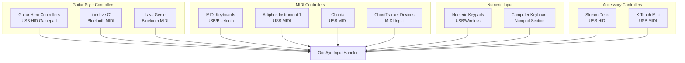
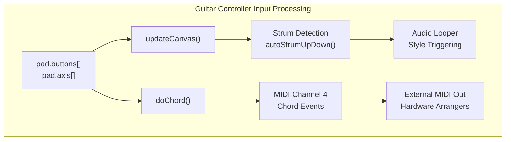
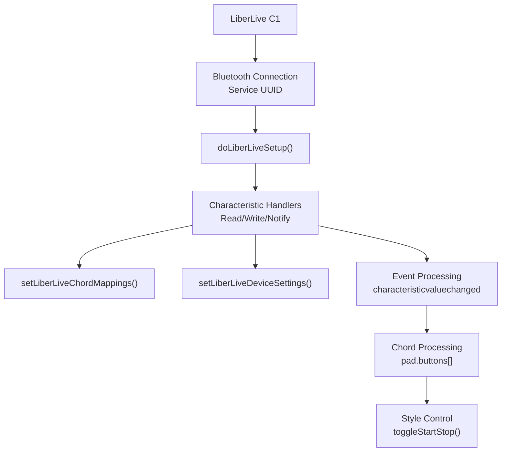
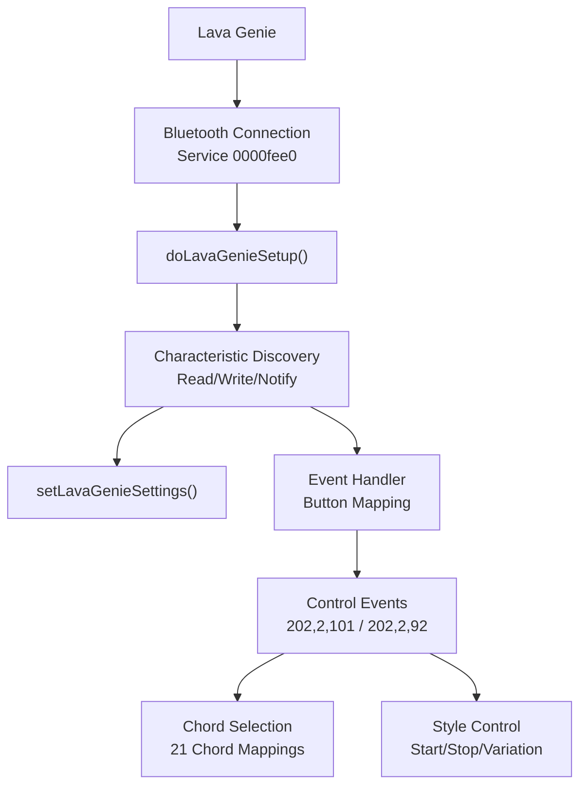
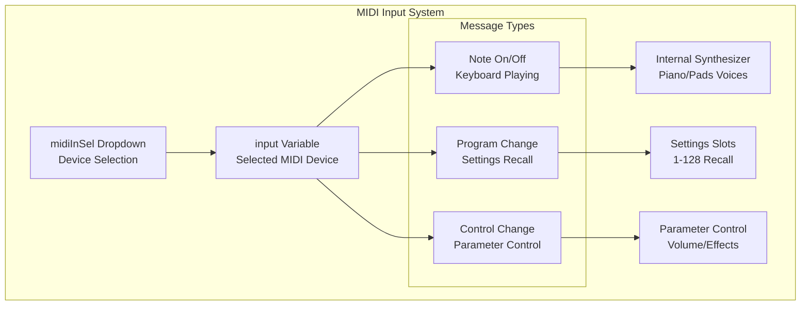
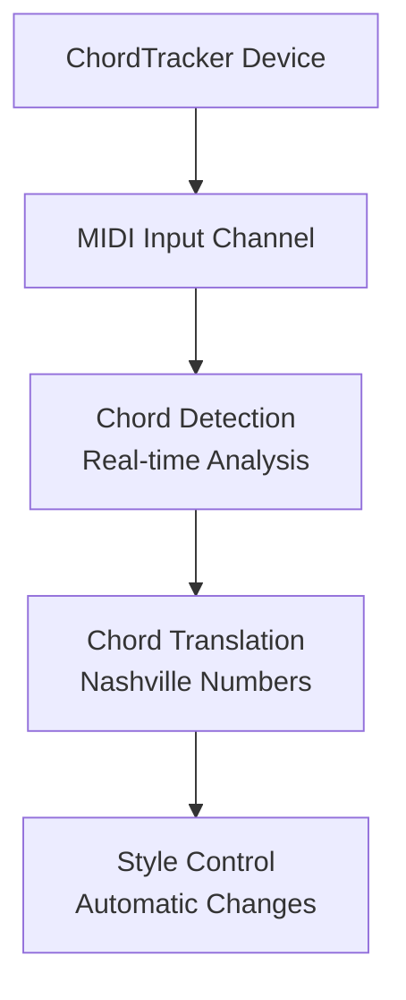
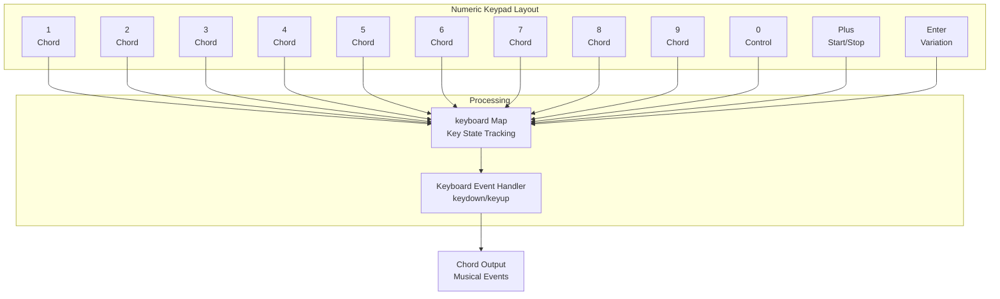
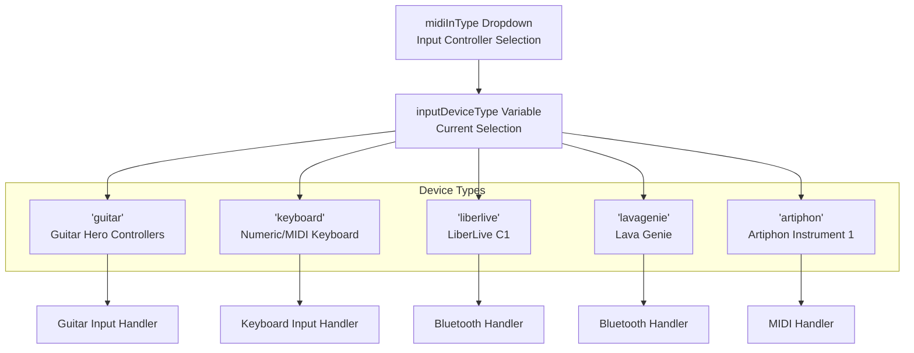
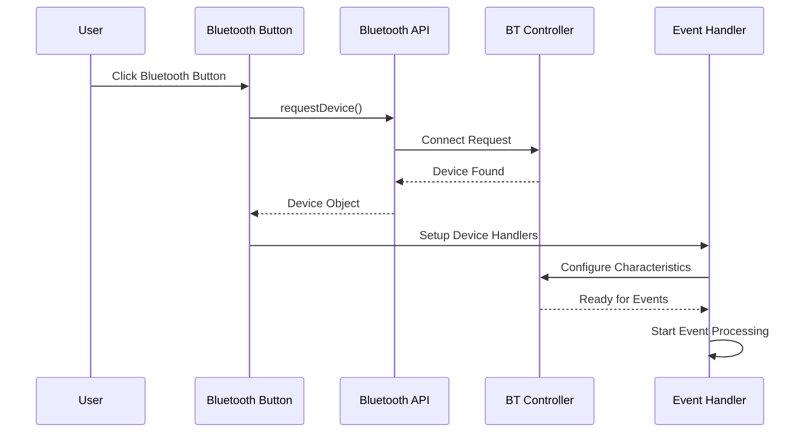
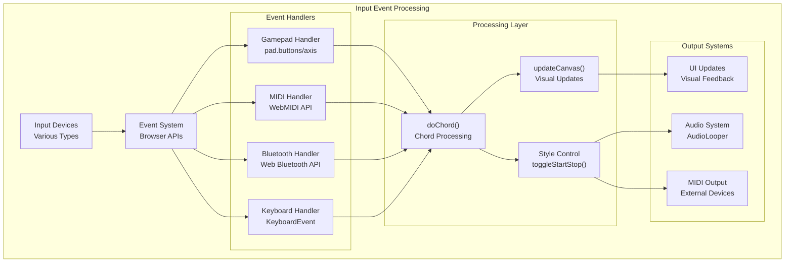

# Input Controllers

> **Relevant source files**
> * [README.md](https://github.com/Jus-Be/orinayo/blob/3c7fbee9/README.md)
> * [USER-GUIDE.md](https://github.com/Jus-Be/orinayo/blob/3c7fbee9/USER-GUIDE.md)
> * [docs/assets/screenshots/num-pad.png](https://github.com/Jus-Be/orinayo/blob/3c7fbee9/docs/assets/screenshots/num-pad.png)
> * [docs/assets/screenshots/numpad-guide.png](https://github.com/Jus-Be/orinayo/blob/3c7fbee9/docs/assets/screenshots/numpad-guide.png)
> * [docs/css/main.css](https://github.com/Jus-Be/orinayo/blob/3c7fbee9/docs/css/main.css)
> * [docs/css/stackedit.css](https://github.com/Jus-Be/orinayo/blob/3c7fbee9/docs/css/stackedit.css)
> * [docs/help.html](https://github.com/Jus-Be/orinayo/blob/3c7fbee9/docs/help.html)
> * [docs/index.html](https://github.com/Jus-Be/orinayo/blob/3c7fbee9/docs/index.html)
> * [docs/js/audio_looper.js](https://github.com/Jus-Be/orinayo/blob/3c7fbee9/docs/js/audio_looper.js)
> * [docs/js/background.js](https://github.com/Jus-Be/orinayo/blob/3c7fbee9/docs/js/background.js)
> * [docs/js/index.js](https://github.com/Jus-Be/orinayo/blob/3c7fbee9/docs/js/index.js)
> * [docs/js/styles.js](https://github.com/Jus-Be/orinayo/blob/3c7fbee9/docs/js/styles.js)
> * [docs/manifest.json](https://github.com/Jus-Be/orinayo/blob/3c7fbee9/docs/manifest.json)
> * [docs/settings/options.js](https://github.com/Jus-Be/orinayo/blob/3c7fbee9/docs/settings/options.js)
> * [documentation/orinayo_views.pptx](https://github.com/Jus-Be/orinayo/blob/3c7fbee9/documentation/orinayo_views.pptx)

This document covers the input controller subsystem in OrinAyo, which handles various hardware devices used to control chord progressions, style variations, and other musical parameters. For information about audio processing and synthesis, see [Audio Processing Pipeline](/Jus-Be/orinayo/3.2-audio-processing-pipeline). For MIDI-specific processing details, see [MIDI Processing](/Jus-Be/orinayo/4.1-midi-processing).

## Overview

OrinAyo supports multiple categories of input controllers that allow users to perform live music by triggering chords, controlling arranger sections, and manipulating musical parameters. The system processes input from these devices and translates them into musical events within the application.

### Supported Input Controller Types

Sources: [docs/js/index.js L147-L154](https://github.com/Jus-Be/orinayo/blob/3c7fbee9/docs/js/index.js#L147-L154)

 [USER-GUIDE.md L89-L97](https://github.com/Jus-Be/orinayo/blob/3c7fbee9/USER-GUIDE.md#L89-L97)

## Guitar Controllers

Guitar controllers use a chord-based input system where combinations of colored fret buttons represent different chord types. The system supports both basic and advanced chord mappings.

### Gamepad Guitar Controllers

Standard USB HID gamepad controllers like Guitar Hero controllers provide the primary interface for chord-based performance.

#### Chord Mapping System

| Chord Type | Green | Red | Yellow | Blue | Orange |
| --- | --- | --- | --- | --- | --- |
| 1 (Tonic) |  |  | X |  |  |
| 2m |  |  |  | X |  |
| 3m | X |  |  | X |  |
| 4 |  |  |  |  | X |
| 5 | X |  |  |  |  |
| 6m |  | X |  |  |  |

Sources: [docs/js/index.js L17-L35](https://github.com/Jus-Be/orinayo/blob/3c7fbee9/docs/js/index.js#L17-L35)

 [docs/js/index.js L257](https://github.com/Jus-Be/orinayo/blob/3c7fbee9/docs/js/index.js#L257-L257)

 [USER-GUIDE.md L104-L135](https://github.com/Jus-Be/orinayo/blob/3c7fbee9/USER-GUIDE.md#L104-L135)

### Bluetooth Guitar Controllers

#### LiberLive C1

The LiberLive C1 connects via Bluetooth and provides both audio output and MIDI control capabilities.

Sources: [docs/js/index.js L465-L492](https://github.com/Jus-Be/orinayo/blob/3c7fbee9/docs/js/index.js#L465-L492)

 [docs/js/index.js L635-L679](https://github.com/Jus-Be/orinayo/blob/3c7fbee9/docs/js/index.js#L635-L679)

 [docs/js/index.js L1012-L1125](https://github.com/Jus-Be/orinayo/blob/3c7fbee9/docs/js/index.js#L1012-L1125)

#### Lava Genie

The Lava Genie provides similar Bluetooth MIDI functionality with a different communication protocol.

Sources: [docs/js/index.js L494-L525](https://github.com/Jus-Be/orinayo/blob/3c7fbee9/docs/js/index.js#L494-L525)

 [docs/js/index.js L681-L952](https://github.com/Jus-Be/orinayo/blob/3c7fbee9/docs/js/index.js#L681-L952)

 [docs/js/index.js L954-L1010](https://github.com/Jus-Be/orinayo/blob/3c7fbee9/docs/js/index.js#L954-L1010)

## MIDI Controllers

MIDI controllers provide keyboard-based input and additional control capabilities through standard MIDI protocols.

### MIDI Input Processing

Sources: [docs/js/index.js L149-L154](https://github.com/Jus-Be/orinayo/blob/3c7fbee9/docs/js/index.js#L149-L154)

 [docs/index.html L164](https://github.com/Jus-Be/orinayo/blob/3c7fbee9/docs/index.html#L164-L164)

 [USER-GUIDE.md L223-L261](https://github.com/Jus-Be/orinayo/blob/3c7fbee9/USER-GUIDE.md#L223-L261)

### Specialized MIDI Controllers

#### Artiphon Instrument 1

Uses the first five pads like a Guitar Hero controller, with strum bridge pads providing control functions.

#### ChordTracker Integration

Processes chord detection from external MIDI sources for automatic accompaniment control.

Sources: [docs/js/index.js L156](https://github.com/Jus-Be/orinayo/blob/3c7fbee9/docs/js/index.js#L156-L156)

 [docs/index.html L186](https://github.com/Jus-Be/orinayo/blob/3c7fbee9/docs/index.html#L186-L186)

 [USER-GUIDE.md L214-L216](https://github.com/Jus-Be/orinayo/blob/3c7fbee9/USER-GUIDE.md#L214-L216)

## Numeric Keypads

Numeric keypads provide an alternative input method for users without guitar or MIDI controllers.

### Keypad Mapping

The numeric keypad maps to chord functions and control operations:

Sources: [docs/js/index.js L136](https://github.com/Jus-Be/orinayo/blob/3c7fbee9/docs/js/index.js#L136-L136)

 [USER-GUIDE.md L96](https://github.com/Jus-Be/orinayo/blob/3c7fbee9/USER-GUIDE.md#L96-L96)

## Input Controller Selection and Configuration

### Controller Type Selection

The `inputDeviceType` variable and corresponding UI dropdown control which type of input system is active:

Sources: [docs/js/index.js L147](https://github.com/Jus-Be/orinayo/blob/3c7fbee9/docs/js/index.js#L147-L147)

 [docs/index.html L167](https://github.com/Jus-Be/orinayo/blob/3c7fbee9/docs/index.html#L167-L167)

### Bluetooth Controller Setup

Bluetooth controllers require specific pairing and setup procedures:

Sources: [docs/js/index.js L476-L491](https://github.com/Jus-Be/orinayo/blob/3c7fbee9/docs/js/index.js#L476-L491)

 [docs/js/index.js L505-L524](https://github.com/Jus-Be/orinayo/blob/3c7fbee9/docs/js/index.js#L505-L524)

## Input Processing Architecture

### Event Flow

Sources: [docs/js/index.js L257](https://github.com/Jus-Be/orinayo/blob/3c7fbee9/docs/js/index.js#L257-L257)

 [docs/js/index.js L339-L342](https://github.com/Jus-Be/orinayo/blob/3c7fbee9/docs/js/index.js#L339-L342)