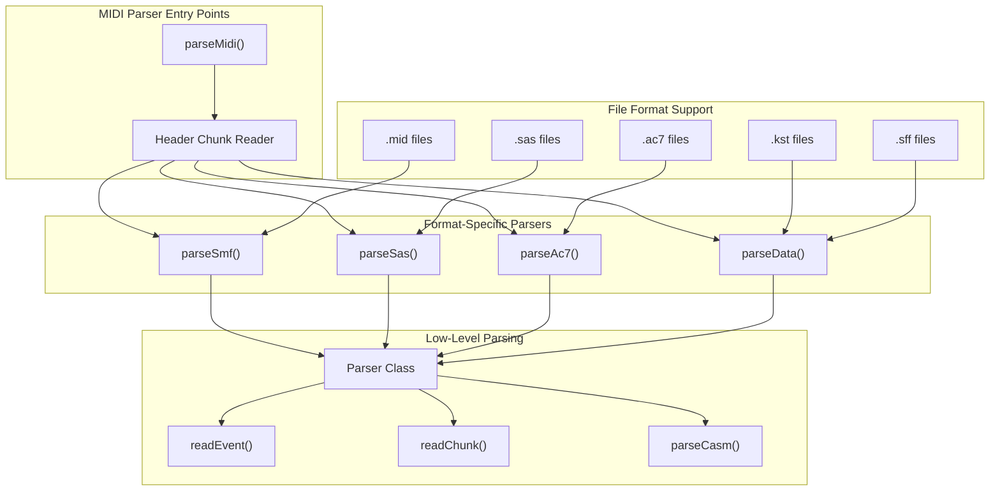
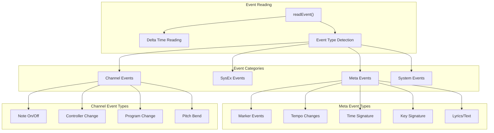
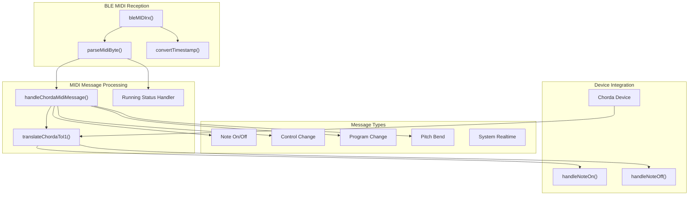
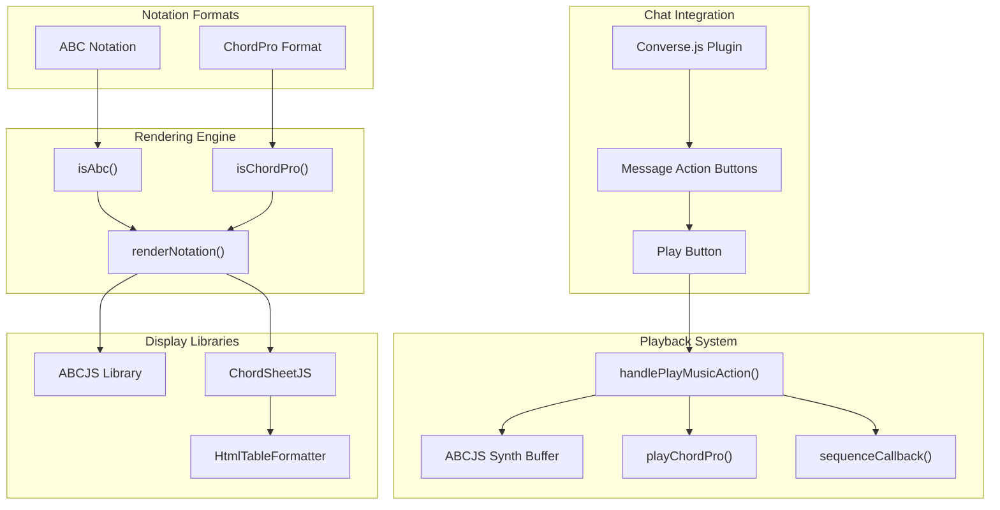
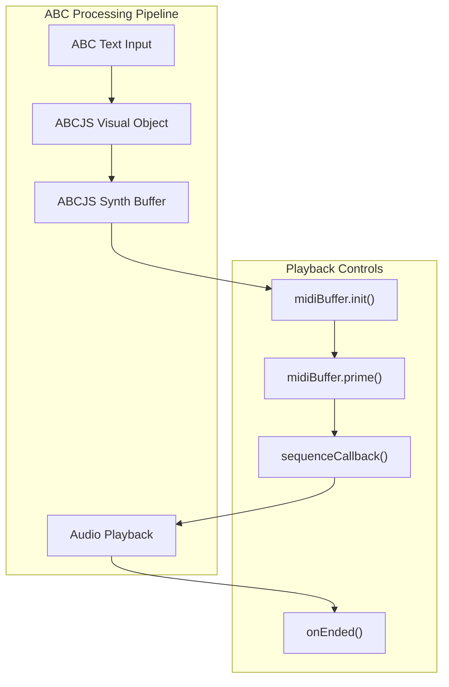
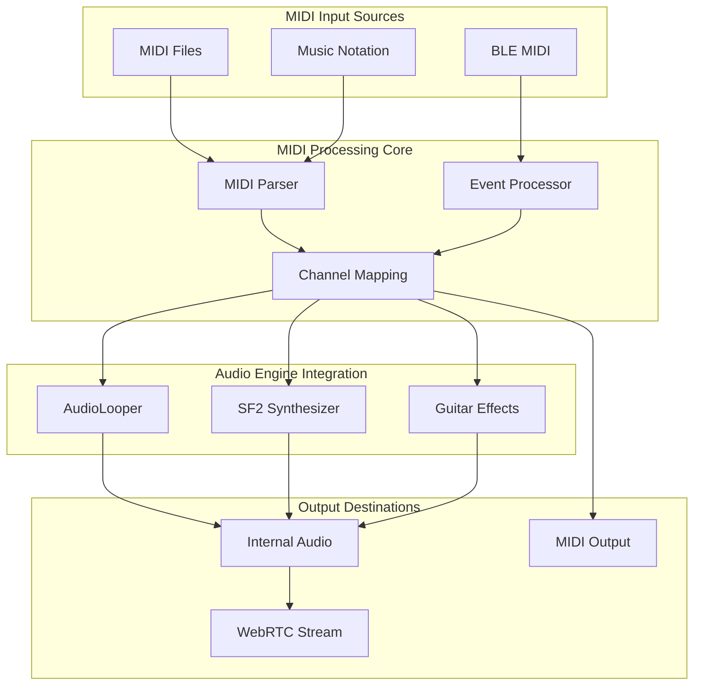

# MIDI Processing

> **Relevant source files**
> * [docs/assets/gmgsx.sf2](https://github.com/Jus-Be/orinayo/blob/3c7fbee9/docs/assets/gmgsx.sf2)
> * [docs/css/synth.css](https://github.com/Jus-Be/orinayo/blob/3c7fbee9/docs/css/synth.css)
> * [docs/js/midi-parser.js](https://github.com/Jus-Be/orinayo/blob/3c7fbee9/docs/js/midi-parser.js)
> * [docs/js/midi.ble.js](https://github.com/Jus-Be/orinayo/blob/3c7fbee9/docs/js/midi.ble.js)
> * [docs/packages/notation/abcjs.js](https://github.com/Jus-Be/orinayo/blob/3c7fbee9/docs/packages/notation/abcjs.js)
> * [docs/packages/notation/notation.js](https://github.com/Jus-Be/orinayo/blob/3c7fbee9/docs/packages/notation/notation.js)
> * [orinayo.exe](https://github.com/Jus-Be/orinayo/blob/3c7fbee9/orinayo.exe)

This document covers OrinAyo's MIDI processing capabilities, including file parsing, BLE MIDI integration, and music notation rendering systems. For information about sound synthesis and audio output, see [Sound Synthesis](/Jus-Be/orinayo/4.2-sound-synthesis). For details about audio effects processing, see [Audio Effects (Pedalboard)](/Jus-Be/orinayo/4.3-audio-effects-(pedalboard)).

## Overview

OrinAyo's MIDI processing system handles multiple aspects of MIDI data flow:

* **MIDI File Parsing**: Support for various MIDI and style file formats (.mid, .kst, .sff, .sas, .ac7)
* **BLE MIDI Communication**: Real-time MIDI over Bluetooth Low Energy
* **Music Notation Rendering**: ABC notation and ChordPro format display and playback
* **MIDI Event Processing**: Real-time MIDI message handling and transformation

## MIDI File Parser Architecture

The core MIDI parsing system supports multiple file formats through a unified interface:



**Sources**: [docs/js/midi-parser.js L4-L53](https://github.com/Jus-Be/orinayo/blob/3c7fbee9/docs/js/midi-parser.js#L4-L53)

 [docs/js/midi-parser.js L55-L122](https://github.com/Jus-Be/orinayo/blob/3c7fbee9/docs/js/midi-parser.js#L55-L122)

### Format Detection and Routing

The main `parseMidi` function determines file format through header inspection:

| File Format | Header ID | Parser Function | Description |
| --- | --- | --- | --- |
| Standard MIDI | `MThd` | `parseSmf()` | Standard MIDI files |
| Ketron Style | `MThd` + `.kst` | `parseData()` | Ketron style files |
| SAS Style | `MThd` + `.sas` | `parseSas()` | SAS arranger files |
| AC7 Style | `AC07` | `parseAc7()` | Casio AC7 format |
| SFF Style | `MThd` + CASM | `parseData()` | Yamaha SFF format |

**Sources**: [docs/js/midi-parser.js L10-L53](https://github.com/Jus-Be/orinayo/blob/3c7fbee9/docs/js/midi-parser.js#L10-L53)

### Event Processing System

MIDI events are processed through a hierarchical system:



**Sources**: [docs/js/midi-parser.js L585-L776](https://github.com/Jus-Be/orinayo/blob/3c7fbee9/docs/js/midi-parser.js#L585-L776)

## BLE MIDI Integration

The BLE MIDI system provides real-time MIDI communication over Bluetooth:



**Sources**: [docs/js/midi.ble.js L12-L89](https://github.com/Jus-Be/orinayo/blob/3c7fbee9/docs/js/midi.ble.js#L12-L89)

 [docs/js/midi.ble.js L122-L171](https://github.com/Jus-Be/orinayo/blob/3c7fbee9/docs/js/midi.ble.js#L122-L171)

 [docs/js/midi.ble.js L224-L264](https://github.com/Jus-Be/orinayo/blob/3c7fbee9/docs/js/midi.ble.js#L224-L264)

### BLE MIDI Packet Structure

BLE MIDI packets are processed with timestamp handling:

| Component | Function | Description |
| --- | --- | --- |
| Timestamp | `convertTimestamp()` | Converts BLE timestamps to local time |
| Running Status | `runningStatus` variable | Maintains MIDI running status |
| Third Byte Flag | `thirdByteFlag` variable | Tracks multi-byte message state |
| Message Parser | `parseMidiByte()` | Parses individual MIDI bytes |

**Sources**: [docs/js/midi.ble.js L1-L11](https://github.com/Jus-Be/orinayo/blob/3c7fbee9/docs/js/midi.ble.js#L1-L11)

 [docs/js/midi.ble.js L92-L119](https://github.com/Jus-Be/orinayo/blob/3c7fbee9/docs/js/midi.ble.js#L92-L119)

## Music Notation System

OrinAyo supports multiple music notation formats for collaborative music sharing:



**Sources**: [docs/packages/notation/notation.js L10-L40](https://github.com/Jus-Be/orinayo/blob/3c7fbee9/docs/packages/notation/notation.js#L10-L40)

 [docs/packages/notation/notation.js L108-L133](https://github.com/Jus-Be/orinayo/blob/3c7fbee9/docs/packages/notation/notation.js#L108-L133)

### Notation Format Detection

The system automatically detects notation formats through content analysis:

| Format | Detection Pattern | Rendering Library | Playback Support |
| --- | --- | --- | --- |
| ABC | Starts with `X:` | ABCJS | Yes (ABCJS Synth) |
| ChordPro | Starts with `{comment:` or `{title:` | ChordSheetJS | Yes (Custom engine) |

**Sources**: [docs/packages/notation/notation.js L42-L52](https://github.com/Jus-Be/orinayo/blob/3c7fbee9/docs/packages/notation/notation.js#L42-L52)

### ABC Notation Processing

ABC notation files are processed through the ABCJS library with enhanced playback capabilities:



**Sources**: [docs/packages/notation/notation.js L75-L96](https://github.com/Jus-Be/orinayo/blob/3c7fbee9/docs/packages/notation/notation.js#L75-L96)

## MIDI Data Structures

The parser generates structured event data compatible with OrinAyo's audio engine:

### Event Object Schema

```yaml
{
  deltaTime: number,          // Time since last event
  type: string,              // Event type (noteOn, noteOff, etc.)
  channel: number,           // MIDI channel (0-15)
  noteNumber?: number,       // Note number for note events
  velocity?: number,         // Note velocity
  controllerType?: number,   // Controller number for CC events
  value?: number,           // Controller/parameter value
  programNumber?: number,    // Program number for PC events
  text?: string,            // Text for meta events
  microsecondsPerBeat?: number // Tempo information
}
```

**Sources**: [docs/js/midi-parser.js L585-L776](https://github.com/Jus-Be/orinayo/blob/3c7fbee9/docs/js/midi-parser.js#L585-L776)

### Style File Organization

Style files are organized into musical sections:

| Section Type | Description | Usage |
| --- | --- | --- |
| `SInt` | Setup/Initialization | Initial settings |
| `Main A-D` | Main accompaniment variations | Primary backing patterns |
| `Intro A-C` | Introduction patterns | Song openings |
| `Ending A-C` | Ending patterns | Song conclusions |
| `Fill In AA-DD` | Fill patterns | Transitional elements |

**Sources**: [docs/js/midi-parser.js L128-L201](https://github.com/Jus-Be/orinayo/blob/3c7fbee9/docs/js/midi-parser.js#L128-L201)

 [docs/js/midi-parser.js L517-L583](https://github.com/Jus-Be/orinayo/blob/3c7fbee9/docs/js/midi-parser.js#L517-L583)

## Integration with Audio Engine

The MIDI processing system integrates with OrinAyo's broader audio architecture:



**Sources**: [docs/js/midi-parser.js L1-L939](https://github.com/Jus-Be/orinayo/blob/3c7fbee9/docs/js/midi-parser.js#L1-L939)

 [docs/js/midi.ble.js L1-L318](https://github.com/Jus-Be/orinayo/blob/3c7fbee9/docs/js/midi.ble.js#L1-L318)