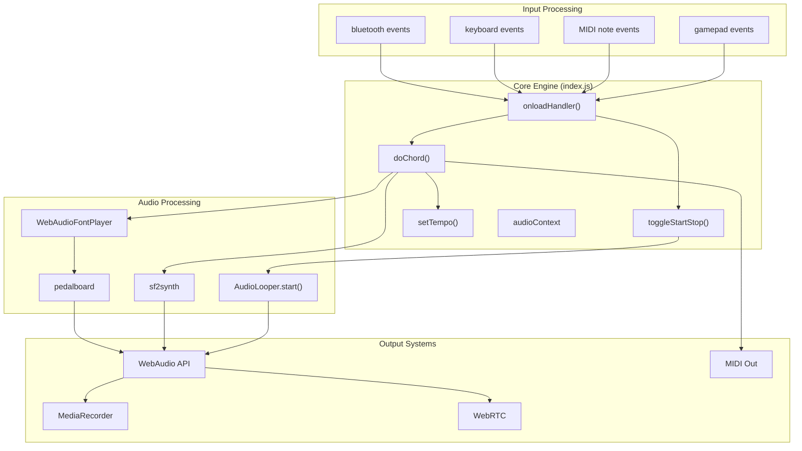
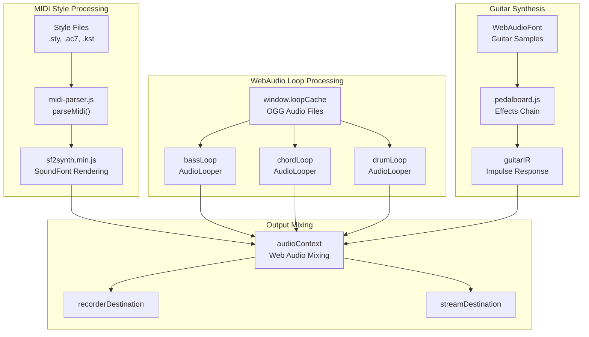
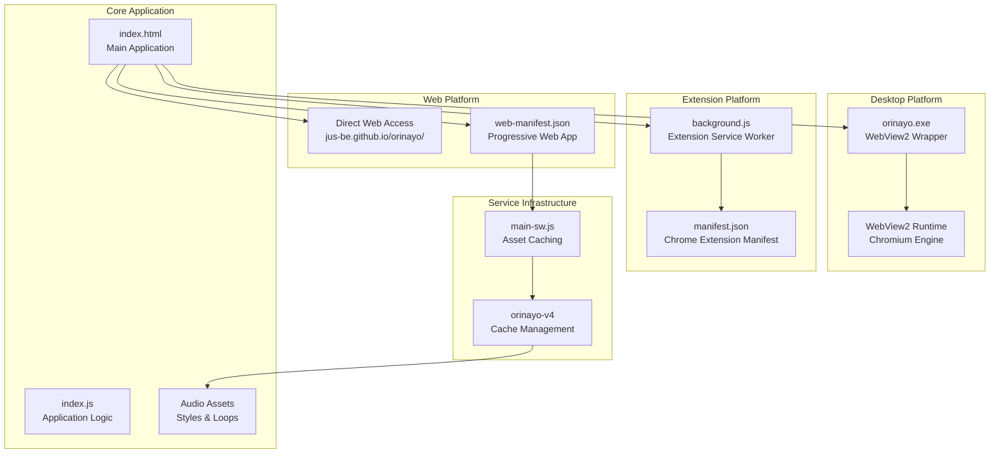

# Overview

> **Relevant source files**
> * [README.md](https://github.com/Jus-Be/orinayo/blob/3c7fbee9/README.md)
> * [USER-GUIDE.md](https://github.com/Jus-Be/orinayo/blob/3c7fbee9/USER-GUIDE.md)
> * [docs/assets/screenshots/num-pad.png](https://github.com/Jus-Be/orinayo/blob/3c7fbee9/docs/assets/screenshots/num-pad.png)
> * [docs/assets/screenshots/numpad-guide.png](https://github.com/Jus-Be/orinayo/blob/3c7fbee9/docs/assets/screenshots/numpad-guide.png)
> * [docs/css/main.css](https://github.com/Jus-Be/orinayo/blob/3c7fbee9/docs/css/main.css)
> * [docs/css/stackedit.css](https://github.com/Jus-Be/orinayo/blob/3c7fbee9/docs/css/stackedit.css)
> * [docs/help.html](https://github.com/Jus-Be/orinayo/blob/3c7fbee9/docs/help.html)
> * [docs/index.html](https://github.com/Jus-Be/orinayo/blob/3c7fbee9/docs/index.html)
> * [docs/js/audio_looper.js](https://github.com/Jus-Be/orinayo/blob/3c7fbee9/docs/js/audio_looper.js)
> * [docs/js/background.js](https://github.com/Jus-Be/orinayo/blob/3c7fbee9/docs/js/background.js)
> * [docs/js/index.js](https://github.com/Jus-Be/orinayo/blob/3c7fbee9/docs/js/index.js)
> * [docs/js/styles.js](https://github.com/Jus-Be/orinayo/blob/3c7fbee9/docs/js/styles.js)
> * [docs/manifest.json](https://github.com/Jus-Be/orinayo/blob/3c7fbee9/docs/manifest.json)
> * [docs/settings/options.js](https://github.com/Jus-Be/orinayo/blob/3c7fbee9/docs/settings/options.js)
> * [docs/web-manifest.json](https://github.com/Jus-Be/orinayo/blob/3c7fbee9/docs/web-manifest.json)
> * [documentation/orinayo_views.pptx](https://github.com/Jus-Be/orinayo/blob/3c7fbee9/documentation/orinayo_views.pptx)

This document provides a high-level technical overview of the OrinAyo codebase, a live music production web application that transforms guitar game controllers and other input devices into MIDI controllers for live music performance and arrangement.

OrinAyo serves as both a standalone music production system using WebAudio technologies and as a controller interface for external arranger keyboards, modules, and loop stations. The system supports real-time collaboration through XMPP communication and can be deployed across multiple platforms including Progressive Web Apps (PWA), Chrome extensions, and desktop applications.

For detailed information about specific subsystems, see [Getting Started](/Jus-Be/orinayo/2-getting-started) for usage instructions, [Core Architecture](/Jus-Be/orinayo/3-core-architecture) for technical implementation details, [Audio Systems](/Jus-Be/orinayo/4-audio-systems) for sound processing components, and [Communication & Collaboration](/Jus-Be/orinayo/5-communication-and-collaboration) for real-time features.

## System Architecture

The OrinAyo system consists of five primary architectural layers working together to provide live music production capabilities:

```mermaid
flowchart TD

ENGINE["OrinAyo Engine<br>index.js"]
UI["User Interface<br>index.html"]
AUDIO_LOOPER["AudioLooper<br>audio_looper.js"]
GUITAR_CTRL["Guitar Controllers<br>GamePad API"]
MIDI_CTRL["MIDI Controllers<br>WebMIDI API"]
KEYPAD_CTRL["Numeric Keypads<br>Keyboard Events"]
BT_CTRL["Bluetooth Controllers<br>Web Bluetooth API"]
STYLE_FILES["MIDI Style Files<br>styles.js"]
AUDIO_LOOPS["WebAudio Loops<br>loopCache"]
SF2_SYNTH["SoundFont Synthesis<br>sf2synth.min.js"]
GUITAR_SIM["Guitar Simulation<br>webaudio-font-player.js"]
XMPP_CLIENT["XMPP Client<br>converse.js"]
WEBRTC_STREAM["WebRTC Streaming<br>WHIP/WHEP"]
VOICE_CHAT["Voice/Video Chat<br>voicechat.js"]
SERVICE_WORKER["Service Worker<br>main-sw.js"]
PWA_MANIFEST["PWA Manifest<br>web-manifest.json"]
CHROME_EXT["Chrome Extension<br>background.js"]

GUITAR_CTRL --> ENGINE
MIDI_CTRL --> ENGINE
KEYPAD_CTRL --> ENGINE
BT_CTRL --> ENGINE
ENGINE --> STYLE_FILES
ENGINE --> AUDIO_LOOPS
ENGINE --> SF2_SYNTH
ENGINE --> GUITAR_SIM
ENGINE --> XMPP_CLIENT
ENGINE --> WEBRTC_STREAM
ENGINE --> VOICE_CHAT
SERVICE_WORKER --> ENGINE
PWA_MANIFEST --> ENGINE
CHROME_EXT --> ENGINE

subgraph subGraph4 ["Platform Layer"]
    SERVICE_WORKER
    PWA_MANIFEST
    CHROME_EXT
end

subgraph subGraph3 ["Communication Layer"]
    XMPP_CLIENT
    WEBRTC_STREAM
    VOICE_CHAT
end

subgraph subGraph2 ["Audio Generation Layer"]
    STYLE_FILES
    AUDIO_LOOPS
    SF2_SYNTH
    GUITAR_SIM
end

subgraph subGraph1 ["Input Processing Layer"]
    GUITAR_CTRL
    MIDI_CTRL
    KEYPAD_CTRL
    BT_CTRL
end

subgraph subGraph0 ["Core Application Layer"]
    ENGINE
    UI
    AUDIO_LOOPER
    ENGINE --> AUDIO_LOOPER
    ENGINE --> UI
end
```

**Sources:** [docs/js/index.js L1-L400](https://github.com/Jus-Be/orinayo/blob/3c7fbee9/docs/js/index.js#L1-L400)

 [docs/index.html L1-L300](https://github.com/Jus-Be/orinayo/blob/3c7fbee9/docs/index.html#L1-L300)

 [docs/js/audio_looper.js L1-L50](https://github.com/Jus-Be/orinayo/blob/3c7fbee9/docs/js/audio_looper.js#L1-L50)

 [docs/js/styles.js L1-L150](https://github.com/Jus-Be/orinayo/blob/3c7fbee9/docs/js/styles.js#L1-L150)

 [docs/manifest.json L1-L30](https://github.com/Jus-Be/orinayo/blob/3c7fbee9/docs/manifest.json#L1-L30)

 [docs/web-manifest.json L1-L26](https://github.com/Jus-Be/orinayo/blob/3c7fbee9/docs/web-manifest.json#L1-L26)

## Core Engine Flow

The main application engine coordinates input processing, audio generation, and output management through a series of interconnected components:

**Sources:** [docs/js/index.js L339-L400](https://github.com/Jus-Be/orinayo/blob/3c7fbee9/docs/js/index.js#L339-L400)

 [docs/js/index.js L1734-L1800](https://github.com/Jus-Be/orinayo/blob/3c7fbee9/docs/js/index.js#L1734-L1800)

 [docs/js/audio_looper.js L215-L245](https://github.com/Jus-Be/orinayo/blob/3c7fbee9/docs/js/audio_looper.js#L215-L245)

 [docs/js/index.js L4050-L4150](https://github.com/Jus-Be/orinayo/blob/3c7fbee9/docs/js/index.js#L4050-L4150)

## Input Controller Integration

OrinAyo supports multiple input device types through standardized web APIs, with each controller type mapped to specific chord and control functions:

| Controller Type | API Integration | Primary Functions | Code References |
| --- | --- | --- | --- |
| Guitar Hero Controllers | GamePad API | 5-button chord mapping, strum detection | `pad.buttons[]` arrays in [index.js L257](https://github.com/Jus-Be/orinayo/blob/3c7fbee9/index.js#L257-L257) |
| LiberLive C1 | Web Bluetooth API | Bluetooth MIDI, 21-chord mapping | `bluetoothGuitar` in [index.js L97](https://github.com/Jus-Be/orinayo/blob/3c7fbee9/index.js#L97-L97) |
| Lava Genie | Web Bluetooth API | Chord key mapping, control buttons | `doLavaGenieSetup()` in [index.js L681-L952](https://github.com/Jus-Be/orinayo/blob/3c7fbee9/index.js#L681-L952) |
| MIDI Keyboards | WebMIDI API | Note events, program changes | `midiOutput` in [index.js L149](https://github.com/Jus-Be/orinayo/blob/3c7fbee9/index.js#L149-L149) |
| Numeric Keypads | Keyboard Events | Chord shortcuts, style control | Keyboard event handlers in [index.js](https://github.com/Jus-Be/orinayo/blob/3c7fbee9/index.js) |

**Sources:** [docs/js/index.js L465-L525](https://github.com/Jus-Be/orinayo/blob/3c7fbee9/docs/js/index.js#L465-L525)

 [docs/js/index.js L635-L680](https://github.com/Jus-Be/orinayo/blob/3c7fbee9/docs/js/index.js#L635-L680)

 [docs/js/index.js L681-L952](https://github.com/Jus-Be/orinayo/blob/3c7fbee9/docs/js/index.js#L681-L952)

## Audio Generation Architecture

The system provides three distinct audio generation modes, each optimized for different use cases and performance requirements:

**Sources:** [docs/js/audio_looper.js L1-L50](https://github.com/Jus-Be/orinayo/blob/3c7fbee9/docs/js/audio_looper.js#L1-L50)

 [docs/js/styles.js L1-L200](https://github.com/Jus-Be/orinayo/blob/3c7fbee9/docs/js/styles.js#L1-L200)

 [docs/js/index.js L211-L230](https://github.com/Jus-Be/orinayo/blob/3c7fbee9/docs/js/index.js#L211-L230)

 [docs/js/index.js L553-L598](https://github.com/Jus-Be/orinayo/blob/3c7fbee9/docs/js/index.js#L553-L598)

## Multi-Platform Deployment

OrinAyo supports deployment across multiple platforms through a unified codebase with platform-specific adaptations:

**Sources:** [docs/web-manifest.json L1-L26](https://github.com/Jus-Be/orinayo/blob/3c7fbee9/docs/web-manifest.json#L1-L26)

 [docs/manifest.json L1-L30](https://github.com/Jus-Be/orinayo/blob/3c7fbee9/docs/manifest.json#L1-L30)

 [docs/js/background.js L1-L126](https://github.com/Jus-Be/orinayo/blob/3c7fbee9/docs/js/background.js#L1-L126)

 [README.md L1-L20](https://github.com/Jus-Be/orinayo/blob/3c7fbee9/README.md#L1-L20)

## Collaboration and Communication Systems

The system integrates real-time communication capabilities for collaborative music sessions through standardized web protocols:

| Component | Technology | Primary Function | Code Integration |
| --- | --- | --- | --- |
| XMPP Client | `converse.js` | Text chat, presence, room management | `_converse` global in [index.js L79](https://github.com/Jus-Be/orinayo/blob/3c7fbee9/index.js#L79-L79) |
| Voice Chat | WebRTC + Jitsi | Audio communication during sessions | `voicechat.js` plugin |
| Video Meetings | Jitsi Meet | Video conferences with screen sharing | `olmeet.js` plugin |
| Live Streaming | WebRTC (WHIP/WHEP) | Performance broadcasting | `publishConnection` in [index.js L82](https://github.com/Jus-Be/orinayo/blob/3c7fbee9/index.js#L82-L82) |
| Screen Sharing | Screen Capture API | Tutorial and collaboration support | `screencast.js` plugin |

**Sources:** [docs/js/index.js L1127-L1200](https://github.com/Jus-Be/orinayo/blob/3c7fbee9/docs/js/index.js#L1127-L1200)

 [docs/index.html L285-L291](https://github.com/Jus-Be/orinayo/blob/3c7fbee9/docs/index.html#L285-L291)

 [docs/settings/options.js L32-L70](https://github.com/Jus-Be/orinayo/blob/3c7fbee9/docs/settings/options.js#L32-L70)

This architecture enables OrinAyo to function as both a standalone music production environment and a collaborative platform for remote music sessions, with flexible deployment options suitable for various user environments and technical requirements.