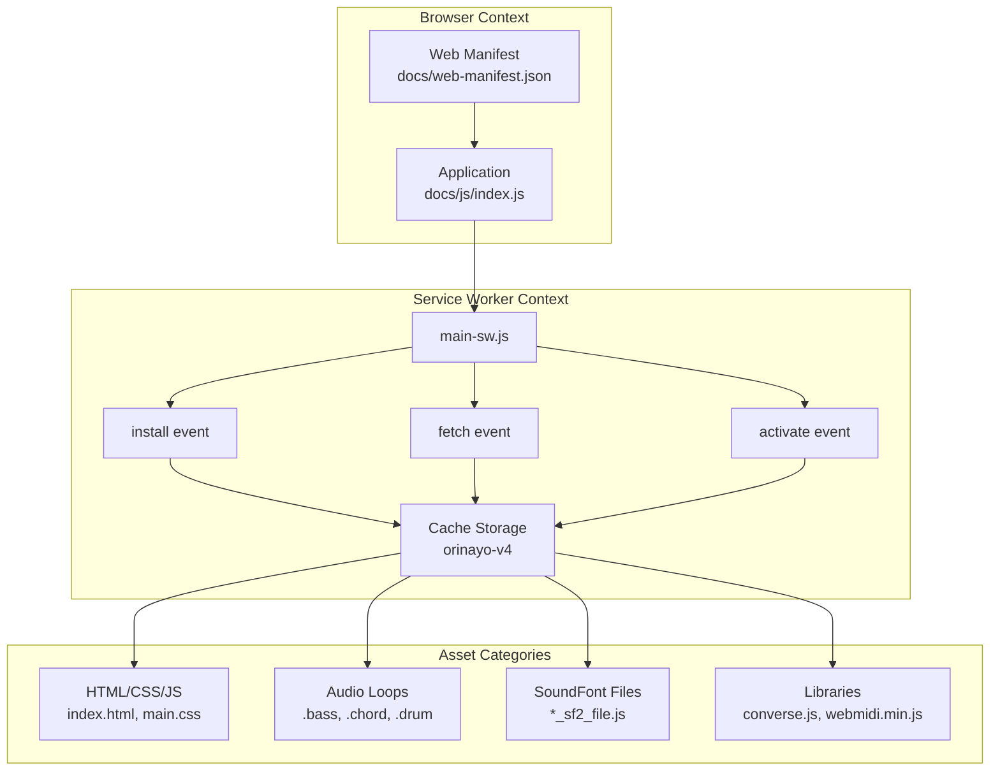
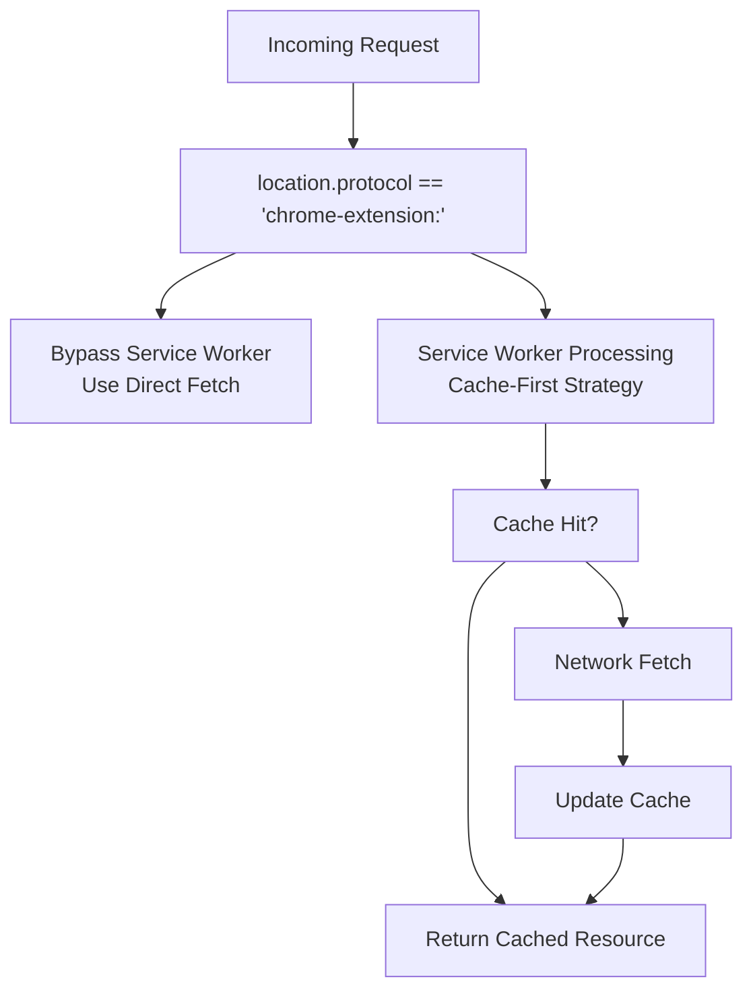
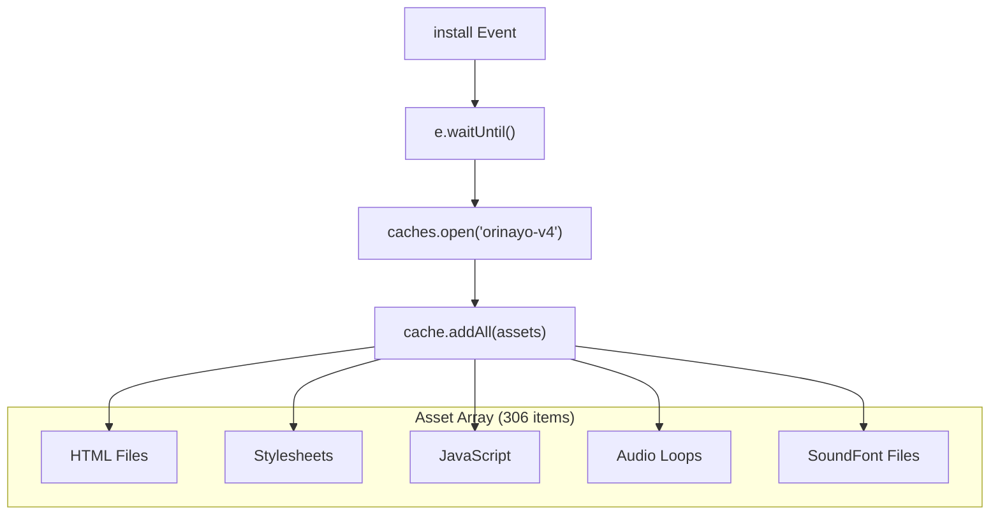

# Progressive Web App

> **Relevant source files**
> * [docs/extra/assets/bass/slow-blues_60_32000.bass](https://github.com/Jus-Be/orinayo/blob/3c7fbee9/docs/extra/assets/bass/slow-blues_60_32000.bass)
> * [docs/extra/assets/chords/blues-slow_60_32000_32000_2.chord](https://github.com/Jus-Be/orinayo/blob/3c7fbee9/docs/extra/assets/chords/blues-slow_60_32000_32000_2.chord)
> * [docs/extra/assets/chords/slow-blues_60_32000_32000_2.chord](https://github.com/Jus-Be/orinayo/blob/3c7fbee9/docs/extra/assets/chords/slow-blues_60_32000_32000_2.chord)
> * [docs/js/main-sw.js](https://github.com/Jus-Be/orinayo/blob/3c7fbee9/docs/js/main-sw.js)
> * [docs/web-manifest.json](https://github.com/Jus-Be/orinayo/blob/3c7fbee9/docs/web-manifest.json)

This document covers OrinAyo's Progressive Web App (PWA) implementation, including the web app manifest, service worker functionality, and offline caching strategy. For information about the Chrome extension deployment, see [Chrome Extension](/Jus-Be/orinayo/6.2-chrome-extension). For details about general asset caching patterns, see [Service Worker & Caching](/Jus-Be/orinayo/6.3-service-worker-and-caching).

## PWA Configuration

OrinAyo is configured as a PWA through the web manifest file, enabling installation on user devices and providing native-like app behavior.

### Web App Manifest

The PWA configuration is defined in [web-manifest.json L1-L26](https://github.com/Jus-Be/orinayo/blob/3c7fbee9/`docs/web-manifest.json#L1-L26)

 which specifies the application metadata:

| Property | Value | Purpose |
| --- | --- | --- |
| `name` | "Orin Ayo" | Full application name |
| `short_name` | "orinayo" | Short name for home screen |
| `description` | "Orin Ayo is live music production web application" | App description |
| `start_url` | "./" | Entry point URL |
| `scope` | "./" | Navigation scope |
| `display` | "standalone" | Display mode (hides browser UI) |
| `orientation` | "portrait" | Preferred screen orientation |
| `background_color` | "#FFFFFF" | Splash screen background |
| `theme_color` | "#FFFFFF" | Browser theme color |
| `categories` | ["social"] | App store category |

The manifest includes two icon sizes for different display contexts:

* 192x192 pixel icon with `"any maskable"` purpose for adaptive icons
* 512x512 pixel icon for high-resolution displays

**Sources:** [web-manifest.json L1-L26](https://github.com/Jus-Be/orinayo/blob/3c7fbee9/`docs/web-manifest.json#L1-L26)

## Service Worker Implementation

OrinAyo implements a comprehensive service worker that provides offline functionality and asset caching. The service worker is registered through the main application and handles three primary lifecycle events.

### Service Worker Architecture

**Sources:** [main-sw.js L1-L427](https://github.com/Jus-Be/orinayo/blob/3c7fbee9/`docs/js/main-sw.js#L1-L427)

### Event Handlers

The service worker implements three critical event handlers:

**Install Event** [main-sw.js L371-L383](https://github.com/Jus-Be/orinayo/blob/3c7fbee9/`docs/js/main-sw.js#L371-L383)

* Pre-caches all essential assets defined in the `assets` array
* Only executes when protocol is not `chrome-extension:`
* Uses cache name `"orinayo-v4"` for versioning

**Fetch Event** [main-sw.js L385-L406](https://github.com/Jus-Be/orinayo/blob/3c7fbee9/`docs/js/main-sw.js#L385-L406)

* Implements cache-first strategy with network fallback
* Bypassed for Chrome extension protocol
* Automatically caches new resources on network requests

**Activate Event** [main-sw.js L408-L426](https://github.com/Jus-Be/orinayo/blob/3c7fbee9/`docs/js/main-sw.js#L408-L426)

* Cleans up old cache versions
* Preserves current cache (`staticOrinAyo`)
* Removes outdated caches during updates

**Sources:** [main-sw.js L371-L426](https://github.com/Jus-Be/orinayo/blob/3c7fbee9/`docs/js/main-sw.js#L371-L426)

## Caching Strategy

OrinAyo employs a comprehensive caching strategy optimized for music production applications, with particular emphasis on audio assets.

### Asset Classification

```mermaid
flowchart TD

CORE["Core Application"]
AUDIO["Audio Assets"]
LIBS["External Libraries"]
UI["UI Resources"]
INDEX["index.html"]
MAIN_JS["index.js"]
AUDIO_LOOPER["audio_looper.js"]
GAME_BOARD["gameBoard.js"]
HIT_BAR["hitBar.js"]
BASS_LOOPS["Bass Loops<br>46 files"]
CHORD_LOOPS["Chord Loops<br>127 files"]
DRUM_LOOPS["Drum Loops<br>123 files"]
SF2_FILES["SoundFont Files<br>10 files"]
CONVERSE["converse.js"]
WEBMIDI["webmidi.min.js"]
MIDI_PARSER["midi-parser.js"]
SF2_SYNTH["sf2.synth.min.js"]
PEDALBOARD["pedalboard.js"]
CSS_FILES["CSS<br>bootstrap.css, main.css"]
ICONS["Icons<br>icon_16.png"]

CORE --> INDEX
CORE --> MAIN_JS
CORE --> AUDIO_LOOPER
CORE --> GAME_BOARD
CORE --> HIT_BAR
AUDIO --> BASS_LOOPS
AUDIO --> CHORD_LOOPS
AUDIO --> DRUM_LOOPS
AUDIO --> SF2_FILES
LIBS --> CONVERSE
LIBS --> WEBMIDI
LIBS --> MIDI_PARSER
LIBS --> SF2_SYNTH
LIBS --> PEDALBOARD
UI --> CSS_FILES
UI --> ICONS

subgraph subGraph4 ["UI Resources"]
    CSS_FILES
    ICONS
end

subgraph subGraph3 ["External Libraries"]
    CONVERSE
    WEBMIDI
    MIDI_PARSER
    SF2_SYNTH
    PEDALBOARD
end

subgraph subGraph2 ["Audio Assets"]
    BASS_LOOPS
    CHORD_LOOPS
    DRUM_LOOPS
    SF2_FILES
end

subgraph subGraph1 ["Core Application"]
    INDEX
    MAIN_JS
    AUDIO_LOOPER
    GAME_BOARD
    HIT_BAR
end

subgraph subGraph0 ["Cached Asset Types"]
    CORE
    AUDIO
    LIBS
    UI
end
```

**Sources:** [main-sw.js L2-L369](https://github.com/Jus-Be/orinayo/blob/3c7fbee9/`docs/js/main-sw.js#L2-L369)

### Cache Distribution

The service worker pre-caches 306 total assets distributed across categories:

| Asset Type | Count | Examples |
| --- | --- | --- |
| Bass Loops | 46 | `acoustic-guitar_75_25600.bass`, `funk_130_14769.bass` |
| Chord Loops | 127 | `16beat_082_23414.chord`, `afro-pop_111_8649.chord` |
| Drum Loops | 123 | `8beat_100_2400.drum`, `ballad-rock_75_3200.drum` |
| SoundFont Files | 10 | `0270_EGuitar_FSBS_SF2_file.js`, `0250_Aspirin_sf2_file.js` |
| Core JS Files | 20+ | `index.js`, `audio_looper.js`, `converse.js` |
| Stylesheets | 5 | `main.css`, `bootstrap.css`, `synth.css` |

Audio loop files follow a naming convention: `{style}_{tempo}_{duration}.{type}` where type is `.bass`, `.chord`, or `.drum`.

**Sources:** [main-sw.js L46-L369](https://github.com/Jus-Be/orinayo/blob/3c7fbee9/`docs/js/main-sw.js#L46-L369)

## Multi-Platform Considerations

The service worker includes special logic to handle different deployment contexts, particularly distinguishing between web and Chrome extension environments.

### Protocol Detection

The service worker checks <FileRef file-url="[https://github.com/Jus-Be/orinayo/blob/3c7fbee9/`location.protocol](https://github.com/Jus-Be/orinayo/blob/3c7fbee9/%60location.protocol) != "chrome-extension#LNaN-LNaN" NaN  file-path="`location.protocol != "chrome-extension">Hii at three points:

* Install event handler [main-sw.js L374](https://github.com/Jus-Be/orinayo/blob/3c7fbee9/`docs/js/main-sw.js#L374-L374)
* Fetch event handler [main-sw.js L388](https://github.com/Jus-Be/orinayo/blob/3c7fbee9/`docs/js/main-sw.js#L388-L388)
* Activate event handler [main-sw.js L411](https://github.com/Jus-Be/orinayo/blob/3c7fbee9/`docs/js/main-sw.js#L411-L411)

This ensures the Chrome extension deployment bypasses service worker caching while maintaining PWA functionality for web deployment.

**Sources:** [main-sw.js L374](https://github.com/Jus-Be/orinayo/blob/3c7fbee9/`docs/js/main-sw.js#L374-L374)

 [main-sw.js L388](https://github.com/Jus-Be/orinayo/blob/3c7fbee9/`docs/js/main-sw.js#L388-L388)

 [main-sw.js L411](https://github.com/Jus-Be/orinayo/blob/3c7fbee9/`docs/js/main-sw.js#L411-L411)

## Cache Management

OrinAyo uses versioned cache storage with automatic cleanup to manage storage efficiently and handle application updates.

### Cache Versioning

The cache uses a versioned naming scheme:

* Current cache: `"orinayo-v4"` [main-sw.js L1](https://github.com/Jus-Be/orinayo/blob/3c7fbee9/`docs/js/main-sw.js#L1-L1)
* Cache variable: `staticOrinAyo` for consistency across handlers

During activation, the service worker:

1. Retrieves all existing cache keys [main-sw.js L413](https://github.com/Jus-Be/orinayo/blob/3c7fbee9/`docs/js/main-sw.js#L413-L413)
2. Compares each key against current cache name [main-sw.js L417](https://github.com/Jus-Be/orinayo/blob/3c7fbee9/`docs/js/main-sw.js#L417-L417)
3. Deletes outdated caches [main-sw.js L420](https://github.com/Jus-Be/orinayo/blob/3c7fbee9/`docs/js/main-sw.js#L420-L420)

This ensures users receive updated assets while preventing storage bloat from multiple cache versions.

### Asset Preloading Strategy

The install event implements comprehensive asset preloading:

The preloading ensures immediate offline availability of all essential application resources, crucial for music production workflows that cannot tolerate network interruptions.

**Sources:** [main-sw.js L376-L380](https://github.com/Jus-Be/orinayo/blob/3c7fbee9/`docs/js/main-sw.js#L376-L380)