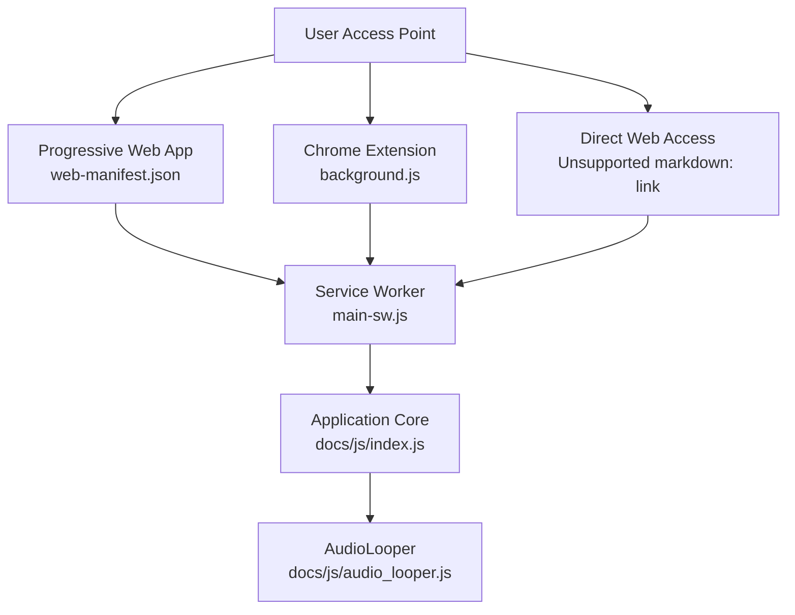
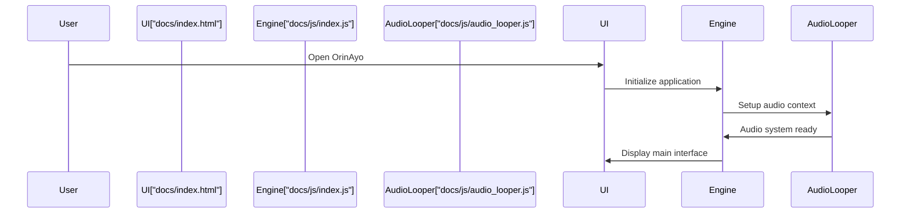
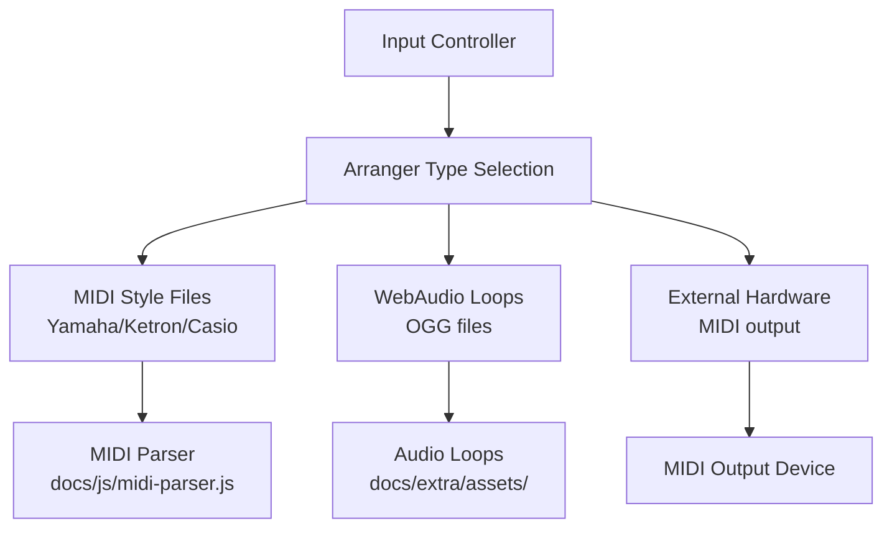
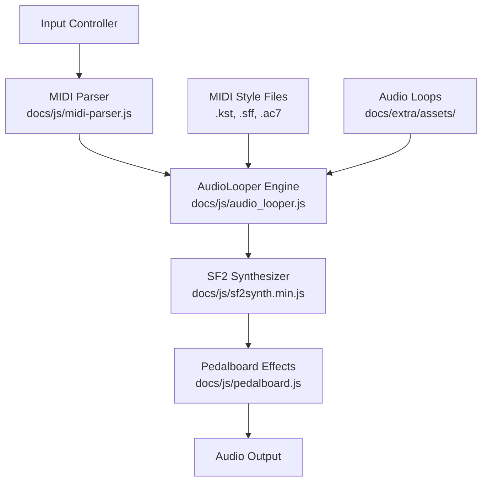
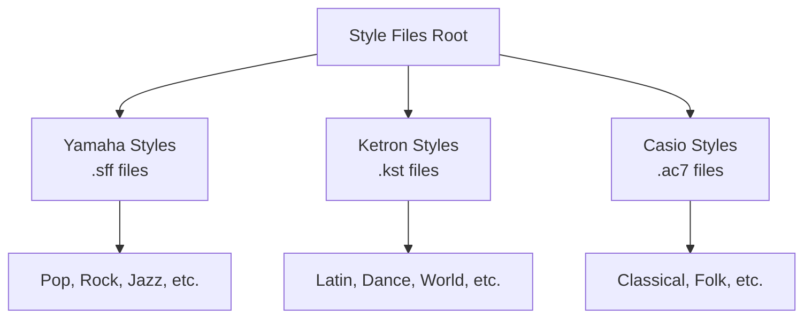

# Quick Start Guide

> **Relevant source files**
> * [docs/assets/screenshots/feature12.png](https://github.com/Jus-Be/orinayo/blob/3c7fbee9/docs/assets/screenshots/feature12.png)
> * [docs/assets/screenshots/feature2.png](https://github.com/Jus-Be/orinayo/blob/3c7fbee9/docs/assets/screenshots/feature2.png)
> * [docs/assets/screenshots/feature3.png](https://github.com/Jus-Be/orinayo/blob/3c7fbee9/docs/assets/screenshots/feature3.png)
> * [docs/assets/screenshots/feature4.png](https://github.com/Jus-Be/orinayo/blob/3c7fbee9/docs/assets/screenshots/feature4.png)
> * [docs/assets/screenshots/feature6-1.jpeg](https://github.com/Jus-Be/orinayo/blob/3c7fbee9/docs/assets/screenshots/feature6-1.jpeg)
> * [docs/assets/screenshots/feature6.png](https://github.com/Jus-Be/orinayo/blob/3c7fbee9/docs/assets/screenshots/feature6.png)
> * [docs/assets/screenshots/feature7.png](https://github.com/Jus-Be/orinayo/blob/3c7fbee9/docs/assets/screenshots/feature7.png)
> * [docs/assets/screenshots/feature8.png](https://github.com/Jus-Be/orinayo/blob/3c7fbee9/docs/assets/screenshots/feature8.png)
> * [documentation/orinayo_quick_start.html](https://github.com/Jus-Be/orinayo/blob/3c7fbee9/documentation/orinayo_quick_start.html)

This guide provides step-by-step instructions for immediate setup and basic usage of OrinAyo with guitar controllers, MIDI keyboards, and other input devices. It covers essential features needed to start making live music within minutes.

For comprehensive documentation of all features and advanced configuration, see [User Guide](/Jus-Be/orinayo/2.2-user-guide). For detailed input device setup and troubleshooting, see [Input Controllers](/Jus-Be/orinayo/2.3-input-controllers).

## System Requirements and Installation

OrinAyo runs as a Progressive Web App (PWA) or Chrome extension, supporting multiple deployment methods through the service worker architecture defined in [docs/main-sw.js L1-L200](https://github.com/Jus-Be/orinayo/blob/3c7fbee9/docs/main-sw.js#L1-L200)

### Hardware Requirements

* **Desktop**: Intel Core i7 or equivalent for standalone WebAudio synthesis
* **Mobile**: Samsung S25-class device or Apple M-series processor
* **Controllers**: Guitar Hero controllers, Bluetooth MIDI devices, or numeric keypads

### Installation Options

**Installation Methods:**

1. **PWA**: Install from browser address bar when visiting the application URL
2. **Chrome Extension**: Install from Chrome Web Store or load unpacked extension
3. **Direct Access**: Use web browser to navigate to hosted application

Sources: [docs/web-manifest.json L1-L30](https://github.com/Jus-Be/orinayo/blob/3c7fbee9/docs/web-manifest.json#L1-L30)

 [docs/background.js L1-L50](https://github.com/Jus-Be/orinayo/blob/3c7fbee9/docs/background.js#L1-L50)

 [docs/main-sw.js L1-L100](https://github.com/Jus-Be/orinayo/blob/3c7fbee9/docs/main-sw.js#L1-L100)

## Quick Setup Workflow

### 1. Launch and Initial Configuration

The main application interface loads through [docs/index.html L1-L100](https://github.com/Jus-Be/orinayo/blob/3c7fbee9/docs/index.html#L1-L100)

 and initializes the core engine via [docs/js/index.js L1-L50](https://github.com/Jus-Be/orinayo/blob/3c7fbee9/docs/js/index.js#L1-L50)

### 2. Controller Detection and Setup

OrinAyo automatically detects connected input devices through the Web MIDI API and Gamepad API:

| Controller Type | Detection Method | Configuration |
| --- | --- | --- |
| Guitar Hero Controllers | `navigator.getGamepads()` | Automatic gamepad mapping |
| MIDI Keyboards | `navigator.requestMIDIAccess()` | Channel 4 for chords |
| Bluetooth MIDI | Web Bluetooth API | Requires user permission |
| Numeric Keypads | Keyboard events | Configurable key mapping |

### 3. Arranger System Selection

Sources: [docs/js/midi-parser.js L1-L100](https://github.com/Jus-Be/orinayo/blob/3c7fbee9/docs/js/midi-parser.js#L1-L100)

 [docs/extra/assets/ L1-L50](https://github.com/Jus-Be/orinayo/blob/3c7fbee9/docs/extra/assets/#L1-L50)

## Essential Interface Elements

### Main Application Controls

The primary interface consists of these key components accessible through [docs/index.html L200-L300](https://github.com/Jus-Be/orinayo/blob/3c7fbee9/docs/index.html#L200-L300)

:

1. **Application Logo/Icon**: Toggle between mobile and desktop views
2. **Guitar Strum Selector**: Choose acoustic/electric guitar types
3. **Arranger Type Dropdown**: Select MIDI Style Files, WebAudio Loops, or External Hardware
4. **Arranger Group**: Filter style files by category
5. **Arranger Style**: Load specific style files
6. **Input Controller Selector**: Configure active input device

### Audio Processing Pipeline

Sources: [docs/js/audio_looper.js L1-L200](https://github.com/Jus-Be/orinayo/blob/3c7fbee9/docs/js/audio_looper.js#L1-L200)

 [docs/js/sf2synth.min.js L1-L50](https://github.com/Jus-Be/orinayo/blob/3c7fbee9/docs/js/sf2synth.min.js#L1-L50)

 [docs/js/pedalboard.js L1-L100](https://github.com/Jus-Be/orinayo/blob/3c7fbee9/docs/js/pedalboard.js#L1-L100)

## Guitar Controller Quick Reference

### Basic Chord Mapping (Nashville Number System)

For Guitar Hero-style controllers, chord input follows this pattern through gamepad button mapping:

| Chord | Green | Red | Yellow | Blue | Orange |
| --- | --- | --- | --- | --- | --- |
| 1 (I) |  |  | X |  |  |
| 2m (IIm) |  |  |  | X |  |
| 3m (IIIm) | X |  |  | X |  |
| 4 (IV) |  |  |  |  | X |
| 5 (V) | X |  |  |  |  |
| 6m (VIm) |  | X |  |  |  |

### Advanced Chord Shapes

| Chord | Green | Red | Yellow | Blue | Orange |
| --- | --- | --- | --- | --- | --- |
| 1sus |  |  | X |  | X |
| 1/3 |  |  | X | X |  |
| 2 |  | X |  | X |  |
| 3b |  | X |  | X | X |

Chord detection and processing occurs in the gamepad handler within [docs/js/index.js L300-L400](https://github.com/Jus-Be/orinayo/blob/3c7fbee9/docs/js/index.js#L300-L400)

Sources: [documentation/orinayo_quick_start.html L98-L220](https://github.com/Jus-Be/orinayo/blob/3c7fbee9/documentation/orinayo_quick_start.html#L98-L220)

## Audio Asset Management

### Style File Organization

MIDI style files are organized by manufacturer and genre:

### WebAudio Loop Assets

Audio loops are cached through the service worker and organized by instrument type:

* **Bass Loops**: [docs/extra/assets/bass/ L1-L50](https://github.com/Jus-Be/orinayo/blob/3c7fbee9/docs/extra/assets/bass/#L1-L50)
* **Chord Loops**: [docs/extra/assets/chords/ L1-L50](https://github.com/Jus-Be/orinayo/blob/3c7fbee9/docs/extra/assets/chords/#L1-L50)
* **Drum Loops**: [docs/extra/assets/drums/ L1-L50](https://github.com/Jus-Be/orinayo/blob/3c7fbee9/docs/extra/assets/drums/#L1-L50)

Sources: [docs/main-sw.js L50-L150](https://github.com/Jus-Be/orinayo/blob/3c7fbee9/docs/main-sw.js#L50-L150)

 [docs/extra/assets/ L1-L100](https://github.com/Jus-Be/orinayo/blob/3c7fbee9/docs/extra/assets/#L1-L100)

## First Session Walkthrough

### 1. Device Connection

1. Connect guitar controller via USB or Bluetooth
2. Launch OrinAyo (PWA, extension, or web)
3. Verify controller detection in Input Controller dropdown

### 2. Select Arranger Type

1. Choose "MIDI Style Files" for beginners
2. Select arranger group (e.g., "Pop", "Rock")
3. Load a style file using the Load button

### 3. Start Playing

1. Strum the controller while holding chord buttons
2. Use the strum bar for rhythm and dynamics
3. MIDI chord events are sent on channel 4 to the audio engine

### 4. Basic Controls

* **Start/Stop**: Space bar or controller start button
* **Tempo**: BPM controls in interface
* **Volume**: Master volume slider
* **Guitar Type**: Select from dropdown for different timbres

This basic workflow enables immediate music creation. For advanced features like effects processing, collaboration, and external hardware integration, see [User Guide](/Jus-Be/orinayo/2.2-user-guide).

Sources: [docs/js/index.js L1-L100](https://github.com/Jus-Be/orinayo/blob/3c7fbee9/docs/js/index.js#L1-L100)

 [docs/js/audio_looper.js L100-L200](https://github.com/Jus-Be/orinayo/blob/3c7fbee9/docs/js/audio_looper.js#L100-L200)

 [documentation/orinayo_quick_start.html L39-L97](https://github.com/Jus-Be/orinayo/blob/3c7fbee9/documentation/orinayo_quick_start.html#L39-L97)