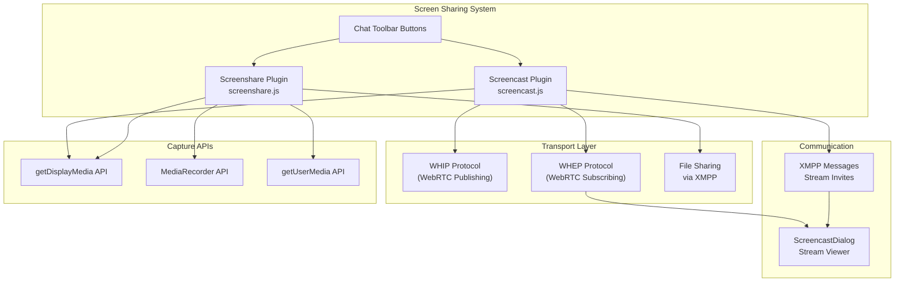
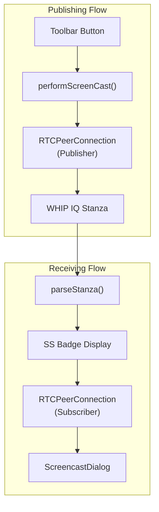
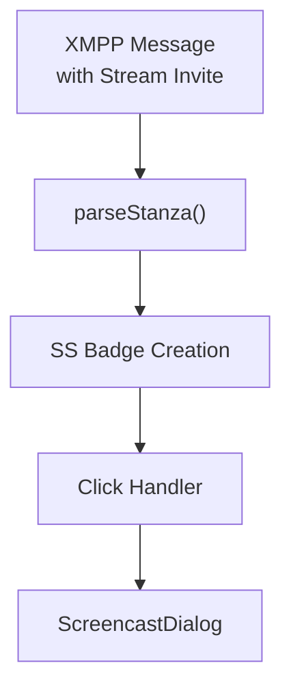
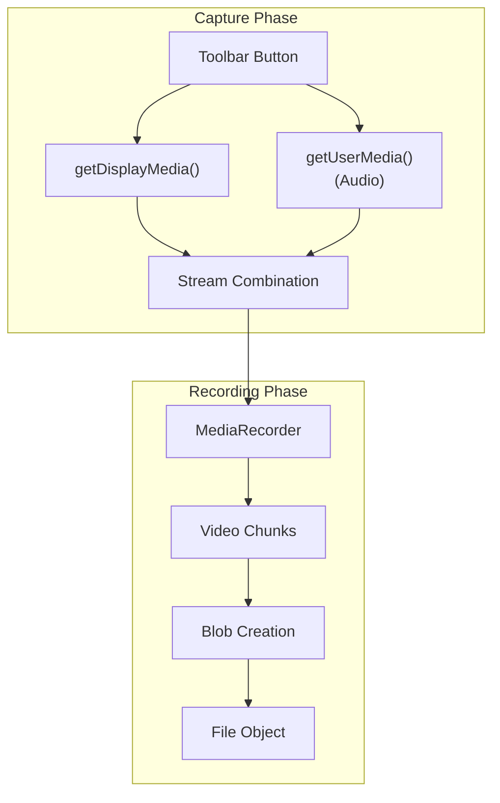

# Screen Sharing

> **Relevant source files**
> * [docs/packages/screencast/package.json](https://github.com/Jus-Be/orinayo/blob/3c7fbee9/docs/packages/screencast/package.json)
> * [docs/packages/screencast/readme.md](https://github.com/Jus-Be/orinayo/blob/3c7fbee9/docs/packages/screencast/readme.md)
> * [docs/packages/screencast/screencast.css](https://github.com/Jus-Be/orinayo/blob/3c7fbee9/docs/packages/screencast/screencast.css)
> * [docs/packages/screencast/screencast.js](https://github.com/Jus-Be/orinayo/blob/3c7fbee9/docs/packages/screencast/screencast.js)
> * [docs/packages/screencast/screencast.png](https://github.com/Jus-Be/orinayo/blob/3c7fbee9/docs/packages/screencast/screencast.png)
> * [docs/packages/screenshare/package.json](https://github.com/Jus-Be/orinayo/blob/3c7fbee9/docs/packages/screenshare/package.json)
> * [docs/packages/screenshare/readme.md](https://github.com/Jus-Be/orinayo/blob/3c7fbee9/docs/packages/screenshare/readme.md)
> * [docs/packages/screenshare/screenshare.js](https://github.com/Jus-Be/orinayo/blob/3c7fbee9/docs/packages/screenshare/screenshare.js)
> * [docs/packages/screenshare/screenshare.png](https://github.com/Jus-Be/orinayo/blob/3c7fbee9/docs/packages/screenshare/screenshare.png)

This document covers OrinAyo's screen sharing capabilities, which enable users to share their desktop or application windows during collaborative sessions. OrinAyo implements two distinct screen sharing approaches: real-time screen streaming via WebRTC and recorded screen capture for file sharing.

For information about voice and video chat functionality, see [Voice and Video Chat](/Jus-Be/orinayo/5.1-voice-and-video-chat). For details about the underlying XMPP communication system, see [XMPP Integration](/Jus-Be/orinayo/5.3-xmpp-integration).

## Overview

OrinAyo provides screen sharing functionality through two complementary plugins:

| Plugin | Approach | Use Case |
| --- | --- | --- |
| **Screencast** | Real-time WebRTC streaming | Live collaboration, demonstrations |
| **Screenshare** | Record and send as file | Asynchronous sharing, documentation |

Both plugins integrate with the XMPP chat interface and appear as toolbar buttons in group chat rooms.

## Architecture



Sources: [docs/packages/screencast/screencast.js L1-L315](https://github.com/Jus-Be/orinayo/blob/3c7fbee9/docs/packages/screencast/screencast.js#L1-L315)

 [docs/packages/screenshare/screenshare.js L1-L134](https://github.com/Jus-Be/orinayo/blob/3c7fbee9/docs/packages/screenshare/screenshare.js#L1-L134)

## Screencast Plugin (Real-time Streaming)

The screencast plugin provides live screen streaming capabilities using WHIP/WHEP protocols for real-time communication.

### Core Components



Sources: [docs/packages/screencast/screencast.js L143-L202](https://github.com/Jus-Be/orinayo/blob/3c7fbee9/docs/packages/screencast/screencast.js#L143-L202)

 [docs/packages/screencast/screencast.js L235-L301](https://github.com/Jus-Be/orinayo/blob/3c7fbee9/docs/packages/screencast/screencast.js#L235-L301)

### Stream Publishing

The `performScreenCast` function handles the screen capture and WebRTC publishing process:

1. **Screen Capture**: Uses `navigator.mediaDevices.getDisplayMedia()` to capture screen content [docs/packages/screencast/screencast.js L159](https://github.com/Jus-Be/orinayo/blob/3c7fbee9/docs/packages/screencast/screencast.js#L159-L159)
2. **WebRTC Setup**: Creates `RTCPeerConnection` with sendonly transceivers [docs/packages/screencast/screencast.js L169-L181](https://github.com/Jus-Be/orinayo/blob/3c7fbee9/docs/packages/screencast/screencast.js#L169-L181)
3. **WHIP Publishing**: Sends SDP offer via XMPP IQ stanza to server [docs/packages/screencast/screencast.js L186-L188](https://github.com/Jus-Be/orinayo/blob/3c7fbee9/docs/packages/screencast/screencast.js#L186-L188)
4. **Stream Announcement**: Broadcasts stream availability via XMPP message [docs/packages/screencast/screencast.js L208-L209](https://github.com/Jus-Be/orinayo/blob/3c7fbee9/docs/packages/screencast/screencast.js#L208-L209)

### Stream Viewing

The `ScreencastDialog` class provides the viewing interface for incoming streams:

* Creates RTCPeerConnection in receive-only mode [docs/packages/screencast/screencast.js L31-L33](https://github.com/Jus-Be/orinayo/blob/3c7fbee9/docs/packages/screencast/screencast.js#L31-L33)
* Handles incoming video tracks and displays in modal dialog [docs/packages/screencast/screencast.js L41-L58](https://github.com/Jus-Be/orinayo/blob/3c7fbee9/docs/packages/screencast/screencast.js#L41-L58)
* Sends WHEP subscribe request to server [docs/packages/screencast/screencast.js L76-L80](https://github.com/Jus-Be/orinayo/blob/3c7fbee9/docs/packages/screencast/screencast.js#L76-L80)

Sources: [docs/packages/screencast/screencast.js L18-L88](https://github.com/Jus-Be/orinayo/blob/3c7fbee9/docs/packages/screencast/screencast.js#L18-L88)

### User Interface Integration

Stream indicators appear as "SS" badges next to participant names in the occupants list:



The badge creation logic extracts occupant information and creates clickable elements [docs/packages/screencast/screencast.js L268-L290](https://github.com/Jus-Be/orinayo/blob/3c7fbee9/docs/packages/screencast/screencast.js#L268-L290)

Sources: [docs/packages/screencast/screencast.js L235-L301](https://github.com/Jus-Be/orinayo/blob/3c7fbee9/docs/packages/screencast/screencast.js#L235-L301)

## Screenshare Plugin (Record and Send)

The screenshare plugin records screen content and sends it as a video file through the chat system.

### Recording Process



Sources: [docs/packages/screenshare/screenshare.js L38-L127](https://github.com/Jus-Be/orinayo/blob/3c7fbee9/docs/packages/screenshare/screenshare.js#L38-L127)

### Stream Handling

The plugin follows a multi-step process to create comprehensive recordings:

1. **Screen Capture**: Obtains display media stream [docs/packages/screenshare/screenshare.js L50-L51](https://github.com/Jus-Be/orinayo/blob/3c7fbee9/docs/packages/screenshare/screenshare.js#L50-L51)
2. **Audio Integration**: Adds microphone audio to the stream [docs/packages/screenshare/screenshare.js L84-L90](https://github.com/Jus-Be/orinayo/blob/3c7fbee9/docs/packages/screenshare/screenshare.js#L84-L90)
3. **Recording Setup**: Configures `MediaRecorder` with combined stream [docs/packages/screenshare/screenshare.js L101-L102](https://github.com/Jus-Be/orinayo/blob/3c7fbee9/docs/packages/screenshare/screenshare.js#L101-L102)
4. **File Creation**: Generates WebM video file when recording stops [docs/packages/screenshare/screenshare.js L119-L121](https://github.com/Jus-Be/orinayo/blob/3c7fbee9/docs/packages/screenshare/screenshare.js#L119-L121)

### Cross-browser Compatibility

The `getDisplayMedia` function provides fallback support for different browser implementations:

* Modern browsers: `navigator.getDisplayMedia()` [docs/packages/screenshare/screenshare.js L73-L74](https://github.com/Jus-Be/orinayo/blob/3c7fbee9/docs/packages/screenshare/screenshare.js#L73-L74)
* Standard implementation: `navigator.mediaDevices.getDisplayMedia()` [docs/packages/screenshare/screenshare.js L75-L76](https://github.com/Jus-Be/orinayo/blob/3c7fbee9/docs/packages/screenshare/screenshare.js#L75-L76)
* Legacy fallback: `getUserMedia()` with screen media source [docs/packages/screenshare/screenshare.js L78](https://github.com/Jus-Be/orinayo/blob/3c7fbee9/docs/packages/screenshare/screenshare.js#L78-L78)

Sources: [docs/packages/screenshare/screenshare.js L71-L80](https://github.com/Jus-Be/orinayo/blob/3c7fbee9/docs/packages/screenshare/screenshare.js#L71-L80)

## XMPP Protocol Integration

Both plugins integrate with the XMPP messaging system but use different message patterns.

### Screencast XMPP Messages

Stream invitations use the `urn:xmpp:call-invites:0` namespace:

```xml
<message from="user@domain" to="room@conference.domain" type="groupchat">
  <body>/me started streaming</body>
  <invite xmlns="urn:xmpp:call-invites:0">
    <external uri="whip:occupant_id" />
  </invite>
</message>
```

Stream termination uses retraction messages [docs/packages/screencast/screencast.js L212-L217](https://github.com/Jus-Be/orinayo/blob/3c7fbee9/docs/packages/screencast/screencast.js#L212-L217)

### Feature Discovery

The screencast plugin checks server capabilities using service discovery:

* Queries server features on connection [docs/packages/screencast/screencast.js L114-L122](https://github.com/Jus-Be/orinayo/blob/3c7fbee9/docs/packages/screencast/screencast.js#L114-L122)
* Looks for `urn:xmpp:whip:0` feature support [docs/packages/screencast/screencast.js L121](https://github.com/Jus-Be/orinayo/blob/3c7fbee9/docs/packages/screencast/screencast.js#L121-L121)
* Hides toolbar button if WHIP unavailable [docs/packages/screencast/screencast.js L124-L128](https://github.com/Jus-Be/orinayo/blob/3c7fbee9/docs/packages/screencast/screencast.js#L124-L128)

Sources: [docs/packages/screencast/screencast.js L108-L129](https://github.com/Jus-Be/orinayo/blob/3c7fbee9/docs/packages/screencast/screencast.js#L108-L129)

## User Interface Components

Both plugins add toolbar buttons to group chat interfaces, with visual indicators for active sharing states.

### Button States

| State | Visual Indicator | Plugin |
| --- | --- | --- |
| Inactive | Static screen icon | Both |
| Active | Blinking animation (`blink_me` class) | Both |
| Unavailable | Hidden button | Screencast only |

### Styling

Custom CSS provides responsive layout for the screencast modal dialog [docs/packages/screencast/screencast.css L1-L11](https://github.com/Jus-Be/orinayo/blob/3c7fbee9/docs/packages/screencast/screencast.css#L1-L11)

Sources: [docs/packages/screencast/screencast.js L92-L105](https://github.com/Jus-Be/orinayo/blob/3c7fbee9/docs/packages/screencast/screencast.js#L92-L105)

 [docs/packages/screenshare/screenshare.js L18-L32](https://github.com/Jus-Be/orinayo/blob/3c7fbee9/docs/packages/screenshare/screenshare.js#L18-L32)

 [docs/packages/screencast/screencast.css L1-L11](https://github.com/Jus-Be/orinayo/blob/3c7fbee9/docs/packages/screencast/screencast.css#L1-L11)