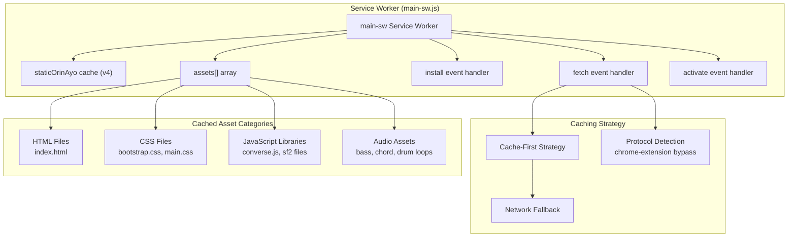
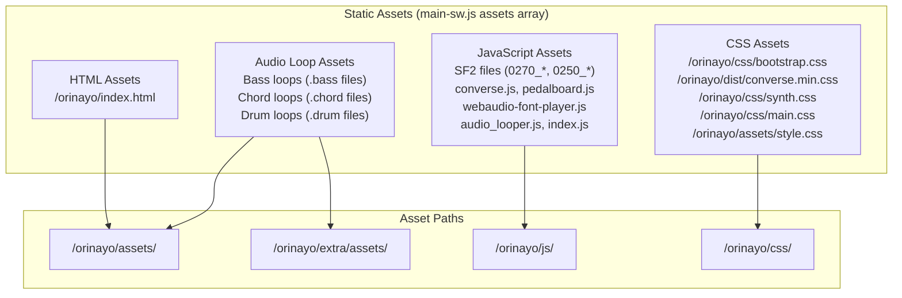
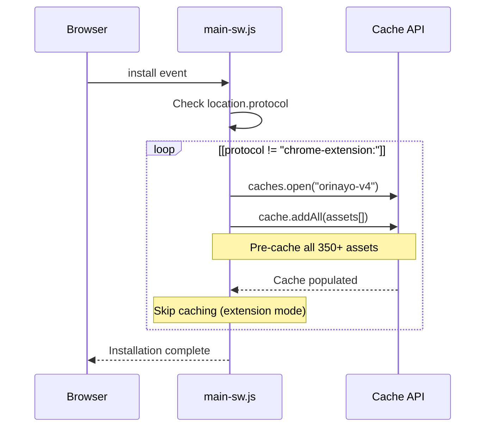
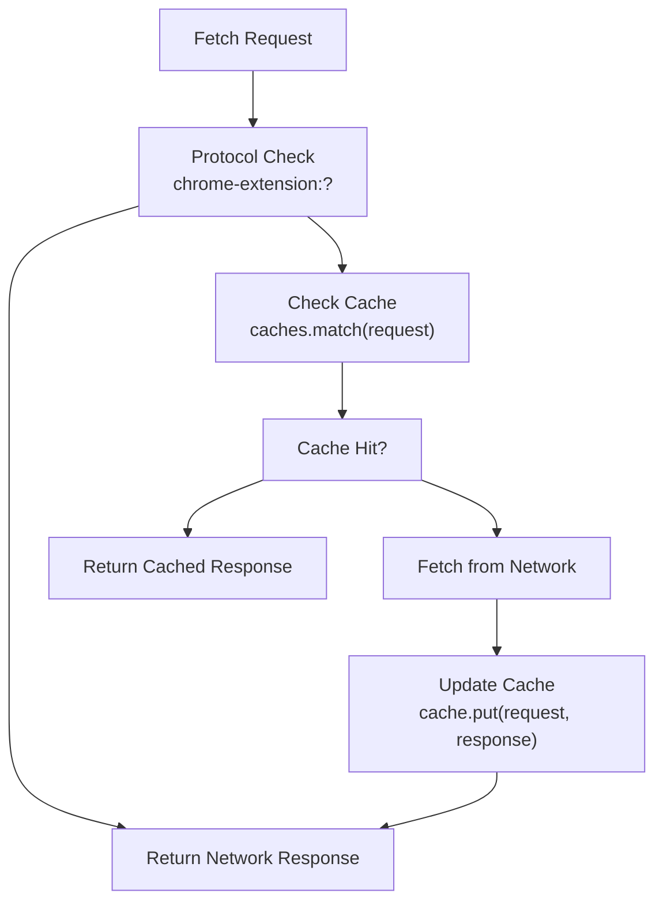
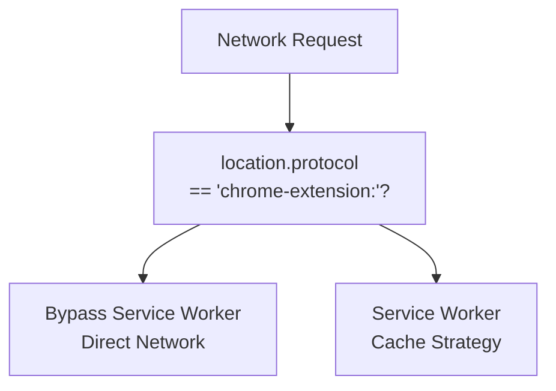

# Service Worker & Caching

> **Relevant source files**
> * [docs/extra/assets/bass/slow-blues_60_32000.bass](https://github.com/Jus-Be/orinayo/blob/3c7fbee9/docs/extra/assets/bass/slow-blues_60_32000.bass)
> * [docs/extra/assets/chords/blues-slow_60_32000_32000_2.chord](https://github.com/Jus-Be/orinayo/blob/3c7fbee9/docs/extra/assets/chords/blues-slow_60_32000_32000_2.chord)
> * [docs/extra/assets/chords/slow-blues_60_32000_32000_2.chord](https://github.com/Jus-Be/orinayo/blob/3c7fbee9/docs/extra/assets/chords/slow-blues_60_32000_32000_2.chord)
> * [docs/js/main-sw.js](https://github.com/Jus-Be/orinayo/blob/3c7fbee9/docs/js/main-sw.js)

This document covers OrinAyo's service worker implementation and caching strategy, which provides offline capabilities and performance optimization for the Progressive Web App. The service worker manages static asset caching, implements cache-first networking strategies, and handles cache lifecycle management.

For information about the broader PWA configuration, see [Progressive Web App](/Jus-Be/orinayo/6.1-progressive-web-app). For details about Chrome extension integration, see [Chrome Extension](/Jus-Be/orinayo/6.2-chrome-extension).

## Service Worker Architecture

The OrinAyo service worker is implemented in `main-sw.js` and provides comprehensive offline support through strategic asset caching. The service worker operates independently of the main application thread and intercepts network requests to serve cached content when available.

### Core Components

**Sources:** [docs/js/main-sw.js L1-L427](https://github.com/Jus-Be/orinayo/blob/3c7fbee9/docs/js/main-sw.js#L1-L427)

### Cache Version Management

The service worker uses versioned caching with the identifier `staticOrinAyo` set to version `"orinayo-v4"`. This versioning strategy allows for controlled cache updates and cleanup of outdated cache entries.

| Component | Purpose | Implementation |
| --- | --- | --- |
| `staticOrinAyo` | Cache version identifier | [docs/js/main-sw.js L1](https://github.com/Jus-Be/orinayo/blob/3c7fbee9/docs/js/main-sw.js#L1-L1) |
| `assets[]` array | Comprehensive asset list | [docs/js/main-sw.js L2-L369](https://github.com/Jus-Be/orinayo/blob/3c7fbee9/docs/js/main-sw.js#L2-L369) |
| Protocol detection | Chrome extension bypass | [docs/js/main-sw.js L374-L382](https://github.com/Jus-Be/orinayo/blob/3c7fbee9/docs/js/main-sw.js#L374-L382) |

**Sources:** [docs/js/main-sw.js L1-L427](https://github.com/Jus-Be/orinayo/blob/3c7fbee9/docs/js/main-sw.js#L1-L427)

## Asset Management Strategy

The service worker manages four primary categories of assets through a comprehensive pre-caching strategy:

### Asset Categories

**Sources:** [docs/js/main-sw.js L2-L369](https://github.com/Jus-Be/orinayo/blob/3c7fbee9/docs/js/main-sw.js#L2-L369)

### Audio Asset Organization

The service worker caches an extensive collection of audio loops organized by type:

| Asset Type | File Extension | Path Structure | Count |
| --- | --- | --- | --- |
| Bass Loops | `.bass` | `/orinayo/assets/bass/` | 30+ files |
| Chord Loops | `.chord` | `/orinayo/assets/chords/` | 150+ files |
| Drum Loops | `.drum` | `/orinayo/assets/drums/` | 120+ files |
| Extended Assets | Various | `/orinayo/extra/assets/` | Additional loops |

**Sources:** [docs/js/main-sw.js L46-L368](https://github.com/Jus-Be/orinayo/blob/3c7fbee9/docs/js/main-sw.js#L46-L368)

## Caching Strategy Implementation

### Install Event Handler

The service worker implements aggressive pre-caching during installation, ensuring all critical assets are available offline immediately after installation:

**Sources:** [docs/js/main-sw.js L371-L383](https://github.com/Jus-Be/orinayo/blob/3c7fbee9/docs/js/main-sw.js#L371-L383)

### Fetch Event Handler

The fetch event implements a cache-first strategy with intelligent network fallback:

**Sources:** [docs/js/main-sw.js L385-L406](https://github.com/Jus-Be/orinayo/blob/3c7fbee9/docs/js/main-sw.js#L385-L406)

### Activate Event Handler

The activate event manages cache cleanup and version management:

| Operation | Purpose | Implementation |
| --- | --- | --- |
| Cache enumeration | List all cache names | `caches.keys()` |
| Version comparison | Identify outdated caches | Compare against `staticOrinAyo` |
| Cache deletion | Remove old cache versions | `caches.delete(key)` |
| Protocol bypass | Skip cleanup for extensions | [docs/js/main-sw.js L411-L425](https://github.com/Jus-Be/orinayo/blob/3c7fbee9/docs/js/main-sw.js#L411-L425) |

**Sources:** [docs/js/main-sw.js L408-L426](https://github.com/Jus-Be/orinayo/blob/3c7fbee9/docs/js/main-sw.js#L408-L426)

## Platform Integration

### Chrome Extension Compatibility

The service worker includes specific logic to handle Chrome extension environments where traditional caching may not be appropriate or necessary:

This design ensures the service worker operates correctly across different deployment contexts including web browsers, PWA installations, and Chrome extension environments.

**Sources:** [docs/js/main-sw.js L374-L425](https://github.com/Jus-Be/orinayo/blob/3c7fbee9/docs/js/main-sw.js#L374-L425)

## Cache Lifecycle Management

The service worker implements a complete cache lifecycle with proper cleanup and versioning:

### Cache Operations

| Event | Action | Files Affected | Purpose |
| --- | --- | --- | --- |
| Install | Pre-cache assets | All 350+ assets | Offline availability |
| Fetch | Cache-first lookup | Requested resources | Performance optimization |
| Fetch miss | Network + cache update | New resources | Dynamic caching |
| Activate | Old cache cleanup | Previous versions | Storage management |

**Sources:** [docs/js/main-sw.js L371-L426](https://github.com/Jus-Be/orinayo/blob/3c7fbee9/docs/js/main-sw.js#L371-L426)

### Performance Optimization

The caching strategy optimizes performance through:

* **Pre-caching**: Critical assets cached during installation
* **Cache-first serving**: Immediate response for cached assets
* **Dynamic caching**: New resources automatically cached after first fetch
* **Version-based cleanup**: Prevents cache bloat from outdated assets

This comprehensive caching approach ensures OrinAyo functions reliably offline while maintaining optimal performance characteristics for audio-intensive applications.

**Sources:** [docs/js/main-sw.js L1-L427](https://github.com/Jus-Be/orinayo/blob/3c7fbee9/docs/js/main-sw.js#L1-L427)