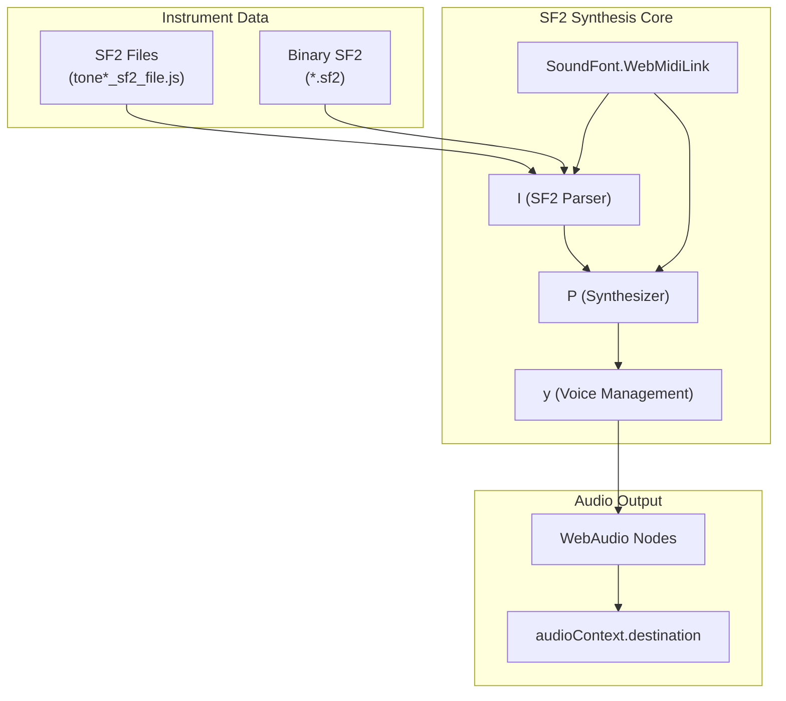
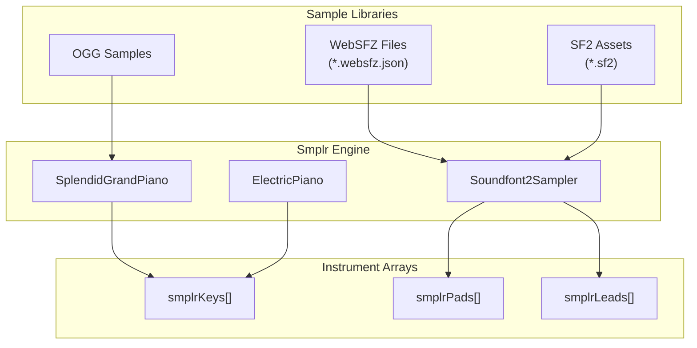
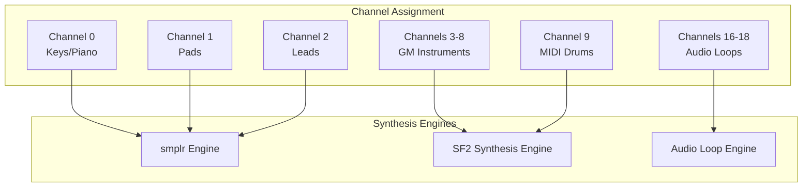
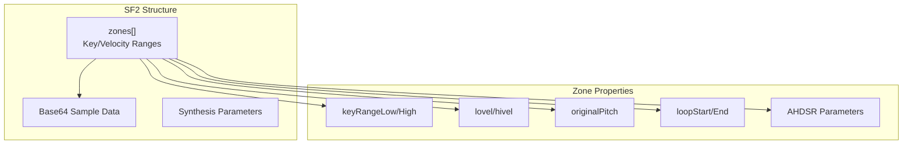
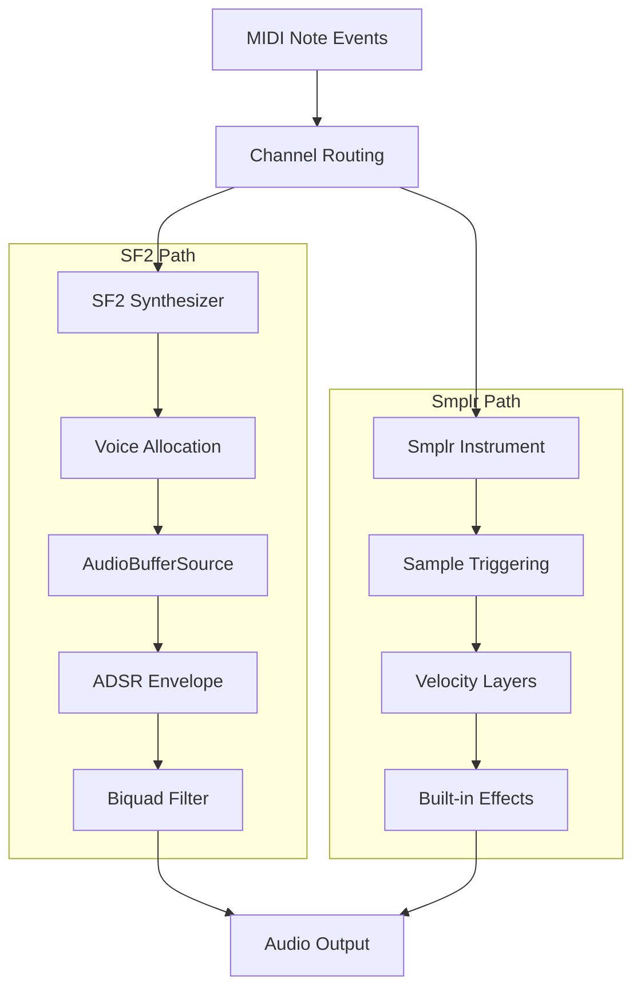

# Sound Synthesis

> **Relevant source files**
> * [docs/assets/gs-e-pianos/CP80/cp80.websfz.json](https://github.com/Jus-Be/orinayo/blob/3c7fbee9/docs/assets/gs-e-pianos/CP80/cp80.websfz.json)
> * [docs/assets/leads/synth_calliope.sf2](https://github.com/Jus-Be/orinayo/blob/3c7fbee9/docs/assets/leads/synth_calliope.sf2)
> * [docs/assets/pads/glass-pad.sf2](https://github.com/Jus-Be/orinayo/blob/3c7fbee9/docs/assets/pads/glass-pad.sf2)
> * [docs/js/0270_Aspirin_sf2_file.js](https://github.com/Jus-Be/orinayo/blob/3c7fbee9/docs/js/0270_Aspirin_sf2_file.js)
> * [docs/js/0280_JCLive_sf2_file.js](https://github.com/Jus-Be/orinayo/blob/3c7fbee9/docs/js/0280_JCLive_sf2_file.js)
> * [docs/js/piano-pads.js](https://github.com/Jus-Be/orinayo/blob/3c7fbee9/docs/js/piano-pads.js)
> * [docs/js/sf2.synth.min.js](https://github.com/Jus-Be/orinayo/blob/3c7fbee9/docs/js/sf2.synth.min.js)
> * [docs/js/smplr.mjs](https://github.com/Jus-Be/orinayo/blob/3c7fbee9/docs/js/smplr.mjs)

The sound synthesis system in OrinAyo handles the conversion of MIDI note events into digital audio using multiple synthesis engines and sample libraries. This system provides the core sound generation capabilities for all instruments in the application, from piano sounds to synthesized leads and pads.

For audio effects processing that operates on the synthesized output, see [Audio Effects (Pedalboard)](/Jus-Be/orinayo/4.3-audio-effects-(pedalboard)). For MIDI event processing that feeds into synthesis, see [MIDI Processing](/Jus-Be/orinayo/4.1-midi-processing).

## SF2 Synthesis Engine

The primary sound synthesis engine uses SoundFont 2 (SF2) format instruments through a specialized synthesis library. The `SoundFont.WebMidiLink` class serves as the main interface for SF2-based synthesis.

The synthesis engine processes MIDI events through the `ga` function, which handles note on/off events, control changes, and program changes. Each synthesized voice uses WebAudio buffer sources with envelope shaping and filtering.

Sources: [docs/js/sf2.synth.min.js L1-L954](https://github.com/Jus-Be/orinayo/blob/3c7fbee9/docs/js/sf2.synth.min.js#L1-L954)

## Sample-Based Synthesis

Modern sample-based synthesis is provided through the smplr library, which offers high-quality instrument sampling with advanced features like velocity layers and round-robin sampling.

The `setupPianos` function initializes the smplr-based instruments and connects them to a shared reverb effect. The system supports dynamic loading of SF2 instruments from IndexedDB storage.

Sources: [docs/js/piano-pads.js L6-L64](https://github.com/Jus-Be/orinayo/blob/3c7fbee9/docs/js/piano-pads.js#L6-L64)

 [docs/js/smplr.mjs L1-L114](https://github.com/Jus-Be/orinayo/blob/3c7fbee9/docs/js/smplr.mjs#L1-L114)

## Instrument Management

OrinAyo manages instruments through multiple channels, with different synthesis engines assigned to specific channel ranges:

| Channel Range | Synthesis Engine | Instrument Type |
| --- | --- | --- |
| 0 (Keys) | smplr / SF2Sampler | Piano, Keys |
| 1 (Pads) | smplr / SF2Sampler | Synth Pads |
| 2 (Leads) | smplr / SF2Sampler | Lead Synths |
| 3-8, 10-15 | SF2 Synth | General MIDI |
| 9 | SF2 Synth | MIDI Drums |
| 16-18 | Audio Loops | Drums, Bass, Chords |

The `addDbKeysAndPads` function handles dynamic loading of SF2 instruments from browser storage, creating `Soundfont2Sampler` instances for each discovered instrument bank.

Sources: [docs/js/piano-pads.js L67-L160](https://github.com/Jus-Be/orinayo/blob/3c7fbee9/docs/js/piano-pads.js#L67-L160)

 [docs/js/sf2.synth.min.js L587-L717](https://github.com/Jus-Be/orinayo/blob/3c7fbee9/docs/js/sf2.synth.min.js#L587-L717)

## SF2 File Format Support

The synthesis system supports multiple SF2 instrument encoding formats:

### JavaScript-Encoded SF2

Instruments can be embedded directly in JavaScript files with base64-encoded sample data. Each instrument defines zones with key ranges, loop points, and ADSR envelope parameters.

### WebSFZ Format

Modern instruments use the WebSFZ JSON format, which provides more flexible sample mapping and supports multiple audio formats (OGG, M4A).

Sources: [docs/js/0270_Aspirin_sf2_file.js L1-L18](https://github.com/Jus-Be/orinayo/blob/3c7fbee9/docs/js/0270_Aspirin_sf2_file.js#L1-L18)

 [docs/js/0280_JCLive_sf2_file.js L1-L18](https://github.com/Jus-Be/orinayo/blob/3c7fbee9/docs/js/0280_JCLive_sf2_file.js#L1-L18)

 [docs/assets/gs-e-pianos/CP80/cp80.websfz.json L1](https://github.com/Jus-Be/orinayo/blob/3c7fbee9/docs/assets/gs-e-pianos/CP80/cp80.websfz.json#L1-L1)

## Synthesis Pipeline

The complete synthesis pipeline processes MIDI events through multiple stages:

The `noteOn` and `noteOff` methods in the SF2 synthesizer handle voice lifecycle management, while smplr instruments provide their own optimized triggering mechanisms.

Sources: [docs/js/sf2.synth.min.js L745-L775](https://github.com/Jus-Be/orinayo/blob/3c7fbee9/docs/js/sf2.synth.min.js#L745-L775)

 [docs/js/piano-pads.js L13-L21](https://github.com/Jus-Be/orinayo/blob/3c7fbee9/docs/js/piano-pads.js#L13-L21)