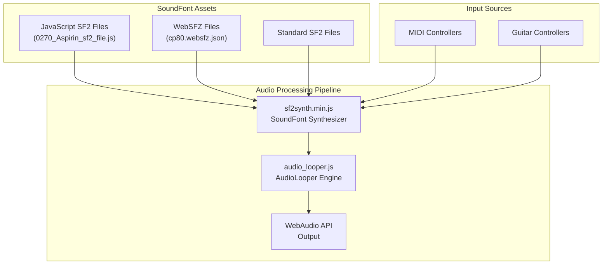
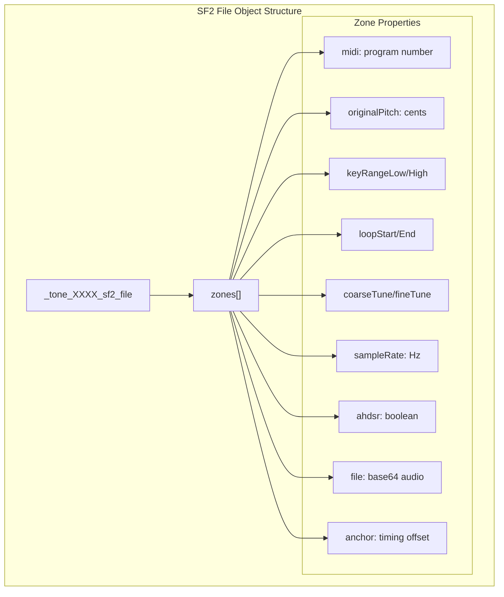
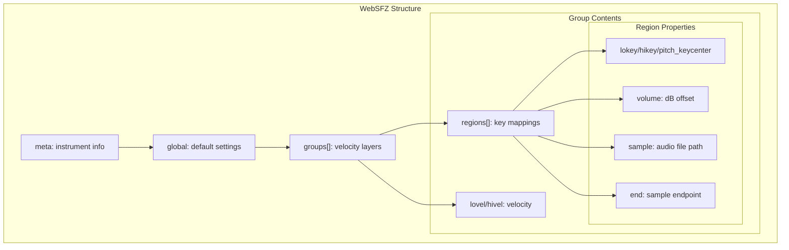

# SoundFont Files

> **Relevant source files**
> * [docs/assets/gs-e-pianos/CP80/cp80.websfz.json](https://github.com/Jus-Be/orinayo/blob/3c7fbee9/docs/assets/gs-e-pianos/CP80/cp80.websfz.json)
> * [docs/js/0270_Aspirin_sf2_file.js](https://github.com/Jus-Be/orinayo/blob/3c7fbee9/docs/js/0270_Aspirin_sf2_file.js)
> * [docs/js/0280_JCLive_sf2_file.js](https://github.com/Jus-Be/orinayo/blob/3c7fbee9/docs/js/0280_JCLive_sf2_file.js)

This document covers SoundFont instrument definition files used by OrinAyo for realistic instrument sound synthesis. SoundFont files define instrument samples, key mappings, and playback parameters that enable the SF2 synthesizer to produce authentic instrument sounds.

For information about the synthesis engine that processes these files, see [Sound Synthesis](/Jus-Be/orinayo/4.2-sound-synthesis). For broader audio asset management, see [Audio Loops and Samples](/Jus-Be/orinayo/7.1-audio-loops-and-samples).

## Purpose and File Formats

OrinAyo supports multiple SoundFont formats to provide realistic instrument sounds for music production:

* **JavaScript SF2 Format**: Native format with embedded base64 audio data
* **WebSFZ Format**: JSON-based format compatible with SFZ samplers
* **Standard SF2**: Traditional SoundFont 2.0 files processed by `sf2synth.min.js`

These files define instrument characteristics including sample data, key ranges, velocity layers, loop points, and ADSR envelope parameters.

## SoundFont Integration Architecture

Sources: High-level architecture diagrams, [docs/js/0270_Aspirin_sf2_file.js](https://github.com/Jus-Be/orinayo/blob/3c7fbee9/docs/js/0270_Aspirin_sf2_file.js)

 [docs/assets/gs-e-pianos/CP80/cp80.websfz.json](https://github.com/Jus-Be/orinayo/blob/3c7fbee9/docs/assets/gs-e-pianos/CP80/cp80.websfz.json)

## JavaScript SF2 File Structure

JavaScript SF2 files contain instrument definitions as JavaScript objects with embedded audio samples:

### Multi-Zone Instruments

Complex instruments like muted guitar sounds use multiple zones for different pitch ranges:

| Zone | Key Range | Center Pitch | Sample Name |
| --- | --- | --- | --- |
| 1 | 0-55 | E2 (5800 cents) | `Gtr_Mute_E2` |
| 2 | 56-60 | A2 (6500 cents) | `Gtr_Mute_A2` |
| 3 | 61-65 | D3 (7000 cents) | `Gtr_Mute_D3` |
| 4 | 66-69 | G3 (7500 cents) | `Gtr_Mute_G3` |
| 5 | 70-74 | B3 (7900 cents) | `Gtr_Mute_B3` |

Sources: [docs/js/0280_JCLive_sf2_file.js L1-L110](https://github.com/Jus-Be/orinayo/blob/3c7fbee9/docs/js/0280_JCLive_sf2_file.js#L1-L110)

## WebSFZ Format

WebSFZ files use JSON structure for more complex instrument definitions with velocity layers and advanced parameters:

### Velocity Layer Example (CP80 Piano)

The CP80 electric piano uses four velocity layers:

| Layer | Velocity Range | Label | Characteristics |
| --- | --- | --- | --- |
| 1 | 1-49 | `PP` (pianissimo) | Soft attack |
| 2 | 50-81 | `MP` (mezzo-piano) | Medium attack |
| 3 | 82-103 | `F` (forte) | Strong attack |
| 4 | 104-127 | `FF` (fortissimo) | Maximum attack |

Sources: [docs/assets/gs-e-pianos/CP80/cp80.websfz.json L1](https://github.com/Jus-Be/orinayo/blob/3c7fbee9/docs/assets/gs-e-pianos/CP80/cp80.websfz.json#L1-L1)

## File Organization and Naming

SoundFont files follow consistent naming patterns:

### JavaScript SF2 Files

* Pattern: `XXXX_InstrumentName_sf2_file.js`
* Location: `docs/js/`
* Examples: `0270_Aspirin_sf2_file.js`, `0280_JCLive_sf2_file.js`

### WebSFZ Assets

* Pattern: `instrumentname.websfz.json`
* Location: `docs/assets/gs-e-pianos/[instrument]/`
* Companion audio files in `Samples/` subdirectory

### Global Configuration

WebSFZ files include global parameters affecting all regions:

| Parameter | Purpose | Example Value |
| --- | --- | --- |
| `amplitude_oncc7` | Volume CC control | 100 |
| `pan_oncc10` | Pan CC control | 100 |
| `ampeg_release_oncc72` | Release CC control | 2 |
| `note_polyphony` | Voice limit per note | 1 |
| `off_time` | Note-off behavior | 0 |

Sources: [docs/assets/gs-e-pianos/CP80/cp80.websfz.json L1](https://github.com/Jus-Be/orinayo/blob/3c7fbee9/docs/assets/gs-e-pianos/CP80/cp80.websfz.json#L1-L1)

## Integration with Synthesis Engine

SoundFont files are loaded and processed by the SF2 synthesis system:

1. **File Loading**: JavaScript SF2 files are loaded as modules
2. **Zone Mapping**: Key ranges and velocity layers are indexed
3. **Sample Preparation**: Base64 audio data is decoded
4. **Synthesis Ready**: Instrument available for real-time playback

The synthesis engine maps incoming MIDI events to appropriate zones based on key number and velocity, then triggers sample playback with the defined parameters.

Sources: System architecture diagrams, [docs/js/0270_Aspirin_sf2_file.js L1-L36](https://github.com/Jus-Be/orinayo/blob/3c7fbee9/docs/js/0270_Aspirin_sf2_file.js#L1-L36)

 [docs/js/0280_JCLive_sf2_file.js L1-L111](https://github.com/Jus-Be/orinayo/blob/3c7fbee9/docs/js/0280_JCLive_sf2_file.js#L1-L111)