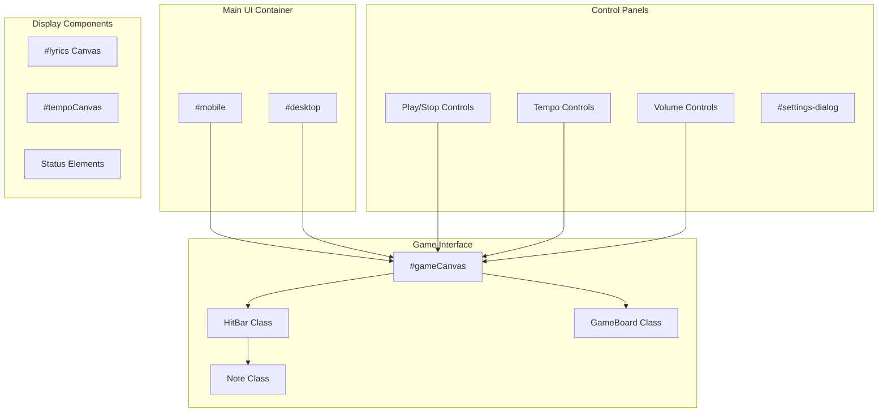
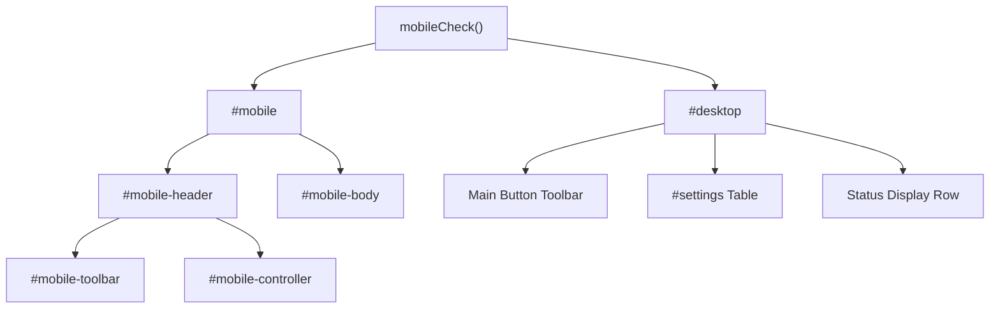
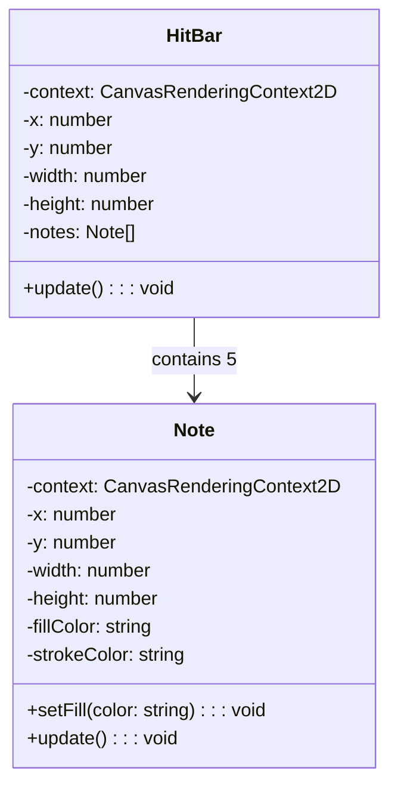
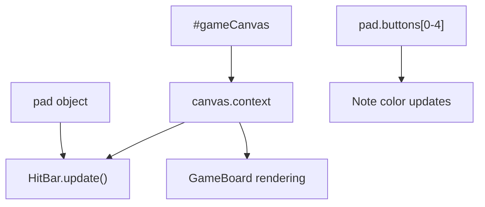
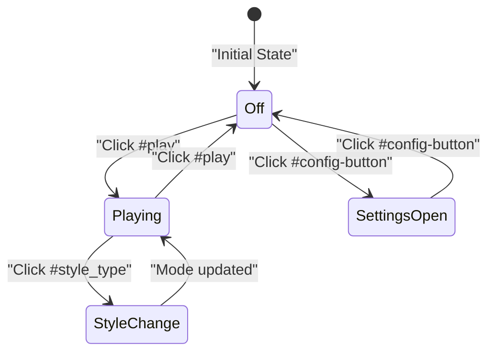
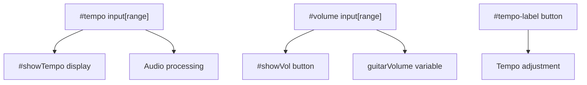
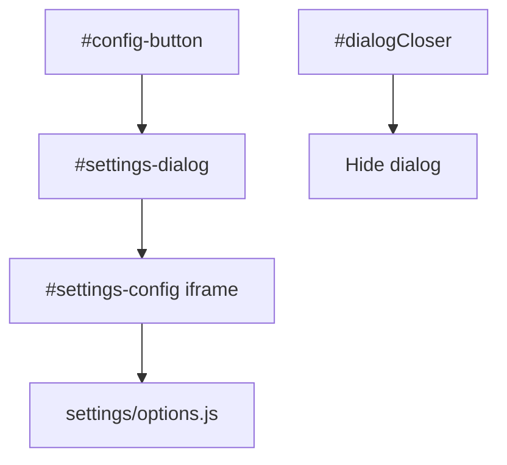
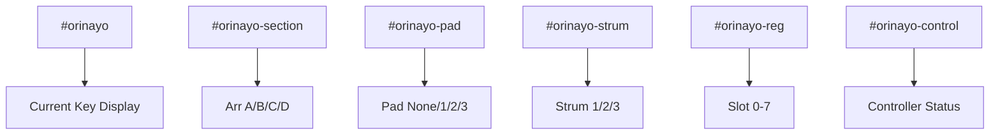
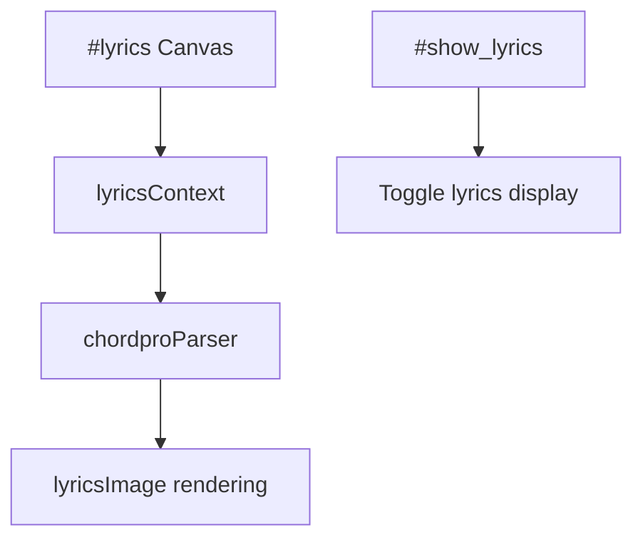
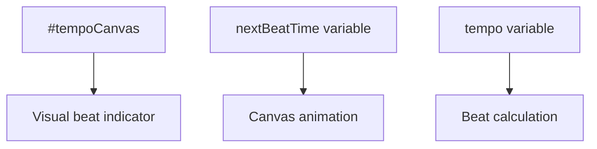

# UI Components

> **Relevant source files**
> * [docs/assets/chords/acoustic-guitar_100_4800_4800_2.chord](https://github.com/Jus-Be/orinayo/blob/3c7fbee9/docs/assets/chords/acoustic-guitar_100_4800_4800_2.chord)
> * [docs/assets/chords/acoustic-guitar_120_4000_4000_2.chord](https://github.com/Jus-Be/orinayo/blob/3c7fbee9/docs/assets/chords/acoustic-guitar_120_4000_4000_2.chord)
> * [docs/assets/chords/acoustic-guitar_75_6400_6400_2.chord](https://github.com/Jus-Be/orinayo/blob/3c7fbee9/docs/assets/chords/acoustic-guitar_75_6400_6400_2.chord)
> * [docs/assets/chords/acoustic_90_5333.chord](https://github.com/Jus-Be/orinayo/blob/3c7fbee9/docs/assets/chords/acoustic_90_5333.chord)
> * [docs/assets/chords/ballad_90_10667_5333.chord](https://github.com/Jus-Be/orinayo/blob/3c7fbee9/docs/assets/chords/ballad_90_10667_5333.chord)
> * [docs/assets/chords/beat-arp2_120_4000.chord](https://github.com/Jus-Be/orinayo/blob/3c7fbee9/docs/assets/chords/beat-arp2_120_4000.chord)
> * [docs/assets/drums/8beat_90_2667_21333_2667_2667_8000.drum](https://github.com/Jus-Be/orinayo/blob/3c7fbee9/docs/assets/drums/8beat_90_2667_21333_2667_2667_8000.drum)
> * [docs/css/main.css](https://github.com/Jus-Be/orinayo/blob/3c7fbee9/docs/css/main.css)
> * [docs/index.html](https://github.com/Jus-Be/orinayo/blob/3c7fbee9/docs/index.html)
> * [docs/js/audio_looper.js](https://github.com/Jus-Be/orinayo/blob/3c7fbee9/docs/js/audio_looper.js)
> * [docs/js/background.js](https://github.com/Jus-Be/orinayo/blob/3c7fbee9/docs/js/background.js)
> * [docs/js/hitBar.js](https://github.com/Jus-Be/orinayo/blob/3c7fbee9/docs/js/hitBar.js)
> * [docs/js/index.js](https://github.com/Jus-Be/orinayo/blob/3c7fbee9/docs/js/index.js)
> * [docs/js/styles.js](https://github.com/Jus-Be/orinayo/blob/3c7fbee9/docs/js/styles.js)
> * [docs/manifest.json](https://github.com/Jus-Be/orinayo/blob/3c7fbee9/docs/manifest.json)
> * [docs/settings/options.js](https://github.com/Jus-Be/orinayo/blob/3c7fbee9/docs/settings/options.js)

This document covers the user interface components that make up OrinAyo's interactive visual elements. These components handle display, user input, and visual feedback for the live music production interface.

For information about the underlying audio processing that these components control, see [Audio Processing Pipeline](/Jus-Be/orinayo/3.2-audio-processing-pipeline). For details about the main application logic that coordinates these UI components, see [Application Engine](/Jus-Be/orinayo/3.1-application-engine).

## Overview

OrinAyo's UI system consists of responsive web components that adapt between mobile and desktop layouts, guitar game-style visual feedback components, and various control panels. The interface is built using HTML5 Canvas for the game elements and standard web technologies for controls and settings.

Sources: [docs/index.html L1-L297](https://github.com/Jus-Be/orinayo/blob/3c7fbee9/docs/index.html#L1-L297)

 [docs/js/index.js L250-L256](https://github.com/Jus-Be/orinayo/blob/3c7fbee9/docs/js/index.js#L250-L256)

 [docs/js/hitBar.js L1-L48](https://github.com/Jus-Be/orinayo/blob/3c7fbee9/docs/js/hitBar.js#L1-L48)

## Layout System

### Mobile vs Desktop Views

The application uses responsive design with separate mobile and desktop container elements that are toggled based on viewport detection.

| Container | Element ID | Primary Use |
| --- | --- | --- |
| Mobile View | `#mobile` | Compact layout for touch devices |
| Desktop View | `#desktop` | Full-featured interface for larger screens |

The `mobileCheck()` function determines which layout to display, and elements are dynamically moved between containers based on the current view mode.

Sources: [docs/index.html L19-L86](https://github.com/Jus-Be/orinayo/blob/3c7fbee9/docs/index.html#L19-L86)

 [docs/index.html L87-L221](https://github.com/Jus-Be/orinayo/blob/3c7fbee9/docs/index.html#L87-L221)

 [docs/js/index.js L471-L474](https://github.com/Jus-Be/orinayo/blob/3c7fbee9/docs/js/index.js#L471-L474)

 [docs/js/index.js L500-L503](https://github.com/Jus-Be/orinayo/blob/3c7fbee9/docs/js/index.js#L500-L503)

## Game Interface Components

### HitBar Component

The `HitBar` class renders the guitar game-style note interface using HTML5 Canvas. It displays five colored buttons corresponding to guitar controller inputs.

The HitBar creates five `Note` instances representing the guitar controller buttons:

* Green (index 0)
* Red (index 1)
* Yellow (index 2)
* Blue (index 3)
* Orange (index 4)

Sources: [docs/js/hitBar.js L1-L48](https://github.com/Jus-Be/orinayo/blob/3c7fbee9/docs/js/hitBar.js#L1-L48)

### Canvas System

The main game canvas (`#gameCanvas`) serves as the primary rendering surface for interactive elements.

The canvas dimensions are set to 1000x175 pixels and uses 2D rendering context for drawing the game interface elements.

Sources: [docs/index.html L241](https://github.com/Jus-Be/orinayo/blob/3c7fbee9/docs/index.html#L241-L241)

 [docs/js/index.js L250-L256](https://github.com/Jus-Be/orinayo/blob/3c7fbee9/docs/js/index.js#L250-L256)

 [docs/js/hitBar.js L36-L40](https://github.com/Jus-Be/orinayo/blob/3c7fbee9/docs/js/hitBar.js#L36-L40)

## Control Interface

### Primary Controls

The main control interface consists of fluent-ui buttons arranged in a toolbar layout:

| Control | Element ID | Function |
| --- | --- | --- |
| Play/Stop | `#play` | Toggle arranger playback |
| Style Type | `#style_type` | Switch between Normal/DJ modes |
| Gamepad Mode | `#gamepad_mode` | Change guitar input style |
| Load File | `#load_file` | Import external music files |
| Settings | `#config-button` | Open configuration dialog |

Sources: [docs/index.html L95-L112](https://github.com/Jus-Be/orinayo/blob/3c7fbee9/docs/index.html#L95-L112)

 [docs/js/index.js L133-L134](https://github.com/Jus-Be/orinayo/blob/3c7fbee9/docs/js/index.js#L133-L134)

### Tempo and Volume Controls

Real-time audio parameter controls are implemented using HTML5 range inputs:

The tempo control ranges from -6 to +6 semitones, while volume ranges from 1 to 100.

Sources: [docs/index.html L115-L131](https://github.com/Jus-Be/orinayo/blob/3c7fbee9/docs/index.html#L115-L131)

 [docs/js/index.js L197](https://github.com/Jus-Be/orinayo/blob/3c7fbee9/docs/js/index.js#L197-L197)

 [docs/js/index.js L219-L220](https://github.com/Jus-Be/orinayo/blob/3c7fbee9/docs/js/index.js#L219-L220)

## Settings and Configuration UI

### Settings Dialog System

The settings interface uses an embedded iframe within a fluent-dialog component:

The settings are organized into tabbed sections covering collaboration servers, devices, contacts, and UI preferences.

Sources: [docs/index.html L137-L140](https://github.com/Jus-Be/orinayo/blob/3c7fbee9/docs/index.html#L137-L140)

 [docs/settings/options.js L25-L186](https://github.com/Jus-Be/orinayo/blob/3c7fbee9/docs/settings/options.js#L25-L186)

### Arranger Configuration Table

A comprehensive settings table provides dropdowns for audio and MIDI configuration:

| Setting Category | Element ID | Purpose |
| --- | --- | --- |
| Guitar Strum | `#guitarStrum1-3` | Strum pattern selection |
| Arranger Type | `#arrangerType` | Style file format |
| MIDI I/O | `#midiInSel`, `#midiOutSel` | Device selection |
| Audio Devices | `#inputAudioDevice` | Hardware configuration |

Sources: [docs/index.html L151-L220](https://github.com/Jus-Be/orinayo/blob/3c7fbee9/docs/index.html#L151-L220)

## Status Display Components

### Real-time Status Elements

The application displays current state through dedicated status elements arranged in a horizontal layout:

These elements are updated in real-time as the user interacts with controllers or changes settings.

Sources: [docs/index.html L230-L237](https://github.com/Jus-Be/orinayo/blob/3c7fbee9/docs/index.html#L230-L237)

 [docs/js/index.js L157-L163](https://github.com/Jus-Be/orinayo/blob/3c7fbee9/docs/js/index.js#L157-L163)

### Visual Feedback Systems

#### Lyrics and Notation Display

The lyrics system uses a dedicated canvas element for rendering song text and chord symbols:

#### Tempo Visualization

A specialized tempo canvas provides visual metronome feedback:

Sources: [docs/index.html L142](https://github.com/Jus-Be/orinayo/blob/3c7fbee9/docs/index.html#L142-L142)

 [docs/index.html L224](https://github.com/Jus-Be/orinayo/blob/3c7fbee9/docs/index.html#L224-L224)

 [docs/js/index.js L189-L210](https://github.com/Jus-Be/orinayo/blob/3c7fbee9/docs/js/index.js#L189-L210)

 [docs/js/index.js L104](https://github.com/Jus-Be/orinayo/blob/3c7fbee9/docs/js/index.js#L104-L104)

 [docs/js/index.js L108-L109](https://github.com/Jus-Be/orinayo/blob/3c7fbee9/docs/js/index.js#L108-L109)