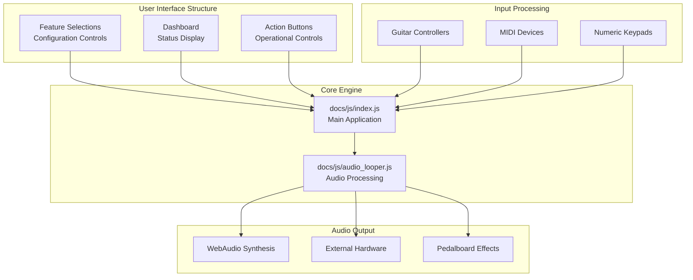
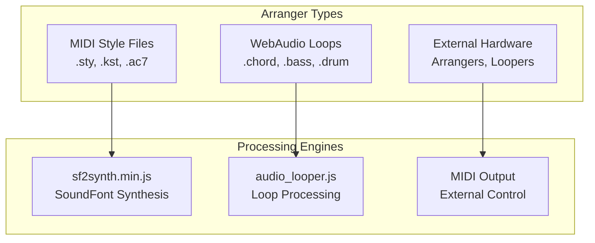
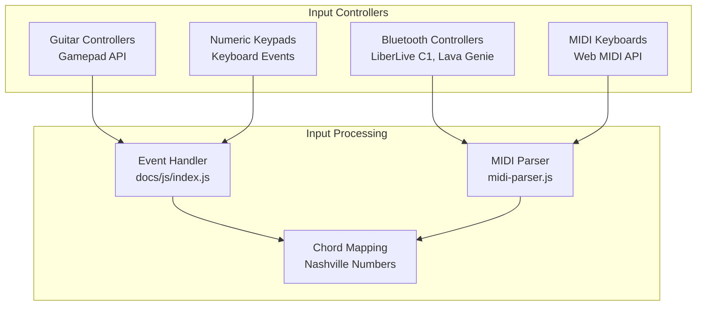
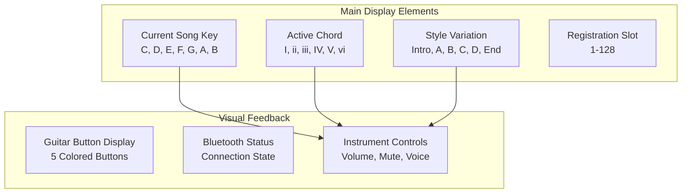
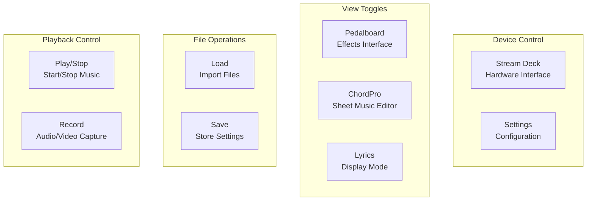
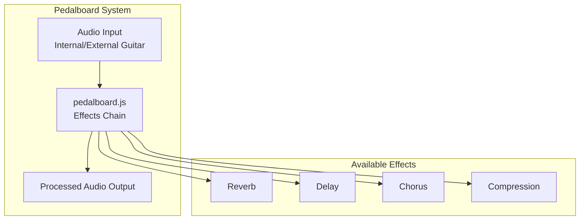
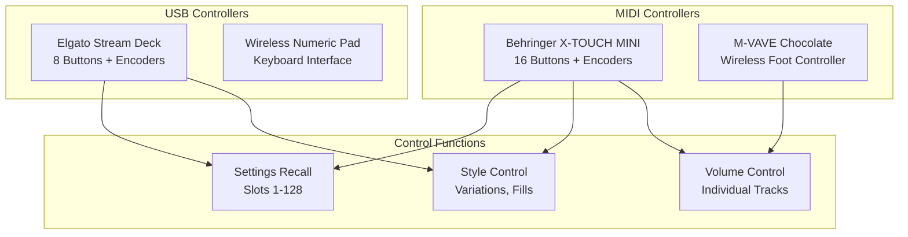

# User Guide

> **Relevant source files**
> * [README.md](https://github.com/Jus-Be/orinayo/blob/3c7fbee9/README.md)
> * [USER-GUIDE.md](https://github.com/Jus-Be/orinayo/blob/3c7fbee9/USER-GUIDE.md)
> * [docs/assets/screenshots/num-pad.png](https://github.com/Jus-Be/orinayo/blob/3c7fbee9/docs/assets/screenshots/num-pad.png)
> * [docs/assets/screenshots/numpad-guide.png](https://github.com/Jus-Be/orinayo/blob/3c7fbee9/docs/assets/screenshots/numpad-guide.png)
> * [docs/css/stackedit.css](https://github.com/Jus-Be/orinayo/blob/3c7fbee9/docs/css/stackedit.css)
> * [docs/help.html](https://github.com/Jus-Be/orinayo/blob/3c7fbee9/docs/help.html)
> * [documentation/orinayo_views.pptx](https://github.com/Jus-Be/orinayo/blob/3c7fbee9/documentation/orinayo_views.pptx)

This comprehensive user guide covers all features and functionality of OrinAyo, a live music production web application. It provides detailed instructions for configuring input controllers, selecting arrangers and audio sources, controlling playback, and using advanced features like collaboration tools and effects processing.

For step-by-step initial setup, see [Quick Start Guide](/Jus-Be/orinayo/2.1-quick-start-guide). For detailed information about specific input devices and their configuration, see [Input Controllers](/Jus-Be/orinayo/2.3-input-controllers).

## Application Architecture Overview

OrinAyo's user interface is organized into three main sections that work together to provide complete control over live music production:

**Sources:** [USER-GUIDE.md L29-L33](https://github.com/Jus-Be/orinayo/blob/3c7fbee9/USER-GUIDE.md#L29-L33)

 [docs/js/index.js](https://github.com/Jus-Be/orinayo/blob/3c7fbee9/docs/js/index.js)

 [docs/js/audio_looper.js](https://github.com/Jus-Be/orinayo/blob/3c7fbee9/docs/js/audio_looper.js)

## Installation and Access Methods

OrinAyo can be accessed through multiple deployment methods:

| Method | Description | Use Case |
| --- | --- | --- |
| **Web Page** | Direct browser access via `https://jus-be.github.io/orinayo/` | Quick access, no installation |
| **Progressive Web App** | Install from browser using "Add to home page" | Offline capability, native-like experience |
| **Chrome Extension** | Install from Chrome Web Store | Background operation, popup window |
| **Windows Executable** | Download `orinayo.exe` for Windows 10+ | Desktop application with WebView2 |

**Sources:** [USER-GUIDE.md L10-L17](https://github.com/Jus-Be/orinayo/blob/3c7fbee9/USER-GUIDE.md#L10-L17)

 [README.md L2](https://github.com/Jus-Be/orinayo/blob/3c7fbee9/README.md#L2-L2)

## Feature Selections

The Feature Selections section contains all configuration controls for setting up your music production environment:

### Arranger Type Configuration

OrinAyo supports three different arranger types for generating accompaniment music:

**Sources:** [USER-GUIDE.md L46-L75](https://github.com/Jus-Be/orinayo/blob/3c7fbee9/USER-GUIDE.md#L46-L75)

 [docs/js/sf2synth.min.js](https://github.com/Jus-Be/orinayo/blob/3c7fbee9/docs/js/sf2synth.min.js)

 [docs/js/audio_looper.js](https://github.com/Jus-Be/orinayo/blob/3c7fbee9/docs/js/audio_looper.js)

#### MIDI Style Files

Uses standard arranger keyboard style formats (Yamaha SFFx, Casio AC7, Ketron KST). Requires SoundFont (.sf2) files for instrument sounds.

#### WebAudio Loops

Uses pre-recorded audio loops from various arranger keyboards. Provides 12 pre-determined tempos per style with major, minor, and suspended chord variations.

#### External Hardware

Sends MIDI messages to control external devices including:

* Ketron Event series keyboards and modules
* Yamaha PSR SX-600, MODX, Montage
* Boss RC 600 Loop Station
* Aeros Loop Studio

### Input Controller Selection

The application recognizes input from multiple controller types:

**Sources:** [USER-GUIDE.md L89-L217](https://github.com/Jus-Be/orinayo/blob/3c7fbee9/USER-GUIDE.md#L89-L217)

 [docs/js/midi-parser.js](https://github.com/Jus-Be/orinayo/blob/3c7fbee9/docs/js/midi-parser.js)

 [docs/js/index.js](https://github.com/Jus-Be/orinayo/blob/3c7fbee9/docs/js/index.js)

### Audio Device Configuration

Configure audio input and output routing:

| Feature | Purpose | Configuration |
| --- | --- | --- |
| **Audio Device In** | Mix external instruments | Select input device for live audio mixing |
| **Audio Device Out** | Route output audio | Select specific output device or virtual cable |
| **MIDI In/Out** | MIDI device routing | Configure MIDI input/output devices |
| **RealGuitar Out** | Virtual instrument control | Route to MusicLabs RealGuitar via virtual MIDI |

**Sources:** [USER-GUIDE.md L294-L311](https://github.com/Jus-Be/orinayo/blob/3c7fbee9/USER-GUIDE.md#L294-L311)

 [USER-GUIDE.md L223-L282](https://github.com/Jus-Be/orinayo/blob/3c7fbee9/USER-GUIDE.md#L223-L282)

## Dashboard Controls

The Dashboard displays real-time status and provides immediate control over active musical elements:

### Main Display Information

**Sources:** [USER-GUIDE.md L352-L376](https://github.com/Jus-Be/orinayo/blob/3c7fbee9/USER-GUIDE.md#L352-L376)

### Instrument Control Interface

Each musical track provides these controls:

* **Enable/Disable Checkbox** - Mute or unmute the instrument
* **Instrument Selection** - Choose from General MIDI voices or loaded samples
* **Volume Control** - Adjust individual track levels
* **Note Activity Display** - Visual indication of currently playing notes (MIDI only)

### Guitar Control Section

Dedicated controls for the internal guitar instrument:

| Control Type | Options | Purpose |
| --- | --- | --- |
| **Guitar Voice** | Acoustic/Electric samples | Select instrument timbre |
| **Strum Type** | Strum, Bass&Strum, Picking | Control playing technique |
| **Voicing Range** | Low (C2-), Medium (C4-C6), High (C6+) | Set pitch range |
| **Impulse Response** | Various IR files | Apply amp/cabinet simulation |

**Sources:** [USER-GUIDE.md L391-L436](https://github.com/Jus-Be/orinayo/blob/3c7fbee9/USER-GUIDE.md#L391-L436)

## Action Buttons

Action buttons trigger specific operations and toggle between different application modes:

### Primary Controls

**Sources:** [USER-GUIDE.md L451-L586](https://github.com/Jus-Be/orinayo/blob/3c7fbee9/USER-GUIDE.md#L451-L586)

### File Loading System

The Load button supports multiple file types for extending functionality:

| File Type | Extension | Purpose |
| --- | --- | --- |
| **OrinAyo Loops** | .drum, .chord, .bass, .riff | Custom audio style loops |
| **MIDI Styles** | .sty, .kst, .ac7, .sas | Arranger style files |
| **SoundFonts** | .sf2, .keys, .pads | Instrument sample libraries |
| **Songs** | .mid | MIDI files with chord progressions |
| **ChordPro** | .cho | Chord sheet music |

**Sources:** [USER-GUIDE.md L484-L541](https://github.com/Jus-Be/orinayo/blob/3c7fbee9/USER-GUIDE.md#L484-L541)

## Advanced Features

### Effects Processing (Pedalboard)

Access guitar effects through the Pedalboard interface:

**Sources:** [USER-GUIDE.md L547-L551](https://github.com/Jus-Be/orinayo/blob/3c7fbee9/USER-GUIDE.md#L547-L551)

 [docs/js/pedalboard.js](https://github.com/Jus-Be/orinayo/blob/3c7fbee9/docs/js/pedalboard.js)

### ChordPro Editor

Built-in editor for chord sheet music with extended directives:

* Support for precise timing controls
* Section change markers
* Tempo adjustments
* Integration with MIDI file generation
* Real-time chord progression display

**Sources:** [USER-GUIDE.md L552-L556](https://github.com/Jus-Be/orinayo/blob/3c7fbee9/USER-GUIDE.md#L552-L556)

 [README.md L15-L17](https://github.com/Jus-Be/orinayo/blob/3c7fbee9/README.md#L15-L17)

### Recording Capabilities

OrinAyo supports two recording modes:

1. **Audio Recording** - Capture live performance as OGG audio file
2. **Video Recording** - Record song playback with lyrics overlay as MP4 video

**Sources:** [USER-GUIDE.md L571-L575](https://github.com/Jus-Be/orinayo/blob/3c7fbee9/USER-GUIDE.md#L571-L575)

## External Accessory Integration

### Supported Hardware Controllers

**Sources:** [USER-GUIDE.md L588-L618](https://github.com/Jus-Be/orinayo/blob/3c7fbee9/USER-GUIDE.md#L588-L618)

### Registration System

Save and recall complete application configurations using:

* **MIDI Program Change** messages (PC 1-128)
* **Stream Deck** buttons with page navigation
* **X-TOUCH MINI** buttons for direct slot access

Each registration slot stores:

* Selected arranger type and style
* Input controller configuration
* Audio device settings
* Instrument selections and volumes
* Effects settings

**Sources:** [USER-GUIDE.md L564-L570](https://github.com/Jus-Be/orinayo/blob/3c7fbee9/USER-GUIDE.md#L564-L570)

 [USER-GUIDE.md L231-L248](https://github.com/Jus-Be/orinayo/blob/3c7fbee9/USER-GUIDE.md#L231-L248)