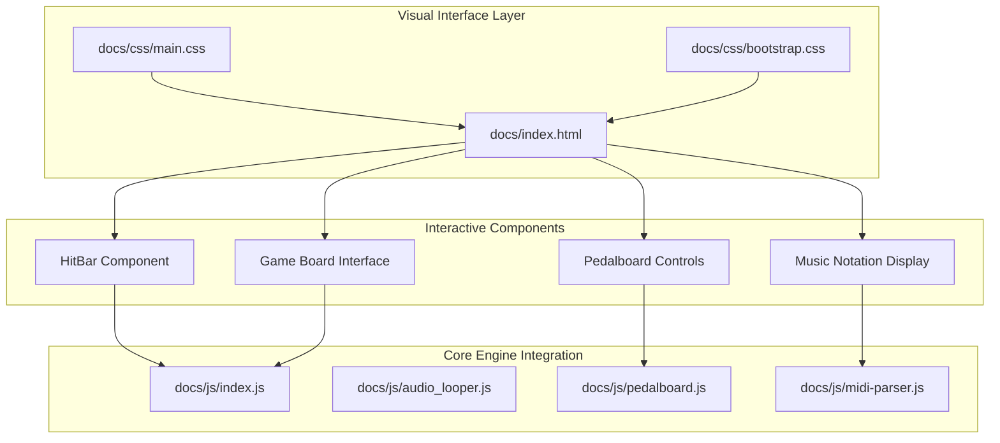
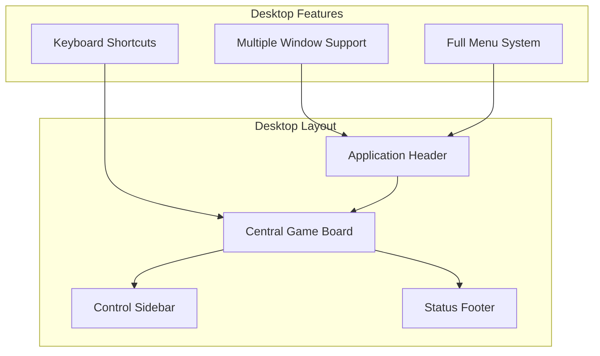
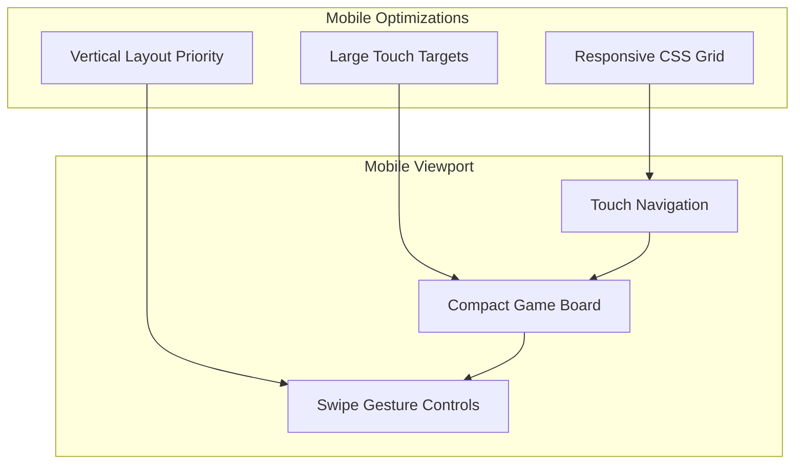
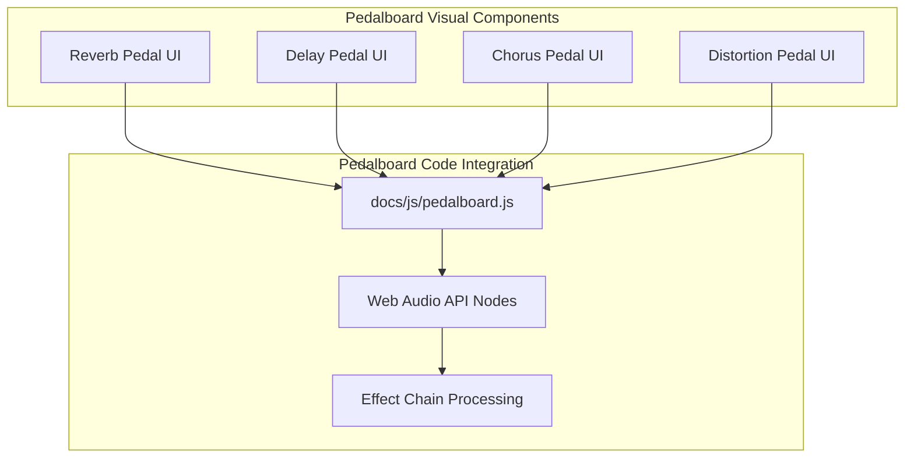
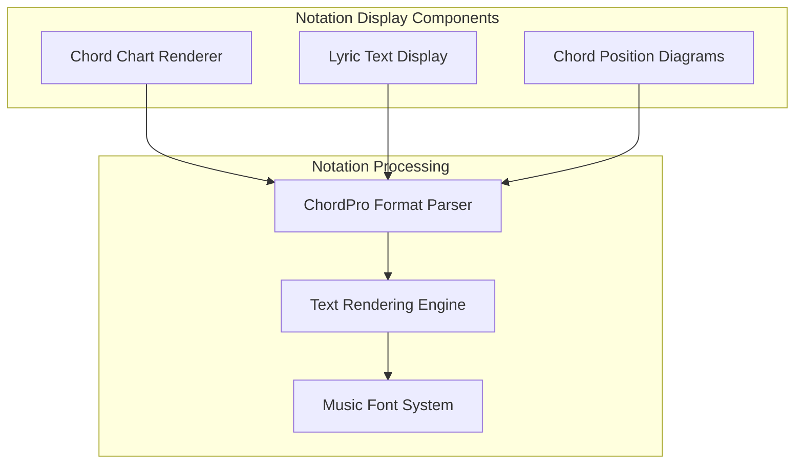
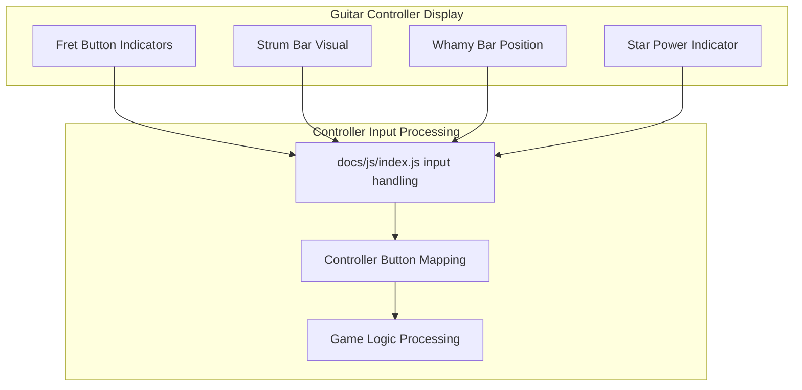
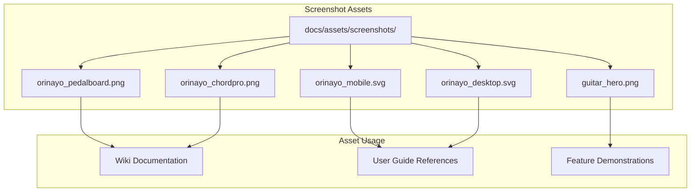
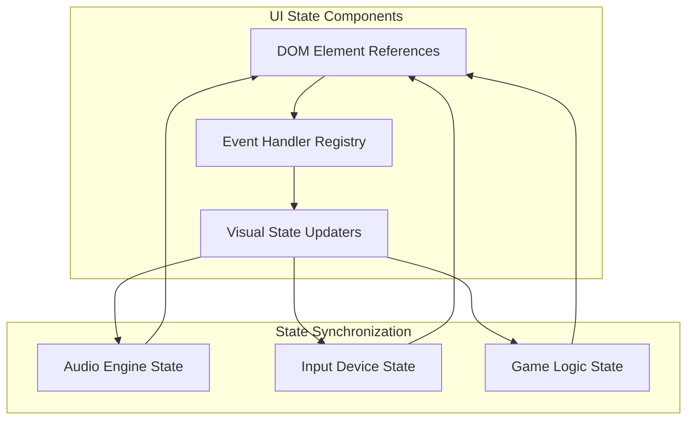

# Visual Documentation

> **Relevant source files**
> * [docs/assets/screenshots/guitar_hero.png](https://github.com/Jus-Be/orinayo/blob/3c7fbee9/docs/assets/screenshots/guitar_hero.png)
> * [docs/assets/screenshots/orinayo.png](https://github.com/Jus-Be/orinayo/blob/3c7fbee9/docs/assets/screenshots/orinayo.png)
> * [docs/assets/screenshots/orinayo_chordpro.png](https://github.com/Jus-Be/orinayo/blob/3c7fbee9/docs/assets/screenshots/orinayo_chordpro.png)
> * [docs/assets/screenshots/orinayo_desktop.svg](https://github.com/Jus-Be/orinayo/blob/3c7fbee9/docs/assets/screenshots/orinayo_desktop.svg)
> * [docs/assets/screenshots/orinayo_mobile.jpeg](https://github.com/Jus-Be/orinayo/blob/3c7fbee9/docs/assets/screenshots/orinayo_mobile.jpeg)
> * [docs/assets/screenshots/orinayo_mobile.svg](https://github.com/Jus-Be/orinayo/blob/3c7fbee9/docs/assets/screenshots/orinayo_mobile.svg)
> * [docs/assets/screenshots/orinayo_pedalboard.png](https://github.com/Jus-Be/orinayo/blob/3c7fbee9/docs/assets/screenshots/orinayo_pedalboard.png)

This page provides a comprehensive visual guide to OrinAyo's user interface, featuring screenshots and visual assets that demonstrate the application's features across different platforms and use cases. The documentation covers the main application interface, platform-specific variations, input device integration, and key functional areas through actual interface captures.

For technical details about the underlying UI implementation, see [UI Components](/Jus-Be/orinayo/3.3-ui-components). For information about the core application architecture powering these interfaces, see [Application Engine](/Jus-Be/orinayo/3.1-application-engine).

## Application Interface Overview

OrinAyo presents a unified interface that adapts to different platforms while maintaining consistent functionality. The main interface combines multiple functional areas including audio controls, device input handling, effects processing, and music notation display.

### UI Architecture Mapping

Sources: [docs/index.html](https://github.com/Jus-Be/orinayo/blob/3c7fbee9/docs/index.html)

 [docs/css/main.css](https://github.com/Jus-Be/orinayo/blob/3c7fbee9/docs/css/main.css)

 [docs/js/index.js](https://github.com/Jus-Be/orinayo/blob/3c7fbee9/docs/js/index.js)

 [docs/js/pedalboard.js](https://github.com/Jus-Be/orinayo/blob/3c7fbee9/docs/js/pedalboard.js)

## Platform-Specific Interfaces

### Desktop Interface

The desktop version provides the full-featured interface optimized for larger screens and mouse/keyboard interaction. It displays all functional areas simultaneously with dedicated space for each component.

Sources: [docs/assets/screenshots/orinayo_desktop.svg](https://github.com/Jus-Be/orinayo/blob/3c7fbee9/docs/assets/screenshots/orinayo_desktop.svg)

### Mobile Interface

The mobile interface adapts the layout for touch interaction and smaller screens, using a responsive design that prioritizes essential controls while maintaining access to all features through navigation.

Sources: [docs/assets/screenshots/orinayo_mobile.svg](https://github.com/Jus-Be/orinayo/blob/3c7fbee9/docs/assets/screenshots/orinayo_mobile.svg)

## Feature-Specific Interface Areas

### Pedalboard Effects Interface

The pedalboard interface provides visual controls for guitar effects processing, presenting familiar pedal-style interfaces for various audio effects.

| Effect Type | Visual Control | Code Implementation |
| --- | --- | --- |
| Reverb | Knob controls for room size, decay | `pedalboard.js` reverb node |
| Delay | Time and feedback sliders | `pedalboard.js` delay node |
| Chorus | Rate and depth controls | `pedalboard.js` chorus node |
| Distortion | Drive and tone knobs | `pedalboard.js` distortion node |

Sources: [docs/assets/screenshots/orinayo_pedalboard.png](https://github.com/Jus-Be/orinayo/blob/3c7fbee9/docs/assets/screenshots/orinayo_pedalboard.png)

 [docs/js/pedalboard.js](https://github.com/Jus-Be/orinayo/blob/3c7fbee9/docs/js/pedalboard.js)

### Music Notation Display

The ChordPro notation interface displays chord charts and lyrics in a readable format, supporting standard ChordPro syntax for musical notation.

Sources: [docs/assets/screenshots/orinayo_chordpro.png](https://github.com/Jus-Be/orinayo/blob/3c7fbee9/docs/assets/screenshots/orinayo_chordpro.png)

## Input Device Integration

### Guitar Controller Visualization

The interface provides visual feedback for guitar controller input, showing button states and fret positions in real-time.

| Controller Element | Visual Indicator | Input Processing |
| --- | --- | --- |
| Green Fret | Green button highlight | Gamepad button 0 |
| Red Fret | Red button highlight | Gamepad button 1 |
| Yellow Fret | Yellow button highlight | Gamepad button 2 |
| Blue Fret | Blue button highlight | Gamepad button 3 |
| Orange Fret | Orange button highlight | Gamepad button 4 |
| Strum Bar | Directional arrow | Gamepad axis movement |

Sources: [docs/assets/screenshots/guitar_hero.png](https://github.com/Jus-Be/orinayo/blob/3c7fbee9/docs/assets/screenshots/guitar_hero.png)

 [docs/js/index.js](https://github.com/Jus-Be/orinayo/blob/3c7fbee9/docs/js/index.js)

## Visual Asset Organization

### Screenshot Asset Structure

Sources: [docs/assets/screenshots/](https://github.com/Jus-Be/orinayo/blob/3c7fbee9/docs/assets/screenshots/)

## Interface State Management

The visual interface maintains state through JavaScript event handlers and DOM manipulation, coordinating between user interactions and audio processing.

Sources: [docs/js/index.js](https://github.com/Jus-Be/orinayo/blob/3c7fbee9/docs/js/index.js)

 [docs/index.html](https://github.com/Jus-Be/orinayo/blob/3c7fbee9/docs/index.html)