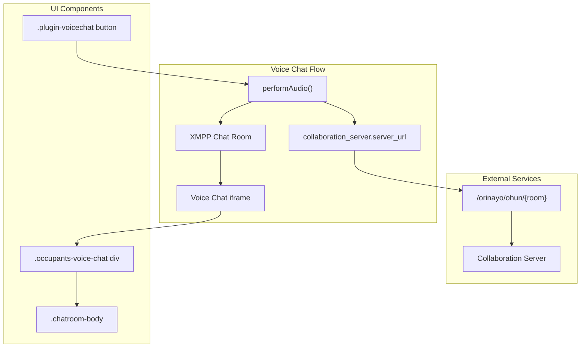
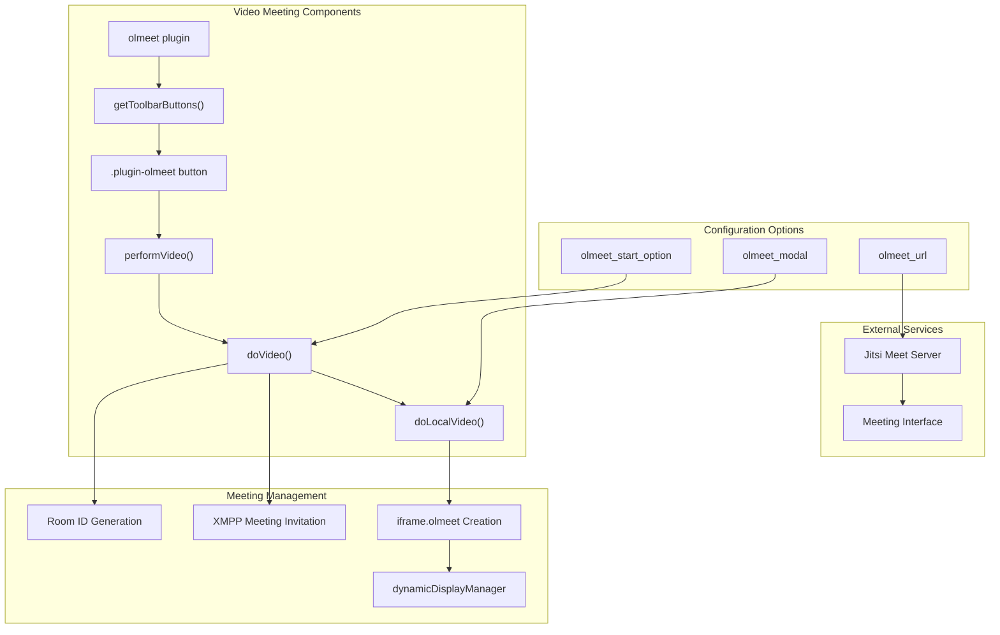
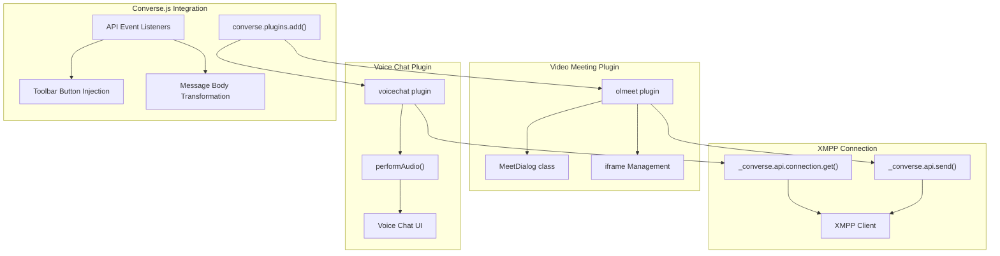
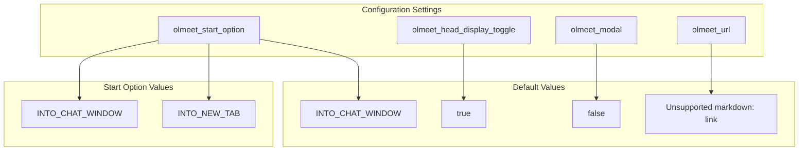

# Voice and Video Chat

> **Relevant source files**
> * [docs/packages/olmeet/olmeet.js](https://github.com/Jus-Be/orinayo/blob/3c7fbee9/docs/packages/olmeet/olmeet.js)
> * [docs/packages/voicechat/voicechat.js](https://github.com/Jus-Be/orinayo/blob/3c7fbee9/docs/packages/voicechat/voicechat.js)

This document covers OrinAyo's real-time communication capabilities for collaborative music sessions, including voice chat and video meeting functionality. These features enable musicians to communicate while collaborating on musical arrangements through integrated XMPP and WebRTC technologies.

For information about screen sharing capabilities, see [Screen Sharing](/Jus-Be/orinayo/5.2-screen-sharing). For details about the underlying XMPP messaging infrastructure, see [XMPP Integration](/Jus-Be/orinayo/5.3-xmpp-integration).

## Overview

OrinAyo provides two primary communication plugins that extend the Converse.js XMPP client:

| Plugin | Purpose | Technology | Primary File |
| --- | --- | --- | --- |
| Voice Chat | Audio-only communication in chat rooms | Custom iframe integration | `docs/packages/voicechat/voicechat.js` |
| Video Meeting | Full video conferencing | Jitsi Meet integration | `docs/packages/olmeet/olmeet.js` |

Both plugins integrate seamlessly with OrinAyo's chat interface, adding toolbar buttons to initiate communication sessions within existing XMPP chat rooms.

Sources: [docs/packages/voicechat/voicechat.js L1-L95](https://github.com/Jus-Be/orinayo/blob/3c7fbee9/docs/packages/voicechat/voicechat.js#L1-L95)

 [docs/packages/olmeet/olmeet.js L1-L481](https://github.com/Jus-Be/orinayo/blob/3c7fbee9/docs/packages/olmeet/olmeet.js#L1-L481)

## Voice Chat Architecture

The voice chat system provides lightweight audio communication through a custom integration with the collaboration server's `ohun` endpoint.

The `voicechat` plugin implements the following key functions:

* **Button Integration**: Adds voice chat button to XMPP chatroom toolbars via `getToolbarButtons` listener [docs/packages/voicechat/voicechat.js L18-L33](https://github.com/Jus-Be/orinayo/blob/3c7fbee9/docs/packages/voicechat/voicechat.js#L18-L33)
* **Audio Session Management**: Toggles voice chat iframe through `performAudio()` function [docs/packages/voicechat/voicechat.js L43-L93](https://github.com/Jus-Be/orinayo/blob/3c7fbee9/docs/packages/voicechat/voicechat.js#L43-L93)
* **Dynamic UI Creation**: Creates `.occupants-voice-chat` div to host voice interface [docs/packages/voicechat/voicechat.js L64-L74](https://github.com/Jus-Be/orinayo/blob/3c7fbee9/docs/packages/voicechat/voicechat.js#L64-L74)

Sources: [docs/packages/voicechat/voicechat.js L10-L41](https://github.com/Jus-Be/orinayo/blob/3c7fbee9/docs/packages/voicechat/voicechat.js#L10-L41)

 [docs/packages/voicechat/voicechat.js L43-L95](https://github.com/Jus-Be/orinayo/blob/3c7fbee9/docs/packages/voicechat/voicechat.js#L43-L95)

## Video Meeting Integration

The video meeting system leverages Jitsi Meet for full video conferencing capabilities with sophisticated iframe management and XMPP invitation handling.

### Meeting Session Lifecycle

The video meeting system implements a comprehensive lifecycle management system:

1. **Room Creation**: Generates unique room IDs using `Strophe.getNodeFromJid()` combined with random suffixes [docs/packages/olmeet/olmeet.js L179](https://github.com/Jus-Be/orinayo/blob/3c7fbee9/docs/packages/olmeet/olmeet.js#L179-L179)
2. **XMPP Invitation**: Sends structured meeting invitations with `<invite>` and `<external>` elements [docs/packages/olmeet/olmeet.js L186](https://github.com/Jus-Be/orinayo/blob/3c7fbee9/docs/packages/olmeet/olmeet.js#L186-L186)
3. **Display Management**: Uses `dynamicDisplayManager` for responsive iframe positioning [docs/packages/olmeet/olmeet.js L241-L358](https://github.com/Jus-Be/orinayo/blob/3c7fbee9/docs/packages/olmeet/olmeet.js#L241-L358)
4. **Event Handling**: Monitors iframe load events for meeting closure detection [docs/packages/olmeet/olmeet.js L372-L381](https://github.com/Jus-Be/orinayo/blob/3c7fbee9/docs/packages/olmeet/olmeet.js#L372-L381)

Sources: [docs/packages/olmeet/olmeet.js L177-L197](https://github.com/Jus-Be/orinayo/blob/3c7fbee9/docs/packages/olmeet/olmeet.js#L177-L197)

 [docs/packages/olmeet/olmeet.js L209-L428](https://github.com/Jus-Be/orinayo/blob/3c7fbee9/docs/packages/olmeet/olmeet.js#L209-L428)

## Plugin Architecture Integration

Both communication plugins follow the Converse.js plugin pattern and integrate with OrinAyo's XMPP infrastructure:

### Plugin Initialization

Both plugins register with Converse.js using the standard plugin architecture:

* **Voice Chat**: Registers as `"voicechat"` plugin with `getToolbarButtons` and `connected` listeners [docs/packages/voicechat/voicechat.js L10-L41](https://github.com/Jus-Be/orinayo/blob/3c7fbee9/docs/packages/voicechat/voicechat.js#L10-L41)
* **Video Meeting**: Registers as `"olmeet"` plugin with multiple event handlers including `messageNotification`, `getToolbarButtons`, and `afterMessageBodyTransformed` [docs/packages/olmeet/olmeet.js L8](https://github.com/Jus-Be/orinayo/blob/3c7fbee9/docs/packages/olmeet/olmeet.js#L8-L8)  [docs/packages/olmeet/olmeet.js L445-L449](https://github.com/Jus-Be/orinayo/blob/3c7fbee9/docs/packages/olmeet/olmeet.js#L445-L449)

Sources: [docs/packages/voicechat/voicechat.js L10-L16](https://github.com/Jus-Be/orinayo/blob/3c7fbee9/docs/packages/voicechat/voicechat.js#L10-L16)

 [docs/packages/olmeet/olmeet.js L430-L449](https://github.com/Jus-Be/orinayo/blob/3c7fbee9/docs/packages/olmeet/olmeet.js#L430-L449)

## User Interface Components

### Toolbar Button Integration

Both plugins add buttons to the chat toolbar with SVG icons and click handlers:

| Plugin | Button Class | Icon | Handler Function |
| --- | --- | --- | --- |
| Voice Chat | `.plugin-voicechat` | Volume/speaker icon | `performAudio` |
| Video Meeting | `.plugin-olmeet` | Video camera icon | `performVideo` |

The buttons are conditionally styled based on chat type (direct chat vs. chatroom) using CSS variables like `--muc-color` and `--chat-color` [docs/packages/voicechat/voicechat.js L23](https://github.com/Jus-Be/orinayo/blob/3c7fbee9/docs/packages/voicechat/voicechat.js#L23-L23)

 [docs/packages/olmeet/olmeet.js L98-L101](https://github.com/Jus-Be/orinayo/blob/3c7fbee9/docs/packages/olmeet/olmeet.js#L98-L101)

### Meeting Interface Display Options

The video meeting system supports multiple display modes:

* **Inline Chat Window**: iframe embedded within chat interface [docs/packages/olmeet/olmeet.js L191-L192](https://github.com/Jus-Be/orinayo/blob/3c7fbee9/docs/packages/olmeet/olmeet.js#L191-L192)
* **New Tab**: Opens meeting in separate browser tab [docs/packages/olmeet/olmeet.js L194-L196](https://github.com/Jus-Be/orinayo/blob/3c7fbee9/docs/packages/olmeet/olmeet.js#L194-L196)
* **Modal Dialog**: Uses `MeetDialog` class extending `BaseModal` [docs/packages/olmeet/olmeet.js L451-L477](https://github.com/Jus-Be/orinayo/blob/3c7fbee9/docs/packages/olmeet/olmeet.js#L451-L477)

Sources: [docs/packages/voicechat/voicechat.js L25-L29](https://github.com/Jus-Be/orinayo/blob/3c7fbee9/docs/packages/voicechat/voicechat.js#L25-L29)

 [docs/packages/olmeet/olmeet.js L103-L108](https://github.com/Jus-Be/orinayo/blob/3c7fbee9/docs/packages/olmeet/olmeet.js#L103-L108)

 [docs/packages/olmeet/olmeet.js L189-L197](https://github.com/Jus-Be/orinayo/blob/3c7fbee9/docs/packages/olmeet/olmeet.js#L189-L197)

## Configuration Settings

### Voice Chat Configuration

Voice chat configuration is minimal and primarily depends on collaboration server settings:

* **Server URL**: Retrieved from `localStorage.getItem("collaboration_server.server_url")` [docs/packages/voicechat/voicechat.js L47](https://github.com/Jus-Be/orinayo/blob/3c7fbee9/docs/packages/voicechat/voicechat.js#L47-L47)
* **Room Endpoint**: Constructs URLs like `https://{server}/orinayo/ohun/{room}` [docs/packages/voicechat/voicechat.js L81](https://github.com/Jus-Be/orinayo/blob/3c7fbee9/docs/packages/voicechat/voicechat.js#L81-L81)

### Video Meeting Configuration

The olmeet plugin provides extensive configuration options:

These settings are extended into the Converse.js API through `api.settings.extend()` [docs/packages/olmeet/olmeet.js L438-L443](https://github.com/Jus-Be/orinayo/blob/3c7fbee9/docs/packages/olmeet/olmeet.js#L438-L443)

Sources: [docs/packages/olmeet/olmeet.js L10-L14](https://github.com/Jus-Be/orinayo/blob/3c7fbee9/docs/packages/olmeet/olmeet.js#L10-L14)

 [docs/packages/olmeet/olmeet.js L438-L443](https://github.com/Jus-Be/orinayo/blob/3c7fbee9/docs/packages/olmeet/olmeet.js#L438-L443)