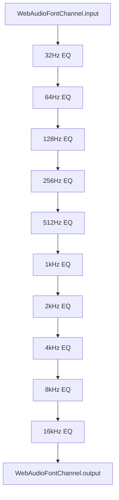
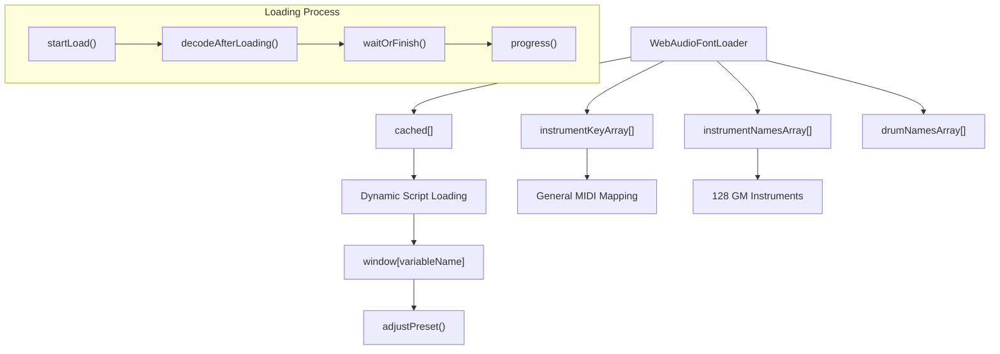
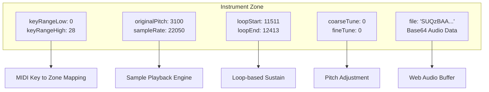
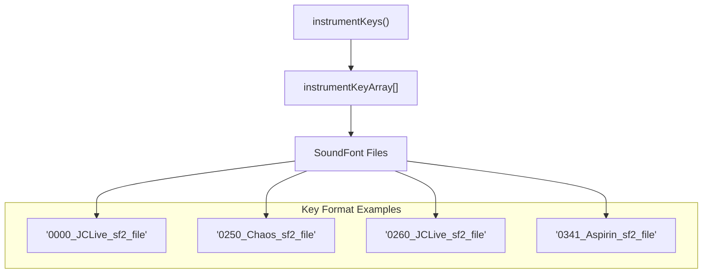
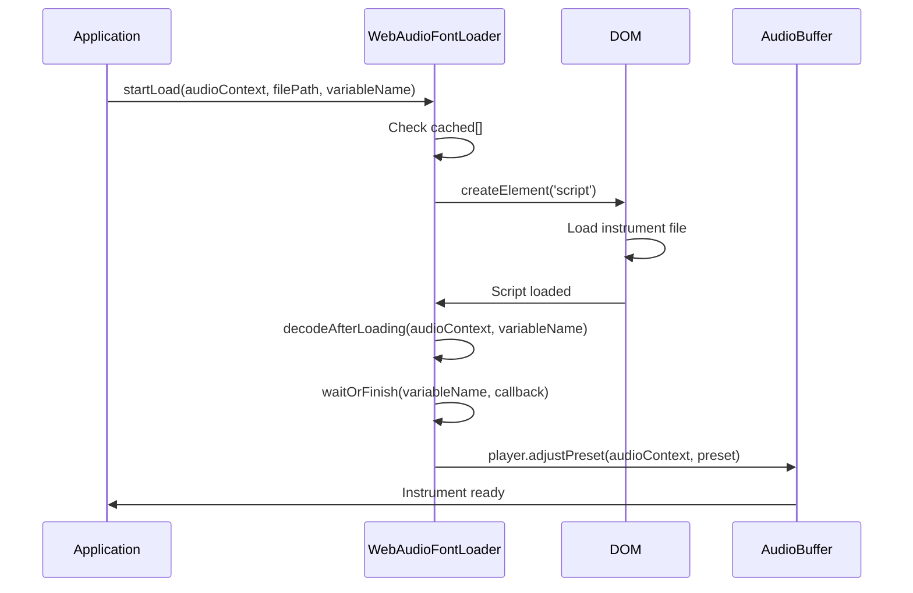

# WebAudio Font System

> **Relevant source files**
> * [docs/js/0250_Aspirin_sf2_file.js](https://github.com/Jus-Be/orinayo/blob/3c7fbee9/docs/js/0250_Aspirin_sf2_file.js)
> * [docs/js/0250_Chaos_sf2_file.js](https://github.com/Jus-Be/orinayo/blob/3c7fbee9/docs/js/0250_Chaos_sf2_file.js)
> * [docs/js/0250_LK_AcousticSteel_SF2_file.js](https://github.com/Jus-Be/orinayo/blob/3c7fbee9/docs/js/0250_LK_AcousticSteel_SF2_file.js)
> * [docs/js/0250_RG_Acoustic_SF2_file.js](https://github.com/Jus-Be/orinayo/blob/3c7fbee9/docs/js/0250_RG_Acoustic_SF2_file.js)
> * [docs/js/0253_Acoustic_Guitar_sf2_file.js](https://github.com/Jus-Be/orinayo/blob/3c7fbee9/docs/js/0253_Acoustic_Guitar_sf2_file.js)
> * [docs/js/0260_JCLive_sf2_file.js](https://github.com/Jus-Be/orinayo/blob/3c7fbee9/docs/js/0260_JCLive_sf2_file.js)
> * [docs/js/0270_EGuitar_FSBS_SF2_file.js](https://github.com/Jus-Be/orinayo/blob/3c7fbee9/docs/js/0270_EGuitar_FSBS_SF2_file.js)
> * [docs/js/0341_Aspirin_sf2_file.js](https://github.com/Jus-Be/orinayo/blob/3c7fbee9/docs/js/0341_Aspirin_sf2_file.js)
> * [docs/js/webaudio-font-player.js](https://github.com/Jus-Be/orinayo/blob/3c7fbee9/docs/js/webaudio-font-player.js)

## Purpose and Scope

The WebAudio Font System provides sample-based instrument synthesis for OrinAyo using the Web Audio API. It loads and plays SoundFont-style instrument definitions with built-in equalization and General MIDI compatibility. This system handles the core sound generation for virtual instruments in the application.

For MIDI file processing and BLE MIDI integration, see [MIDI Processing](/Jus-Be/orinayo/4.1-midi-processing). For guitar effects processing, see [Audio Effects (Pedalboard)](/Jus-Be/orinayo/4.3-audio-effects-(pedalboard)).

## System Architecture

The WebAudio Font System consists of two main components: the audio channel processing chain and the instrument loader/manager.

### Audio Processing Chain

**WebAudio Font Audio Chain**

The `WebAudioFontChannel` creates a 10-band equalizer chain where each band uses a biquad filter with "peaking" type. All filters are initialized with 0dB gain and Q factor of 1.0, providing a flat response that can be adjusted as needed.

Sources: [docs/js/webaudio-font-player.js L2-L30](https://github.com/Jus-Be/orinayo/blob/3c7fbee9/docs/js/webaudio-font-player.js#L2-L30)

### Instrument Loading System

**Instrument Loading Architecture**

The system dynamically loads instrument definitions by injecting script tags into the DOM. Each instrument is stored as a global variable and processed through the Web Audio API's audio buffer decoding system.

Sources: [docs/js/webaudio-font-player.js L31-L253](https://github.com/Jus-Be/orinayo/blob/3c7fbee9/docs/js/webaudio-font-player.js#L31-L253)

## Instrument Format

### Zone Definition Structure

Each instrument consists of multiple zones that define how samples map to key ranges and playback parameters:

| Property | Type | Purpose |
| --- | --- | --- |
| `midi` | number | MIDI note number for the sample |
| `originalPitch` | number | Original pitch of the sample in cents |
| `keyRangeLow` | number | Lowest MIDI key this zone covers |
| `keyRangeHigh` | number | Highest MIDI key this zone covers |
| `loopStart` | number | Sample position where loop begins |
| `loopEnd` | number | Sample position where loop ends |
| `coarseTune` | number | Coarse tuning adjustment in semitones |
| `fineTune` | number | Fine tuning adjustment in cents |
| `sampleRate` | number | Sample rate of the audio data |
| `ahdsr` | boolean | Whether to apply AHDSR envelope |
| `file` | string | Base64 encoded audio data |
| `anchor` | number | Timing anchor point |

### Sample Instrument Definition

**Instrument Zone Structure**

Each zone defines a key range and associated sample with loop points for sustain. Multiple zones per instrument enable realistic key-based sample switching.

Sources: [docs/js/0341_Aspirin_sf2_file.js L2-L34](https://github.com/Jus-Be/orinayo/blob/3c7fbee9/docs/js/0341_Aspirin_sf2_file.js#L2-L34)

 [docs/js/0260_JCLive_sf2_file.js L2-L15](https://github.com/Jus-Be/orinayo/blob/3c7fbee9/docs/js/0260_JCLive_sf2_file.js#L2-L15)

## General MIDI Support

The system includes comprehensive General MIDI instrument mapping with 128 standard instruments organized by families:

### Instrument Categories

```mermaid
flowchart TD

GM["General MIDI<br>128 Instruments"]
Piano["Piano Family<br>0-7"]
Chromatic["Chromatic Percussion<br>8-15"]
Organ["Organ Family<br>16-23"]
Guitar["Guitar Family<br>24-31"]
Bass["Bass Family<br>32-39"]
Strings["Strings Family<br>40-47"]
Ensemble["Ensemble Family<br>48-55"]
Brass["Brass Family<br>56-63"]
Reed["Reed Family<br>64-71"]
Pipe["Pipe Family<br>72-79"]
SynthLead["Synth Lead<br>80-87"]
SynthPad["Synth Pad<br>88-95"]
SynthFX["Synth Effects<br>96-103"]
Ethnic["Ethnic<br>104-111"]
Percussive["Percussive<br>112-119"]
SoundFX["Sound Effects<br>120-127"]

GM --> Piano
GM --> Chromatic
GM --> Organ
GM --> Guitar
GM --> Bass
GM --> Strings
GM --> Ensemble
GM --> Brass
GM --> Reed
GM --> Pipe
GM --> SynthLead
GM --> SynthPad
GM --> SynthFX
GM --> Ethnic
GM --> Percussive
GM --> SoundFX
```

**General MIDI Instrument Organization**

The `instrumentTitles()` method returns the complete GM instrument set with family classifications. Each instrument includes both the instrument name and its family group.

Sources: [docs/js/webaudio-font-player.js L39-L173](https://github.com/Jus-Be/orinayo/blob/3c7fbee9/docs/js/webaudio-font-player.js#L39-L173)

### Instrument Key Mapping

The system maintains arrays of instrument keys that correspond to actual SoundFont file implementations:

**Instrument Key to File Mapping**

The key format follows the pattern `{program}_{soundfont}_{type}_file` where program numbers correspond to General MIDI program changes.

Sources: [docs/js/webaudio-font-player.js L254-L500](https://github.com/Jus-Be/orinayo/blob/3c7fbee9/docs/js/webaudio-font-player.js#L254-L500)

## Loading and Caching System

### Dynamic Loading Process

**Instrument Loading Sequence**

The loading system uses dynamic script injection to load instrument definitions and processes them through the Web Audio API's buffer decoding system.

### Loading State Management

The system provides methods to track loading progress and completion:

| Method | Purpose |
| --- | --- |
| `startLoad()` | Initiates loading of an instrument file |
| `loaded()` | Checks if an instrument is fully loaded and decoded |
| `progress()` | Returns loading progress as a fraction (0-1) |
| `waitLoad()` | Waits for all cached instruments to complete loading |

Sources: [docs/js/webaudio-font-player.js L176-L253](https://github.com/Jus-Be/orinayo/blob/3c7fbee9/docs/js/webaudio-font-player.js#L176-L253)

## Integration with OrinAyo

The WebAudio Font System integrates with OrinAyo's audio processing pipeline by providing synthesized instrument sounds that can be routed through the pedalboard effects system and mixed with other audio sources. The equalization capabilities allow for real-time tonal shaping of individual instruments, while the General MIDI compatibility ensures broad instrument selection for musical arrangements.

Sources: [docs/js/webaudio-font-player.js L1-L500](https://github.com/Jus-Be/orinayo/blob/3c7fbee9/docs/js/webaudio-font-player.js#L1-L500)

 [docs/js/0341_Aspirin_sf2_file.js L1-L50](https://github.com/Jus-Be/orinayo/blob/3c7fbee9/docs/js/0341_Aspirin_sf2_file.js#L1-L50)

 [docs/js/0260_JCLive_sf2_file.js L1-L50](https://github.com/Jus-Be/orinayo/blob/3c7fbee9/docs/js/0260_JCLive_sf2_file.js#L1-L50)