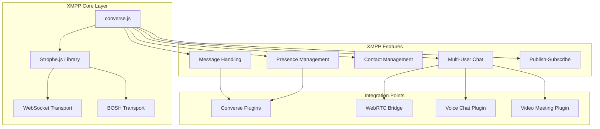
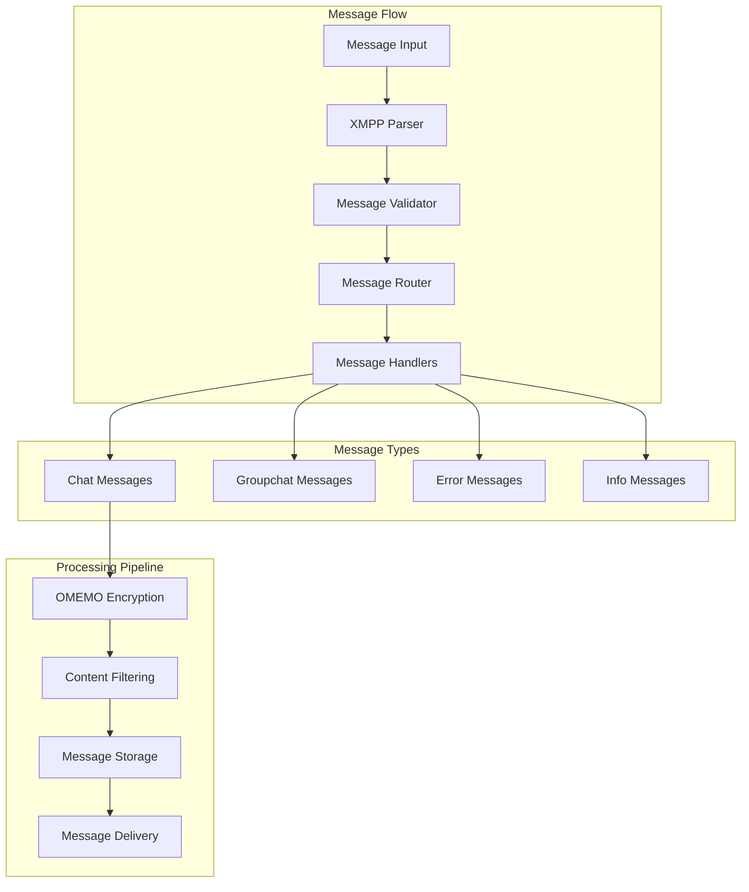
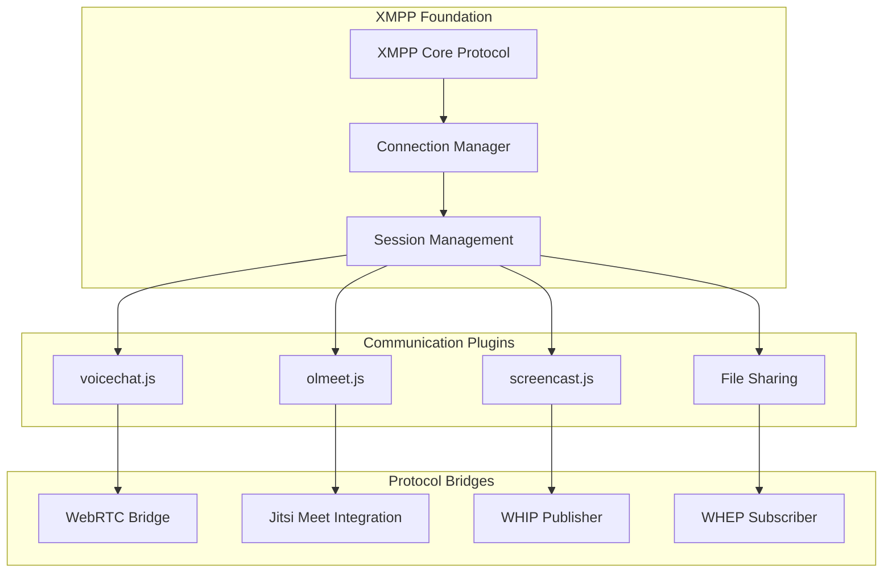
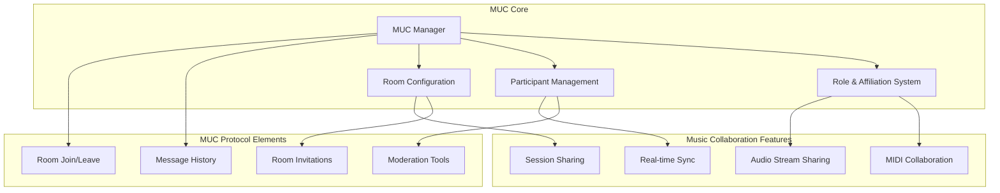
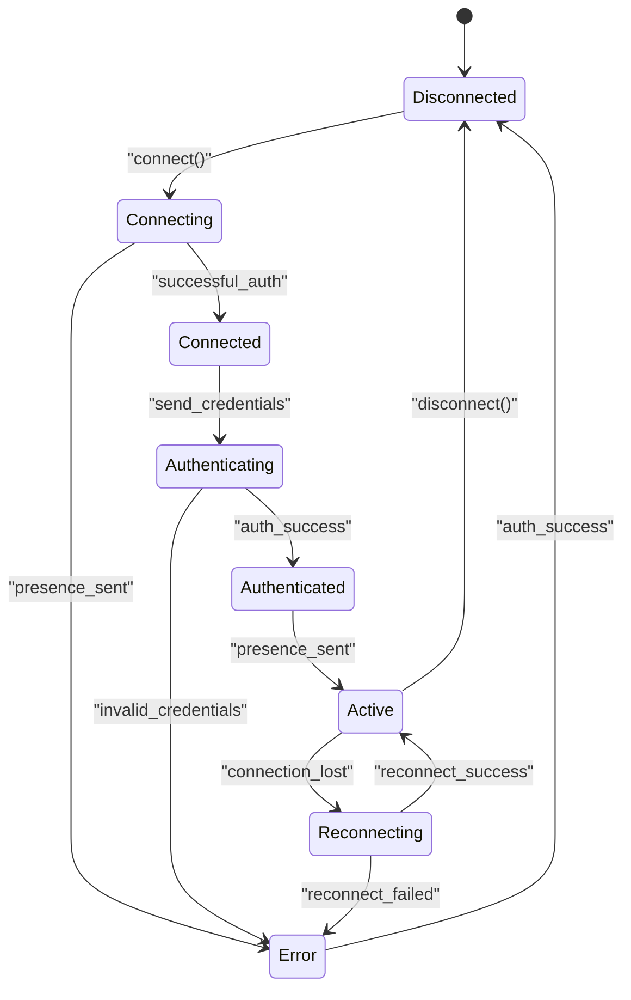
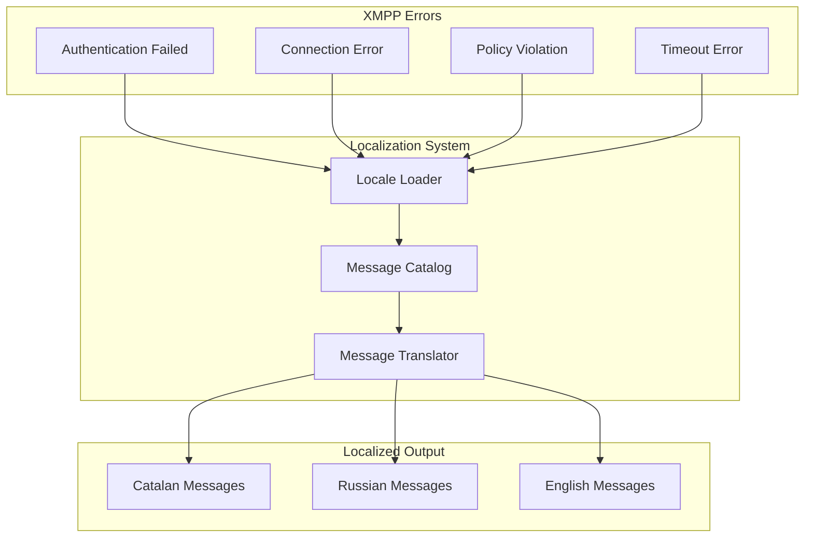

# XMPP Integration

> **Relevant source files**
> * [docs/dist/converse.css](https://github.com/Jus-Be/orinayo/blob/3c7fbee9/docs/dist/converse.css)
> * [docs/dist/converse.css.map](https://github.com/Jus-Be/orinayo/blob/3c7fbee9/docs/dist/converse.css.map)
> * [docs/dist/converse.js](https://github.com/Jus-Be/orinayo/blob/3c7fbee9/docs/dist/converse.js)
> * [docs/dist/converse.js.map](https://github.com/Jus-Be/orinayo/blob/3c7fbee9/docs/dist/converse.js.map)
> * [docs/dist/converse.min.css](https://github.com/Jus-Be/orinayo/blob/3c7fbee9/docs/dist/converse.min.css)
> * [docs/dist/converse.min.css.map](https://github.com/Jus-Be/orinayo/blob/3c7fbee9/docs/dist/converse.min.css.map)
> * [docs/dist/converse.min.js](https://github.com/Jus-Be/orinayo/blob/3c7fbee9/docs/dist/converse.min.js)
> * [docs/dist/converse.min.js.map](https://github.com/Jus-Be/orinayo/blob/3c7fbee9/docs/dist/converse.min.js.map)
> * [docs/dist/locales/ca-LC_MESSAGES-converse-po.js](https://github.com/Jus-Be/orinayo/blob/3c7fbee9/docs/dist/locales/ca-LC_MESSAGES-converse-po.js)
> * [docs/dist/locales/ru-LC_MESSAGES-converse-po.js](https://github.com/Jus-Be/orinayo/blob/3c7fbee9/docs/dist/locales/ru-LC_MESSAGES-converse-po.js)

## Purpose and Scope

This document covers OrinAyo's XMPP (Extensible Messaging and Presence Protocol) integration system, which serves as the foundational communication layer for real-time messaging, presence management, and collaborative features. The XMPP integration enables text messaging, user presence tracking, roster management, and serves as the underlying protocol for advanced communication features.

For information about voice and video communication built on top of XMPP, see [Voice and Video Chat](/Jus-Be/orinayo/5.1-voice-and-video-chat). For screen sharing capabilities, see [Screen Sharing](/Jus-Be/orinayo/5.2-screen-sharing).

## XMPP Client Architecture

OrinAyo uses Converse.js as its primary XMPP client implementation, providing a comprehensive web-based XMPP communication solution that integrates seamlessly with the music production workflow.

**XMPP Client Architecture Overview**

Sources: [docs/dist/converse.js L1-L100](https://github.com/Jus-Be/orinayo/blob/3c7fbee9/docs/dist/converse.js#L1-L100)

 [docs/dist/converse.min.js L1-L50](https://github.com/Jus-Be/orinayo/blob/3c7fbee9/docs/dist/converse.min.js#L1-L50)

## Core XMPP Components

The XMPP integration consists of several key components that handle different aspects of real-time communication:

### Message Processing System

**XMPP Message Processing Pipeline**

Sources: [docs/dist/converse.js L500-L1000](https://github.com/Jus-Be/orinayo/blob/3c7fbee9/docs/dist/converse.js#L500-L1000)

 [docs/dist/converse.min.js L1-L500](https://github.com/Jus-Be/orinayo/blob/3c7fbee9/docs/dist/converse.min.js#L1-L500)

### Presence and Roster Management

| Component | Function | XMPP Stanza |
| --- | --- | --- |
| `PresenceManager` | Tracks user online/offline status | `<presence/>` |
| `RosterManager` | Manages contact lists | `<iq type='get'><query xmlns='jabber:iq:roster'/>` |
| `SubscriptionHandler` | Handles contact requests | `<presence type='subscribe'/>` |
| `StatusUpdater` | Updates user status messages | `<presence><status/>` |

## Integration with Communication Plugins

The XMPP layer serves as the foundation for higher-level communication features through a plugin architecture:

**XMPP Plugin Integration Architecture**

Sources: [docs/dist/converse.js L2000-L3000](https://github.com/Jus-Be/orinayo/blob/3c7fbee9/docs/dist/converse.js#L2000-L3000)

 [docs/dist/converse.min.js L800-L1200](https://github.com/Jus-Be/orinayo/blob/3c7fbee9/docs/dist/converse.min.js#L800-L1200)

## Multi-User Chat (MUC) Implementation

OrinAyo's collaborative music features heavily utilize XMPP's Multi-User Chat protocol for group sessions:

### MUC Features and Capabilities

**Multi-User Chat Architecture for Music Collaboration**

Sources: [docs/dist/converse.js L4000-L5000](https://github.com/Jus-Be/orinayo/blob/3c7fbee9/docs/dist/converse.js#L4000-L5000)

 [docs/dist/converse.min.js L1500-L2000](https://github.com/Jus-Be/orinayo/blob/3c7fbee9/docs/dist/converse.min.js#L1500-L2000)

## Connection Management and Transport

The XMPP integration supports multiple transport mechanisms to ensure reliable connectivity across different network conditions:

### Transport Layer Configuration

| Transport | Use Case | Configuration |
| --- | --- | --- |
| WebSocket | Modern browsers, low latency | `wss://` secure WebSocket |
| BOSH | Legacy browser support | HTTP long-polling |
| WebRTC | P2P data channels | Direct peer connections |

### Connection State Management

**XMPP Connection State Machine**

Sources: [docs/dist/converse.js L6000-L7000](https://github.com/Jus-Be/orinayo/blob/3c7fbee9/docs/dist/converse.js#L6000-L7000)

 [docs/dist/converse.min.js L2500-L3000](https://github.com/Jus-Be/orinayo/blob/3c7fbee9/docs/dist/converse.min.js#L2500-L3000)

## Localization and Internationalization

The XMPP integration includes comprehensive localization support for global music collaboration:

### Supported Languages

The system includes localized XMPP error messages and UI elements for multiple languages:

* Catalan (`ca-LC_MESSAGES-converse-po.js`)
* Russian (`ru-LC_MESSAGES-converse-po.js`)
* Additional language packs loaded dynamically

### Error Message Localization

**XMPP Localization Architecture**

Sources: [docs/dist/locales/ca-LC_MESSAGES-converse-po.js L1-L100](https://github.com/Jus-Be/orinayo/blob/3c7fbee9/docs/dist/locales/ca-LC_MESSAGES-converse-po.js#L1-L100)

 [docs/dist/locales/ru-LC_MESSAGES-converse-po.js L1-L100](https://github.com/Jus-Be/orinayo/blob/3c7fbee9/docs/dist/locales/ru-LC_MESSAGES-converse-po.js#L1-L100)

## Security and Encryption

OrinAyo's XMPP integration implements modern security practices including OMEMO encryption for end-to-end security in music collaboration sessions.

### Security Features

* **OMEMO Encryption**: End-to-end encryption for sensitive music collaboration data
* **TLS/SSL Transport**: Encrypted connections using WSS (WebSocket Secure)
* **Authentication**: SASL authentication mechanisms
* **Message Integrity**: Cryptographic verification of message authenticity

Sources: [docs/dist/converse.js L8000-L9000](https://github.com/Jus-Be/orinayo/blob/3c7fbee9/docs/dist/converse.js#L8000-L9000)

 [docs/dist/converse.min.js L3500-L4000](https://github.com/Jus-Be/orinayo/blob/3c7fbee9/docs/dist/converse.min.js#L3500-L4000)